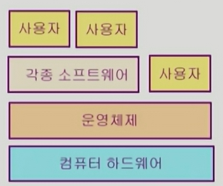
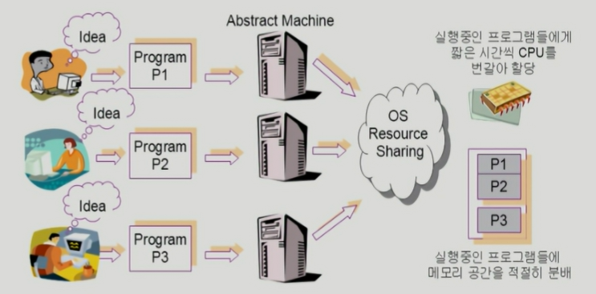

# 인트로

## 1. 운영체제란?

운영체제는 컴퓨터 하드웨어 바로 위에 설치되어 사용자 및 다른 모든 소프트웨어와 하드웨어를 연결하는 소프트웨어 계층

- 협의의 운영체제(커널)
  - 운영체제의 핵심 부분으로 **메모리에 상주**하는 부분
- 광의의 운영체제
  - 커널 뿐 아니라 각종 주변 시스템 유틸리티를 포함한 개념
  - 메모리에 상주하지 않는 별도의 프로그램이지만, 운영체제의 개념에 포함

## 2. 운영체제의 목표

1. 컴퓨터 시스템을 편리하게 사용할 수 있는 환경을 제공
   - 운영체제는 동시 사용자/프로그램들이 각각 독자적 컴퓨터에서 수행되는 것 같은 경험을 제공
     - 짧은 시간 간격으로 번갈아가며 수행하도록 CPU를 번갈아 할당
     - 하드웨어를 직접 다루는 복잡한 부분을 운영체제가 대행
2. 컴퓨터 시스템의 **자원을 효율적으로 관리**
   - 프로세서, 기억장치, 입출력 장치 등(하드웨어 자원들)의 효율적 관리
     - 사용자간의 형평성있는 자원 분배
     - 주어진 자원으로 최대한의 성능을 내도록 함
   - 사용자 및 운영체제 자신의 보호
   - 프로세스, 파일, 메시지 등(소프트웨어 자원들)을 관리

## 3. 운영체제의 분류

### 1. 동시 작업 가능 여부

- 단일 작업
  - 한 번에 하나의 작업만 처리
  - MS-DOS 등
- 다중 작업
  - 동시에 두 개 이상의 작업 처리
  - 한 명령의 수행이 끝나기 전에 다른 명령이나 프로그램을 수행할 수 있음
  - UNIX, MS Windows 등

### 2. 사용자의 수

- 단일 사용자
  - MS-DOS, MS Windows
  - 단, Windows도 서버 기능을 추가하면 여러명이 원격 접속 가능
- 다중 사용자
  - UNIX, NT server
  - 보안 기능과, 형평성 있는 자원 관리 필요

### 3. 처리 방식

- 일괄 처리(batch programming)
  - 작업 요청을 일정량 모아서 한꺼번에 처리
  - 작업이 완전 종료될 때까지 기다려야 함
  - 초기 Punch Card 처리 시스템
  - Outdated
- 시분할
  - 여러 작업을 수행할 때 컴퓨터 처리 능력을 일정한 시간 단위로 분할하여 사용
  - 일괄 처리 시스템에 비해 짧은 응답 시간을 가짐
  - UNIX 등
  - interactive한 방식
- 실시간
