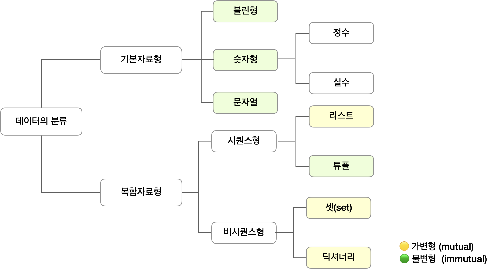

# Types




## Dictionary

- 키:값으로 이루어진 타입이다.
- 특성
  - Not iterable
  - Not Sequence
  - Mutable
- 선언방법

```python
a = dict(one=1, two=2, three=3) # dict함수 안에 key=value형태로 쓰기, 이 때 주의해야 할 점은, key 자리에 변수를 쓸 수 없다는 점이다. 문자열로 들어간다!
b = {'one': 1, 'two': 2, 'three': 3} # {}안에 key:value 형태로 쓰기
c = {('one', 1), ('two', 2), ('three', 3)} # 튜플 형태로 묶어 넣기
d = {zip(['one','two','three'],[1, 2, 3])} # zip() 활용
```

