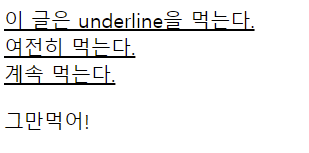

# text-decoration

- 기본적으로, `text-decoration`은 자손 **텍스트 요소** - `<span>`, `<strong>`, `<a> `등으로 묶인 요소들 포함 - 에게 상속된다.
- 일단 상속된 `text-decoration` 속성은, 이후 자손 텍스트 요소들에 다시 스타일 지정을 한다고 해도, **해제할 수 없음에 주의하자!**



```html
<!DOCTYPE html>
<html lang="en">
  <head>
    <meta charset="UTF-8" />
    <meta http-equiv="X-UA-Compatible" content="IE=edge" />
    <meta name="viewport" content="width=device-width, initial-scale=1.0" />
    <title>Document</title>
  </head>
  <style>
    .underline {
      text-decoration: underline;
    }
    .asdf {
      text-decoration: none;
    }
  </style>
  <body>
    <!-- p 전체에 underline을 먹여주었다. -->
    <p class="underline">
      이 글은 underline을 먹는다.
      <!-- 하위 텍스트 요소에 text-decoration:none을 먹였는데도 해제되지 않는다. -->
      <span class="asdf">
        여전히 먹는다.
      </span>
      <!-- 설령 inline style을 먹이더라도, 해제되지 않는다. -->
      <a style="text-decoration: none">
        계속 먹는다.
      </a>
      <div>
        <!-- 새로운 div로 묶어주어야 상속이 종료된다. -->
        그만먹어!
      </div>
    </p>
  </body>
</html>

```

