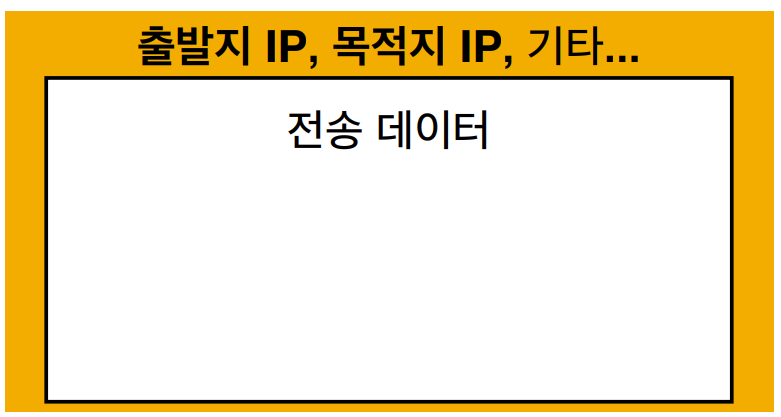
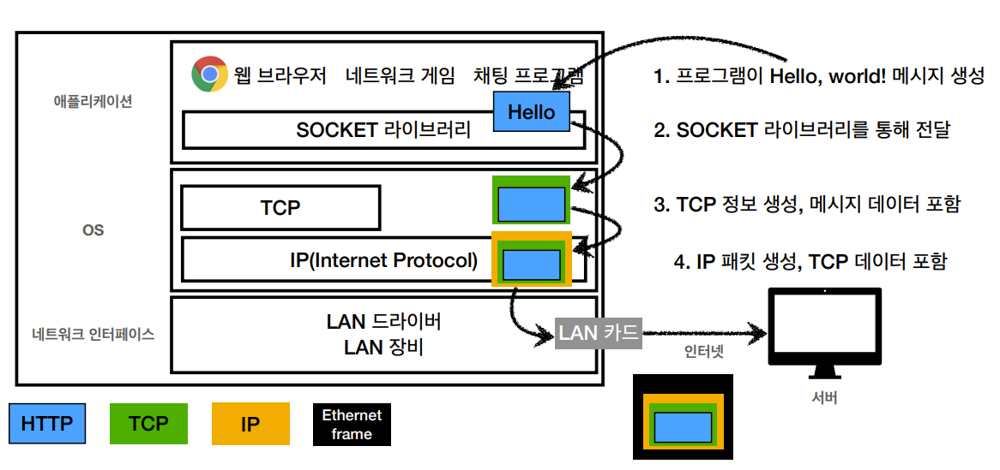
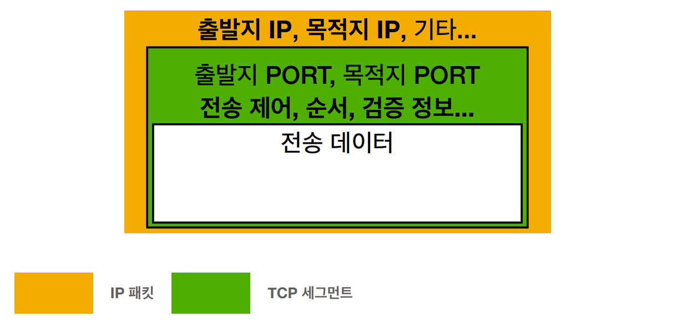
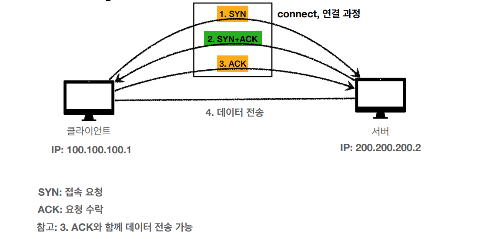
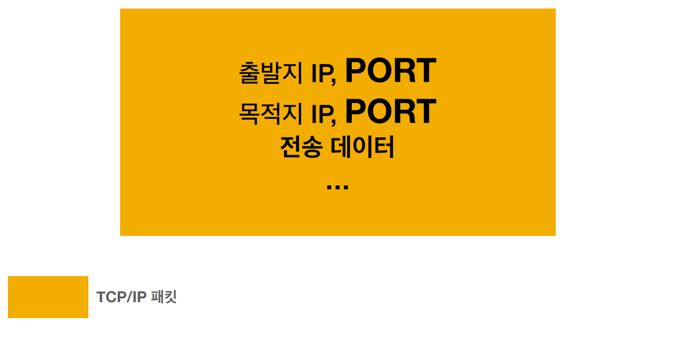
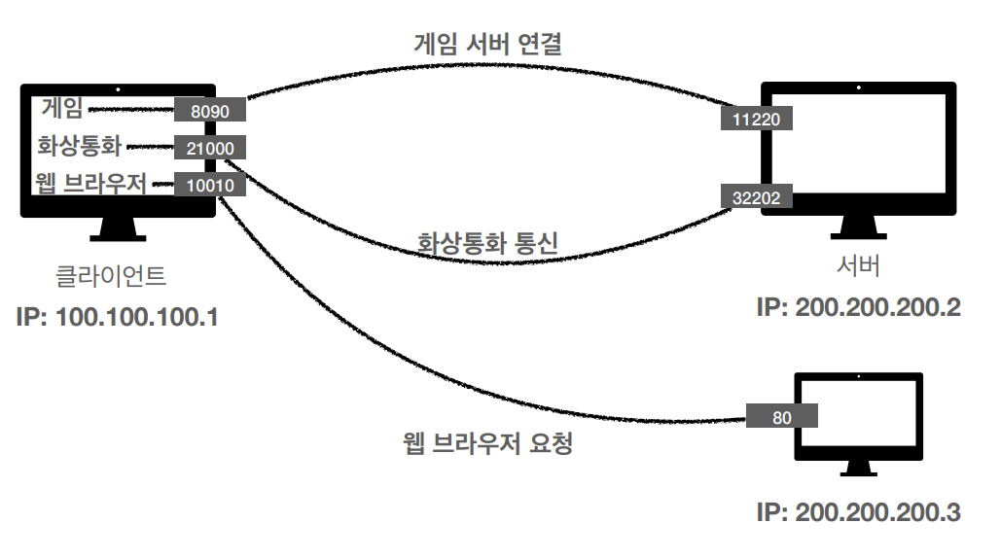
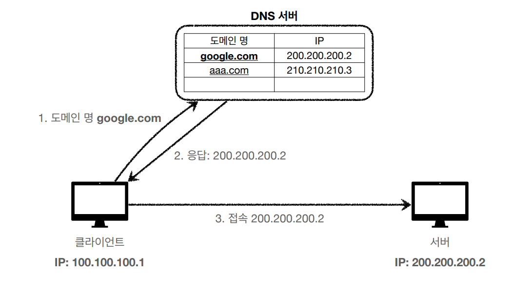

# Internet Network

## 1. 인터넷 통신

### 1. 인터넷에서 컴퓨터 둘은 어떻게 통신할까?

- 클라이언트에서 요청을 보냄 => 수많은 인터넷 망 사이의 노드를 거침 => 서버에 도달
  - 어떻게 수많은 노드를 거쳐 서버까지 도달하게 될까?
  - IP 주소를 부여해서!

## 2. IP(Internet Protocol)

- IP 주소
  - 클라이언트와, 서버는 각각 IP주소를 부여받는다.
- IP의 역할
  - 지정한 IP 주소(IP Address)에 데이터 전달
  - 패킷(Packet)이라는 통신 단위로 데이터 전달
- IP 패킷 정보
  - 출발지 IP, 목적지 IP, 기타 등을 전송하려는 데이터('Hello World!')의 밖에 붙여서 전송

> IP 패킷

##### 클라이언트 패킷 전달

- 클라이언트에서 던진 IP 패킷은 노드 사이를 거치며 목적지까지 던져짐

##### 서버 패킷 전달

- 서버도 데이터를 잘 받았다는 신호를 보내기 위해 IP 패킷을 만들어서 전달

- 재미있는 것은, 클라이언트와 서버가 던진 패킷이 지나가는 경로는 서로 다를 수 있다.

#### IP 프로토콜의 한계

- 비연결성
  - 클라이언트는 대상 서버가 패킷을 받을 수 있는 상태인지 모름
  - 패킷을 받을 대상이 없거나 서비스 불능 상태여도 패킷 전송
- 비신뢰성
  - 패킷 소실: 중간에 패킷이 사라지면?
    - 패킷을 전달받은 중간 노드가 갑자기 노드가 꺼짐
    - 중간 케이블이 끊어짐 등등
  - 패킷이 순서대로 오지 않는다면?
    - 패킷의 용량이 클 때, 대략 패킷의 용량이 1500byte가 넘으면 메시지를 끊어서 보냄
    - 그런데, 두 개의 패킷은 서로 다른 노드들의 루트를 탈 수 있다.
      - 따라서, 최종적으로 패킷이 도착하는 순서가 바뀔 수 있다.
- 프로그램 구분
  - 같은 IP를 사용하는 서버에서 통신하는 애플리케이션이 둘 이상이면?

##### => 이러한 문제들을 해결해 주는 게 TCP 프로토콜

## 3. TCP, UDP

### 0. 인터넷 프로토콜 스택의 4계층 -상위 계층부터 하위 계층까지

- 애플리케이션 계층 - HTTP, FTP

- in OS

  - 전송 계층 - TCP, UDP

  - 인터넷 계층 - IP

- 네트워크 인터페이스 계층 - 랜카드, 랜드라이버 등

##### => IP 위에 TCP를 얹어서 IP를 보완해 준다고 생각하자

- 전송 순서는 상위 계층부터 하위 계층까지
- 한 겹 한 겹 포장을 한다고 생각하자
  1. 프로그램에서 메시지 생성
  2. SOCKET 라이브러리를 통해 전달
  3. TCP 세그먼트 생성(메시지를 감싸서)
  4. IP 패킷 생성(TCP 정보를 감싸서)
  5. 마지막으로 LAN 카드를 통해 이더넷 프레임으로 감싸 전송

- 참고: 패킷이란?
  - 패키지(수화물) + 버킷(덩어리)

### 1. TCP(Transmission Control Protocol)

- 전송 제어 프로토콜(Transmission Control Protocol)
- 특징 3가지
  - 연결 지향 - TCP 3 way handshake(가상 연결)
    - 연결을 한 다음 메시지를 보냄
    - 비연결성 해결
  - 데이터 전달 보증
    - 보낸 메시지가 중간에 누락되면 내가 알 수 있음
  - 순서 보장

- **신뢰할 수 있는 프로토콜**
- 현재는 대부분 TCP 사용

- TCP에 들어가는 것들
  - 출발지 PORT, 목적지 PORT, 전송 제어, 순서, 검증 정보...

### 2. TCP 3 way handshake

1. 클라이언트에서 서버로 SYN(Synchronize - 접속 요청)이라는 메시지를 보냄
2. 서버는 SYN과 ACK(Acknowledgment - 요청 수락)이라는 답변을 같이 보냄
3. 클라이언트는 ACK를 보냄
   - 결론적으로 클라이언트와 서버는 모두 SYN과 ACK를 보냄
   - 이러한 과정이 3단계이기 때문에 3 Way Handshake
4. 연결된 걸 확인했으니 데이터 전송

##### 참고: 요즘에는 최적화가 되어 3단계에서 ACK와 함께 데이터를 전송 가능하다!

- 위에서 말한 연결이란 것은 논리적인 연결이지 물리적인 연결이 아니다.
  - 중간의 노드들은 연결이 되었는지 안 되었는지 - 어떤 상태인지 - 모른다

### 3. 데이터 전달 보증

1. 데이터 전송
2. 데이터를 잘 받았다는 응답을 보내줌

### 4. 순서 보장

1. 클라이언트가 패킷1, 패킷2, 패킷3 순서로 전송
2. 서버에서는 패킷1, 패킷3, 패킷2 순서로 받음 => 무언가 잘못됨
3. 패킷 2부터 다시 보내라는 요청을 클라이언트로 보냄

- 어떻게 이것이 가능한가?
  - 위 그림을 다시 참고하면, TCP세그먼트에 전송 제어, 순서, 검증 정보가 담겨 있다는 것을 알 수 있다.

### 5. UDP(User Datagram Protocol)

- 사용자 데이터그램 프로토콜(User Datagram Protocol)

- 하얀 도화지에 비유(기능이 거의 없음)

- 연결 지향 - TCP 3 way handshake X

- 데이터 전달 보증 X

- 순서 보장 X

- 데이터 전달 및 순서가 보장되지 않지만, 단순하고 빠름

  - 3 way handshaking은 이미 완전하기 때문에 추가적인 최적화가 힘들다 

    => 따라서 최적화를 위해서라면 애플리케이션 레벨에서 UDP에 손을 대면 된다.

    => 한 때 TCP가 정복했다가 최근에 UDP가 다시 각광받고 있다.

- 정리

  - IP와 거의 같다.

    - PORT, 체크섬 정도만 추가 => IP 프로토콜에는 PORT가 없다.

      - PORT
        - 하나의 IP에서 여러 개의 애플리케이션을 사용할 때, 이를 구분할 때 쓰는 것

      - 체크섬
        - 메시지가 맞는지 검증해주는 데이터

  - 애플리케이션에서 추가 작업 필요

## 4. PORT

- 같은 IP 주소를 가진 클라이언트에서 여러 개의 애플리케이션을 쓴다면?
- TCP에 출발지 PORT, 목적지 PORT 정보가 포함되어 있다.
- 앞으로의 표현 TCP/IP 패킷
  - 내용물
    - 출발지 IP, PORT
    - 목적지 IP, PORT
    - 전송 데이터 등

- PORT란, 같은 IP 내에서 프로세스 구분을 해 주는 역할
  - IP가 아파트라면, PORT는 X동 XX호

- 포트 번호
  - 0 ~ 65535: 할당 가능
  - 0 ~ 1023: 잘 알려진 포트, 사용하지 않는 것이 좋음
    - FTP - 20, 21
    - TELNET - 23
    - HTTP - 80
    - HTTPS - 443

## 5. DNS

### 1. IP의 문제들

- IP는 기억하기 어렵다
- IP는 변경될 수 있다.
  - 변경되는 일이 많다.

### 2. DNS(Domain Name System)

- 도메인 네임 시스템
- 일종의 전화번호부
- 도메인 명을 IP 주소로 변환

### 3. DNS 사용

- 도메인 명을 구매 후, DNS서버에 도메인 등록 후 IP를 배정
- 클라이언트가 DNS서버에 도메인을 보내면 IP 주소를 응답해줌
- 받은 IP 주소를 통해 서버로 접속

## 인터넷 네트워크 정리

- 인터넷 통신
- IP(Internet Protocol)
- TCP, UDP
- PORT
- DNS
