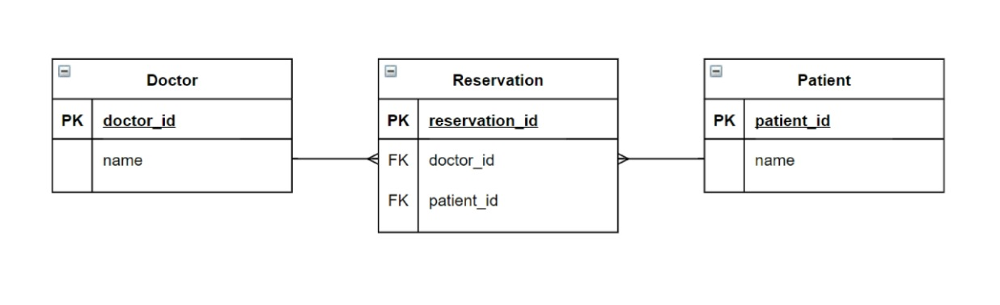

# 다대다

## 1. Intro: 병원 진료 기록 시스템

- 병원 진료 기록 시스템
- 환자와 의사가 사용하는 병원 진료 기록 시스템 구축
  - 병원 시스템에서 가장 핵심이 되는 객체는 환자와 의사
  - 이 둘의 관계를 어떻게 표현할 수 있을까?
- 시작하기 전
  - 모델링은 현실 세계를 최대한 유사하게 반영하기 위한 것
  - 우리 일상에 가까운 예시를 통해 DB를 모델링하고, 그 내부에서 일어나는 데이터의 흐름을 어떻게 제어할 수 있는지 알아보기

> 1:N의 한계

- 한 환자(tony)가 1번 의사의 진료를 마치고, 2번 의사에게 방문하려 할 때, 새로운 예약을 생성해야 하고, tony의 새로운 환자 레코드가 생김
- 한 번에 두 의사에게 진료를 받고자 할 때, 하나의 외래 키에 2개의 의사 데이터를 넣을 수 없음
- 새로운 예약을 생성하는 것이 불가능
  - 새로운 객체를 생성해야 함
- 여러 의사에게 진료 받은 기록을 환자 한 명에 저장할 수 없음
  - 외래 키에  '1, 2' 형식의 데이터 사용 불가

> 중개 모델

- 중개 모델(혹은 중개 테이블, Associative Table) 작성
- 어떤 테이블에서 조회를 하든 역참조가 되는 셈
- 중개 모델과의 모델 관계 확인

> ManyToManyField

- ManyToManyField 작성(중개 모델 삭제)

> 데이터베이스 모델링의 목적

현실 세계를 표현하기 위함

> 데이터베이스 모델링: 4Steps

1. 어떤 정보를 저장해야할지 고민한다.
2. 테이블명을 지어준다.
3. 필드명과 필드의 타입을 지정한다.
4. 필요시 테이블을 쪼개고 관계를 지어준다.