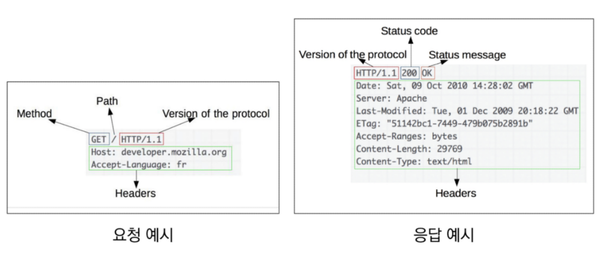
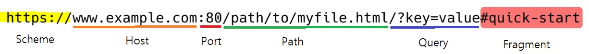

# REST API

[toc]

## 1. HTTP

### 1. HTTP (1/2)

- HyperText Transfer Protocel
- 웹 상에서 컨텐츠를 전송하기 위한 약속
- HTML 문서와 같은 리소스들을 가져올 수 있도록 하는 프로토콜(규칙, 약속)
- 웹에서 이루어지는 모든 데이터 교환의 기초
  - 요청(request)
    - 클라이언트에 의해 전송되는 메시지
  - 응답(response)
    - 서버에서 응답으로 전송되는 메시지

---

### 2. HTTP(2/2)

- 기본 특성

  - stateless

  - Connectionless

- 쿠키과 세션을 통해 서버 상태를 요청과 연결하도록 함

---

### 3. HTTP 메시지



---

### 4. HTTP request methods

- 자우너에 대한 행위(수행하고자 하는 동작)을 정의
- 주어진 리소스(자원)에 수행하길 원하는 행동을 나타냄
- HTTP Method 예시
  - GET, POST, PUT, DELETE
  - 조회, 작성, 수정, 삭제

----

### 5.  HTTP response status codes

- 특정 HTTP 요청이 성공적으로 완료되었는지 여부를 나타냄
- 응답은 5개의 그룹으로 나뉘어짐
  1. Informational responses(1xx)
  2. Successful responses(2xx)
  3. Redirection responses(3xx)
  4. Client error responses(4xx)
  5. Server error responses(5xx)

---

### 6. 웹에서의 리소스 식별

- HTTP 요청의 대상을 리소스(resource, 자원)라고 함
- 리소스는 문서, 사진 또는 기타 어떤 것이든 될 수 있음
- 각 리소스는 리소스 식별을 위해 HTTP 전체에서 사용되는 URI(Uniform Resource Identifier)로 식별됨

---

### 7. URL, URN

- URL(Uniform Resource Locator)
  - 통합 자원 위치
  - 네트워크상에 자원이 어디 있는지 알려주기 위한 약속
  - 과거에는 실제 자원의 위치를 나타냈지만 현재는 추상화된 의미론적인 구성
  - '웹 주소', '링크' 라고도 불림

- URN(Uniform Resource Name)
  - 통합 자원 이름
  - URL과 달리 자원의 위치에 영향을 받지않는 유일한 이름 역할을 함
  - 예시
    - ISBN(국제표준도시번호)

---

### 8. URI

- URI(Uniform Resource Identifier)
  - 통합 자원 식별자
  - 인터넷의 자원을 식별하는 유일한 주소(정보의 자원을 표현)
  - 인터넷에서 자원을 식별하거나 이름을 지정하는데 사용되는 간단한 문자열
  - 하위 개념
    - URL, URN
- URI는 크게 URL과 URN으로 나눌 수 있지만, URN을 사용하는 비중이 매우 적기 때문에 일반적으로 URL은 URI와 같은 의미로 사용되고는 함

####  정리: URL, URN, URN의 의미

- 인터넷에서 정보를 어떻게 표현할 것인가?

---


### 9. URI의 구조



- Scheme(protocol)
  - 브라우저가 사용해야 하는 프로토콜
  - http(s), data, file, ftp, mailto

- Host(Domain name)
  - www.example.com
  - 요청을 받는 웹 서버의 이름
  - IP address를 직접 사용할 수도 있지만, 실사용시 불편하므로 웹에서 그리 자주 사용되지는 않음
    - google의 IP address - 142.251.42.142 - 주소창에 칠 수 있음
- Port
  - 웹 서버 상의 리소스에 접근하는데 사용되는 기술적인 문
  - 일반적으로 사용될 때는 생략됨
  - HTTP 프로토콜의 표준 포트
    - HTTP 80
    - HTTPS 443
- Path
  - 웹 서버 상의 리소스 경로
  - 초기에는 실제 파일이 위치한 물리적 위치를 나타냈지만, 오늘날은 물리적인 실제 위치가 아닌 추상화 형태의 구조로 표현

- Query(Identifier)
  - Query String Parameters
  - 웹 서버에 제공되는 추가적인 매개 변수
  - &로 구분되는 Key-value 목록
- Fragment
  - Anchor
  - 자원 안에서의 북마크의 한 종류를 나타냄
  - 브라우저에게 해당 문서(HTML)의 특정 부분을 보여주기 위한 방법
  - 브라우저에게 알려주는 요소이기 때문에 fragment identifier(부분 식별자)라고 부르며 '#'뒤의 부분은 요청이 **서버로 보내지지 않음**

---


## 2. RESTful API

### 1. API

- Application Programming Interface
- 프로그래밍 언어가 제공하는 기능을 수행할 수 있게 만든 **인터페이스**
  - 한마디로 프로그래밍 언어로 조작하겠다는 것
  - 애플리케이션과 프로그래밍으로 소통하는 방법
  - CLI(명령줄), GUI(그래픽), API(프로그래밍)을 통해 특정한 기능 수행
- Web API
  - 웹 애플리케이션 개발에서 다른 서비스에 요청을 보내고 응답을 받기 위해 정의된 명세
  - 현재 웹 개발은 모든 것을 직접 개발하기보다 여러 Open API를 활용하는 추세
- 응답 데이터 타입
  - HTML, XML, JSON 등

- 대표적인 API 서비스 목록
  - Youtube API, Naver Papago API, Kakao Map API 등
  - 예를 들어, 지도 서비스를 제공할 때 구글 등의 서비스를 빌려 제공
- API Server
  - 응답에 대한 특정 형식(JSON 등)의 요청을 주는 서버

---


### 2. REST

- **RE**presentational **S**tate **T**ransfer
- API 서버를 개발하기 위한 일종의 소프트웨어 설계 방법론
  - 규약이나 약속 아님! 방법론!
  - 2000년 로이 필딩의 박사학위 논문에서 처음으로 소개된 후 네트워킹 문화에 널리 퍼짐
- 네트워크 구조(Network Architecture)원리의 모음
  - 자원을 정의하고 자원에 대한 주소를 지정하는 전반적인 방법
- REST 원리를 따르는 시스템을 RESTful 이란 용어로 지칭함
- 자원을 정의하는 방법에 대한 고민
  - 예: 정의된 자원을 어디에 위치 시킬 것인가

#### - REST의 자원과 주소의 지정 방법

1. 자원
   - URI(URL)
2. 행위
   - HTTP Method
3. 표현
   - 자원과 행위를 통해 궁극적으로 표현되는 (추상화된) 결과물
   - JSON으로 표현된 데이터를 제공

#### - REST의 핵심 규칙!

1. **URI**는 정보의 자원을 표현해야 한다.
2. 자원에 대한 (어떠한)**행위**는 **HTTP Method**로 표현(GET, POST, PUT, DELETE => CRUD)
   - 설계 방법론은 지키지 않았을 때 잃는 것보다 지켰을 때 얻는 것이 훨씬 많음
     - 단, 설계 방법론을 지키지 않더라도 동작 여부에 큰 영향을 미치지는 않음!

---


### 3. JSON

- JSON(JavaScript Object Notation)
  - JSON is a lightweight data-interchange format
  - JavaScript의 표기법을 따른 **단순 문자열** : 데이터 덩어리
    - 우리는 예전에 파이썬으로 request.json()을 통해 딕셔너리로 파싱해서 사용
  - API서버가 JSON 데이터 덩어리를 던져주면, 클라이언트들이 각자의 편의에 맞게 이를 파싱해서 쓰면 된다.

- 특징
  - 사람이 읽거나 쓰기 쉽고 기계가 파싱(해석, 분석)하고 만들어내기 쉬움
  - 파이썬의 dictionary, 자바스크립트의 object처럼 C 계열의 언어가 갖고 있는 자료구조로 쉽게 변화할 수 있는 key-value 형태의 구조를 갖고 있음
    - key: value 형태는 모든 프로그래밍 언어가 지원하는 형태

---


### 4. RESTful API

- REST 원리를 따라 설계한 API
- RESTful services, 혹은 simply REST services라고도 부름
- 프로그래밍을 통해 클라이언트의 요청에 JSON을 응답하는 서버를 구성
  - 지금까지 사용자의 입장에서 썼던 API를 제공자의 입장이 되어 개발해보기


## 3. RESPONSE

### 1. 기본 설정

- django seed를 통해 더미 데이터 생성
- articles 테이블에 20개의 더미 데이터 생성
  - `$ python manage.py seed articles --number=20`

---


### 2. JSON으로 응답받기(3가지 방법)

### 1. Response - JsonResponse

- view 함수의 `return Jsonresponse(articles_json, safe=False)` 등으로 구현
- 크롬 개발자 도구의 Network - Headers - Response Headers에서 Content Type 확인

- **Content-Type** entity header
  - 테이터의 media type(MOME type, content type)을 나타내기 위해 사용됨
  - 응답 내에 있는 컨텐츠의 컨텐츠 유형이 실제로 무엇인지 클라이언트에게 알려줌

```python
def article_json_1(request):
    articles = Article.objects.all()
    articles_json = []

    for article in articles:
        articles_json.append(
            {
                'id': article.pk,
                'title': article.title,
                'content': article.content,
                'created_at': article.created_at,
                'updated_at': article.updated_at,
            }
        )
    return JsonResponse(articles_json, safe=False)
```


- JsonResponse objects
  - **JSON-encoded response**를 만드는 HttpResponse의 서브클래스
  - 'safe' parameter
    - True(기본값): 앞에 들어오는 인자가 dictionary가 아니라면 False
    - dict 이외의 객체를 **직렬화**(Serialization)하려면 False로 설정해야 함

```python
# JsonResponse 예시

response = JsonResponse({'foo': 'bar'})
response = JsonResponse([1, 2, 3], safe=False)
```


### 2. Serialization

- 직렬화
- 데이터 구조나 객체 상태를, 동일하거나 다른 컴퓨터 환경에 저장하고, 나중에 재구성할 수 있는 포맷으로 변환하는 과정

- **Serializers in Django**
  - Queryset 및 Model Instance와 같은 복잡한 데이터를 JSON, XML등의 유형으로 쉽게 변환할 수 있는 Python 데이터 타입으로 만들어 줌
  - 예시: 쿼리셋 => 직렬화를 통한 중간단계의 데이터 타입 => JSON


### 3. Response - Django Serializer

- Django의 내장 HttpResponse를 활용한 JSON 응답
- 주어진 모델 정보를 활용하기 때문에 이전과 달리 필드를 개별적으로 직접 만들어 줄 필요 없음

```python
# articles/views.py

from django.http.response import JsonResponse, HttpResponse
from django.core import serializers

def article_json_2(request):
    articles = Article.objects.all()
    data = serializers.serialize('json', articles)
    return HttpResponse(data, content_type='application/json')
```


### 4. Response - Django REST Framework(오늘 사용, 주로 사용)

- Django REST framework(DRF) **라이브러리**를 사용한 JSON 응답
  - 장고로 API서버를 짤 때 거의 무조건 사용하는 라이브러리
  - `$ pip install djangorestframework`
  - settings.py에서 installed_app에 'rest_framework' 추가
- Article 모델에 맞춰 자동으로 필드를 생성해 serialize 해주는 Model Serializer 확인

```python
# articles/serializers.py

from rest_framework import serializers
from .models import Article

# 게시글에 대한 쿼리셋을 serialize해 주는 도구
class ArticleSerializer(serializers.ModelSerializer):
    class Mera:
        model = Article
        fields = '__all__'
```

```python
# articles/views.py

from .serializers import ArticleSerializer

# @api_view(['GET'])
@api_view()
def article_json_3(request):
    articles = Article.objects.all()
    # many=True는 앞에 인자로 받는 객체가 단일 객체가 아닐 때 설정
    serializer = ArticleSerializer(articles, many=True)
    return Response(serializer.data)
```

```python
# requests로 위에서 만들어진 url로 요청 보내기 
# => 위의 코드를 통해 파이썬 데이터로 바꾸어진 데이터를 받아 파싱해 줌(.json()으로 파싱)

import requests
from pprint import pprint 
response = requests.get('http://127.0.0.1:8000/api/v1/json-3/')
pprint(response.json())

# pprint(type(response) => requests.models.Response
# pprint(type(response.json()) => list

# 요렇게 만들어서 활용
articles_list = response.json()

for article in articles_list:
    print(article.get('title'))

```


## 4. Single Model

many


### build RESTful API


- 2개의 view 함수 사용


### GET - Article List

- api_view decorator
  - 기본적으로 GET 메서드만 허용되며 다른 메서드 요청에 대해서는 405 Method Not allowed로 응답

## 5. 1:N Relation

