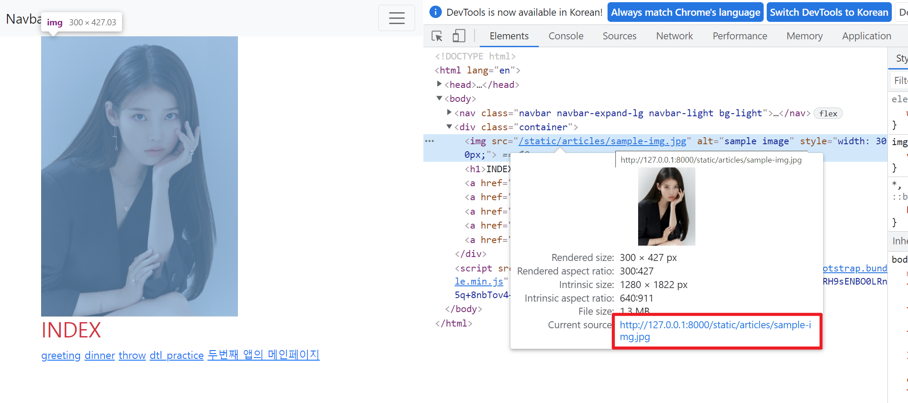

[TOC]

# Static files

**Static files**

- 정적 파일 
- 응답할 때 별도의 처리 없이 파일 내용을 그대로 보여주면 되는 파일 
- 사용자의 요청에 따라 내용이 바뀌는 것이 아니라 요청한 것을 그대로 보여주는 파일 
- 예를 들어, 웹 사이트는 일반적으로 이미지, 자바 스크립트 또는 CSS와 같은 미리 준비된 추가 파일(움직이지 않는)을 제공해야 함 
- Django에서는 이러한 파일들을 “static file”이라 함
- Django는 내부적으로 staticfiles라는 앱을 통해 정적 파일과 관련된 기능을 제공

> https://docs.djangoproject.com/en/3.1/howto/static-files/#managing-static-files-e-g-images-javascript-css

<br>

## Static files 구성

1. django.contrib.staticfiles 앱이 `INSTALLED_APPS`에 있는지 확인
2. setting.py에 `STATIC_URL` 정의
   - `STATIC_URL = /static/`등
   - 앞 뒤에 / 빼먹지 말것!!!
3. 템플릿에서 static 템플릿 태그를 사용하여 static file이 있는 상대경로를 빌드
   - 같은 이름의 서로 다른 이미지를 서로 다른 앱에서 사용해야 할 경우가 있으므로, templates의 이름 공간을 사용하는 것 처럼 static의 이름 공간을 빌드해준다
   - `<appname>/templates/<appname>/`와 비슷한 방식으로, 아래 4번과 같이 지정해준다.
4. 만약 공통 템플릿과 같은 느낌으로, 공통 static파일을 사용하고 싶다면, `STATICFILES_DIRS`를 설정해준다.
5. 앱에 static file 저장하기 (`my_app/static/my_app/sample.jpg`)

<br>

**Django template tag**

- static 파일을 사용하기 위해서, 아래 두 개의 태그가 필요하다
- load가 필요한 이유는 static이 built-in tag가 아니기 때문이다.

- load
  - 사용자 정의 템플릿 태그 세트를 로드
  - 로드하는 라이브러리, 패키지에 등록된 모든 태그와 필터를 로드 
  - ``
- static
  - STATIC_ROOT에 저장된 정적 파일에 연결
  - `` 
  - 실제로는 `my_app/static/my_app/sample.jpg` 경로지만, django에서는 `my_app/static`(기본경로)을 조사하기 때문에, 이름 공간을 만들어준 것이다.

<br>

- 이미지 파일 위치 - `articles/static/articles/images/`
- static file 기본 경로
  - `app_name/static/`

<br>

## The staticfiles app

> https://docs.djangoproject.com/en/3.1/ref/contrib/staticfiles/#module-django.contrib.staticfiles

**`STATICFILES_DIRS`**

```python
STATICFILES_DIRS = [
    BASE_DIR / 'static',
]
```

- app/static/ 디렉토리 경로를 사용하는 것(기본 경로) 외에 추가적인 정적 파일 경로 목록을 정의하는 리스트
- 추가 파일 디렉토리에 대한 전체 경로를 포함하는 문자열 목록으로 작성되어야 함

<br>

**`STATIC_URL`**

```python
STATIC_URL = '/static/'
```

- STATIC_ROOT에 있는 정적 파일을 참조 할 때 사용할 URL 
- host/static/추가경로 식으로 만들어짐
- 개발 단계에서는 실제 정적 파일들이 저장되어 있는 app/static/(기본 경로) 및 STATICFILES_DIRS에 정의된 추가 경로들을 탐색함 
- 실제 파일이나 디렉토리가 아니며, URL로만 존재
- 비어 있지 않은 값으로 설정 한다면 반드시 slash(/)로 끝나야 함

<br>

**`STATIC_ROOT`**

- collectstatic이 배포를 위해 모든 정적 파일을 수집하는 디렉토리의 절대 경로 
- django 프로젝트에서 사용하는 모든 정적 파일을 한 곳에 모아 넣는 경로 
- 개발 과정에서 setting.py의 DEBUG 값이 True로 설정되어 있으면 해당 값은 작용되지 않음 => 동작하지 않음 
  - DEBUG를 False로 바꾸면 배포 단계로 바꾼다.
  - 배포 단계에서는, 개발 단계와는 달리 에러가 났을 때 내부 코드를 통해 어디서 에러가 났는지 알려주지 않는다.

- 다른 서버로 올릴 때는, 다른 서버에서는 static 파일이 어디 있는지 모르기 때문에, 모아주는 것!
- 직접 작성하지 않으면 django 프로젝트에서는 setting.py에 작성되어 있지 않음 
- 실 서비스 환경(배포 환경)에서 django의 모든 정적 파일을 다른 웹 서버가 직접 제공하기 위함

> [참고] **collectstatic**
>
> - 프로젝트 배포 시 흩어져있는 정적 파일들을 모아 특정 디렉토리로 옮기는 작업
> - bash에서 아래 명령어를 입력할 경우, staticfiles라는 폴더에 모든 static파일이 복사됨
>
> ```python
> # settings.py 예시
> 
> STATIC_ROOT = BASE_DIR / 'staticfiles'
> ```
>
> ```bash
> $ python manage.py collectstatic
> ```

<br>

### static file 사용하기

1. 기본경로

   - `article/static/articles/` 경로에 이미지 파일 위치

     ```django
     <!-- articles/index.html -->
     
     
     
     
     
       
       ...
     
     ```

   	- 이미지 파일 위치 - `articles/static/articles/`

    - static file 기본 경로
      - `app_name/static/`

2. 추가 경로

   - `static/` 경로에 CSS 파일 위치

```django
<!-- base.html -->
<!-- base.html 안에 이 template를 상속받는 template들이 각각 style을 지정할 수 있게끔 추가적인 block을 만들어 준다. -->

<head>
  
</head>
```

```python
# settings.py

STATICFILES_DIRS = [
    BASE_DIR / 'static',
]
```

```django
<!-- articles/index.html -->





  <link rel="stylesheet" href="">

```

```css
/* static/style.css */

h1 {
    color: crimson;
}
```


<br>

**STATIC_URL 확인해보기**

****
