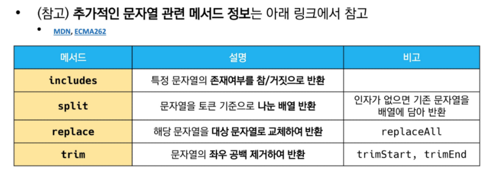
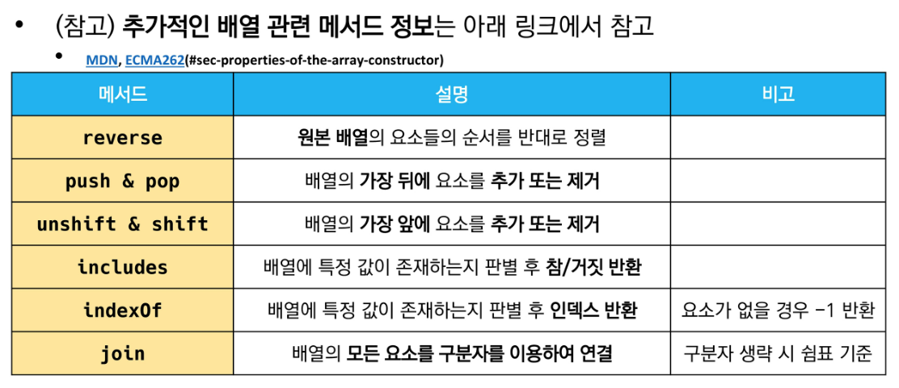
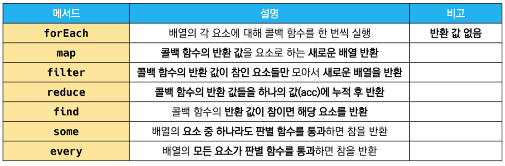
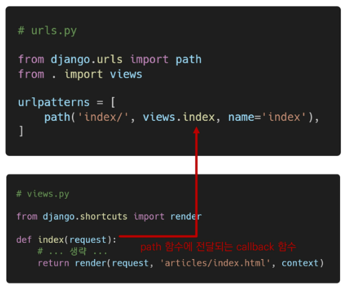

# Javascript Intor

- 동작 방식
  - HTML, CSS
- 브라우저
  - URL로 웹을 탐색하며 거버와 통신하고
- JavaScript의 필요성
  - 브라우저 화면을 '동적'으로 만들기 위함
  - 브라우저를 조작할 수 있는 **유일한** 언어


## Browser

### 1. 브라우저에서 할 수 있는 일

- DOM 조작
  - 문서(HTML) 조작
- BOM 조작
  - navigator, screen, location, frames, history, XHR
- JavaScript 


---

### DOM이란?

- HTML, XML과 같은 문서를 다루기 위한 프로그래밍 인터페이스

- 문서를 구조화하고 구조화된 구성 요소를 하나의 객체로 취급하여 다루는 논리적 트리 모델

- 문서가 객체로 구조화되어 있으면 key로 접근 가능


### DOM 해석

- 파싱
  - 구문 분석, 해석
  - 브라우저가 문자열을 해석하여 DOM Tree로 만드는 과정

### 정리

브라우저(BOM)과 그 내부의 문서(DOM)를 조작하기 위해 ECMAScript(JS)를 학습

## 1. ECMAScript

### ECMA?

- DCMA
  - 정보 통신에 대한 표준을 제정하는 비영리 표준화 기구
- DCMAScript는 ECMA에서 규격에 따라 정의한 언어
- ECMAScript6는 ECMA에서 제안하는 6번째 표준명세를 말함
  - ECMAScript6의 발표 연도에 따라 ECMAScript2015라고도 불림


## 세미콜론

- 자바스크립트는 세미콜론을 선택적으로 사용 가능
- 세미콜론이 없으면 ASI에 의해 자동으로 세미콜론이 삽입됨
  - ASI: 자동 세미콜론 삽입 규칙
- 본 수업에서는 자바스크립트의 문법 및 개념적 측면에 집중하기 위해 세미콜론을 사용하지 않고 진행


## 코딩 스타일 가이드

- 코딩 스타일 가이드의 핵심으 합의된 원칙과 일관성


- 다양한 자바스크립트 코딩 스타일 가이드
  - Airbnb
  - google
  - 


## 변수와 식별자

### 식별자 정의와 특징

- 식별자는 변수를 구분할 수 있는 변수명을 말함
- 식별자는 반드시 문자, 달러($) 또는 밑줄(_)로 시작
- 대소문자를 구분, 클래스명 외에는 모두 소문자로 시작


### 식별자 작성 스타일

- 카멜 케이스 (myInfo)
  - 변수, 객체, 함수에 사용
  - 두 번째 단어의 첫 글자부터 대문자

- 파스칼 케이스
  - 클래스, 생성자에 사용

- 대문자 스네이크 케이스(API_KEY)
  - 상수에 사용
    - 개발자의 의도에 따라 변경하지 말아야 할 값을 의미!
    - 건들지 마! 다 이거 써!


- let 
  - 재할당 할 예정인 변수 선언 시 사용


### 선언, 할당, 초기화

- 선언
  - 변수를 생성하는 행위 또는 시점
- 할당
  - 선언된 변수에 값을 저장하는 행위 또는 시점
- 초기화
  - 선언된 변수에 처음으로 값을 저장하는 행위 또는 시점

```javascript
let foo				// 선언
console.log(foo)	// undefined

foo = 11			// 할당
console.log(foo)	

let bar = 0			// 선언 + 할당
console.log(bar)
```


```js
let number 10		// 1. 선언 및 초기값 할당
number = 10			// 2. 재할당

console.log(number) // 10

const number = 10	// 1. 선언 및 초기값 할당
number = 10			// 2. 재할당 불가능
// Uncaught TypeError: Assignment to constant variable
// 못 하는 것은 값을 바꾸는 게 아니라 재할당!!!
// 값이 바꾸는 것은 가능! 재할당은 불가!
// '=' 다시 말해 불가

```

```js
let number = 10 // 선언 및 초기값 할당
let number = 50 // 2. 재선언 불가능

const number = 10 // 선언 및 초기값 할당
const number = 50 // 2. 재선언 불가능
```


변수 선언 키워드(let, const)

- 블록 스코프
  - if, for, 함수 등의 중괄호 내부를 가리킴
  - 블록 스코프를 가지는 변수는 블록 바깥에서 접근 불가능

```js
let x = 1

if (x==1) {
    let x = 2
    console.log(x)  // 2
}

console.log(x)		// 1
```


### 변수 선언 키워드 - 'var'

- var
  - var로 선언한 변수는 재선언 및 재할당 모두 가능
  - var을 쓰는 것은 지양하자.

- 호이스팅
  - 변수를 선언 이전에 참조할 수 있는 현상
  - 변수 선언 이전의 위치에서 접근 시 undefined를 반환


## 데이터 타입

### 데이터 타입 종류

- 자바스크립트의 모든 값은 특정한 데이터 타입을 가짐
- 크게 원시 타입(Primitive type)과 참조 타입(Reference type)으로 분류됨


- 파이썬의 None을 두 개로 쪼갠 타입들
  - undefined, null


- Reference type
  - Objects
    - Array
    - Function
    - ...


- 원시 타입(Primitive type)
  - 객체(object)가 아닌 기본 타입
  - 변수에 해당 타입의 값이 담김
  - 다른 변수에 복사할 때 실제 값이 복사됨
- 참조 타입
  - 객체 타입의 자료형
  - 변수에 해당 객체의 참조 값이 담김
  - 다른 변수에 복사할 때 참조 값이 복사됨


- 원시 타입
  - e = Infinity
  - f = -Infinity
  - NaN => 'asdf' / 100 => 에러를 내는 게 아님!
    - NaN은 숫자형 자료형


- 템플릿 리터럴 => f스트링 비슷한거


- undefined
  - 변수의 값이 없음을 나타내는 데이터 타입
  - 변수 선언 이후 직접 값을 할당하지 않으면 자동으로 undefined가 할당됨


- null
  - 변수의 값이 없음을 **의도적**으로 표현할 때 사용하는 데이터 타입
    - **직접 입력**해서, 의도적으로 표현할 때
  - null 타입과 typeof 연산자
    - typeof(null) => object


- 자바스크립트에서는 if([]) == True


- 특이한 연산자
  - ++
  - --

== 동등 비교 연산자

- **예상치 못한 결과가 발생할 수 있으므로 특별한 경우를 제외하고는 사용하지 않음**

- 1 == '1' => True!

  

=== 일치 비교 연산자

- python에서의 ==
- 두 피연산자가 같은 값으로 평가되는지 비교 후 boolean 값을 반환
- 엄격한 비교가 이뤄지며 암묵적 타입 변환이 발생하지 않음
  - 엄격한 비교

- 두 피연산자가 모두 객체일 경우 메모리의 같은 객체를 바라보는지 판별


- 논리 연산자
  - 세 가지 논리 연산자로 구성
  - and => `&&`연산자를 이용
  - or 연산은 `||` 연산자를 이용
  - not 연산은 `!`연산자를 이용

- 단축 평가도 파이썬과 동일하게 지원
  - 1 && 2 && 3 && 4 => 4
  - 1 || 2 || 3 || 4 => 1
- !true => false
- !!true => true
- !'bonjure' => false


- 삼항 연산자
  - 파이썬에서의 조건 표현식과 비슷
  - 세 개의 피연산자를 사용하여 조건에 따라 값을 반환하는 연산자
  - 가장 왼쪽의 조건식이 참이면 콜론 앞의 값을 사용하고 그렇지 않으면 콜론 뒤의 값을 사용
  - 삼항 연산자의 **결과값**이기 때문에 변수에 할당 가능
    - 단항, 이항 연산자도 동일하게 결과값!

```js
console.log(true ? 1:2) // 1
console.log(false ? 1:2) // 2
```


- 참고: 단항 연산자 => -1, !1, 이항 연산자 => 1+2


조건문

조건문의 종류와 특징

- if statement
  - 조건 표현식의 결과값을 Boolean 타입으로 변환 후 참/거짓을 판다
- switch


- if, else if, else
  - 조건은 소괄호 안에 작성()


switch statement

- python switch statement도 엄청 최근에 도입

```js
    let n = 3
    switch (n) {
      case 1:
        console.log('장학금')
        // break; // 주석을 남겨 놓고 이유까지 달아 줌 => 내가 일부로 break를 넣지 않았다고 표현
      case 2:
        console.log('메달')
        // break

      case 3:
        console.log('상장')
        // break 
        //default: // 3등 미만 없음
    }
```


반복문의 종류와 특징

- while
- for: 불편
- for in
- for of


자바스크립트에서의 객체는 딕셔너리!!!

- 객체의 속성들을 순회할 때 사용

  === 딕셔너리의 속성들을 순회할 때 사용


```js
const fruits = ['딸기', '사과', '수박']

for (const fruit of fruits) {
    console.log
}

// 위도 돈다. 블록 스코프이기 때문에 반복 한 번이 끝나면 종료
// fruit를 안에서 변환해서 쓸거면 let, 아니면 const
```


- 언제 let? 언제 const?
  - let
    - 재할당 할 예정인 변수 선언 시 사용
  - const
    - 재할당 할 예정이 없는 변수 선언 시 사용
    - 기본적으로 재할당 할 일이 없다고 가정 하고, 있을 때 let을 써라
    - 실제 알고리즘 풀이를 제외한 코드에서는 let보다 const를 많이 쓴다.
      - let 쓸 일이 거의 없다.


const 변수 => 특정 메모리 영역을 가리키는 것

가리키는 곳을 못 바꾼다는 것이지 내용물을 못 바꾼다는 것이 아님 따라서 리스트 안의 인자는 바꿀 수 있음


of 반복문을 쓸 때, 앞에 let을 안 붙이면 함수 바깥에서도 사용 가능 => 지양하자


## 함수

### 함수 in javascript

- 참조 타입 중 하나로써 function 타입에 속함
- JavaScript에서 함수를 정의하는 방법은 주로 2가지로 구분
  - 함수 선언식
  - 함수 표현식
- JavaScript의 함수는 일급 객체에 해당


### 함수 선언식

- 함수의 이름과 함께 정의하는 방식
- 3가지 부분으로 구성
  - 함수의 이름

```js
function add(n1, n2) {
    return n1 + n2;
}

let c = add(10, 20)
console.log(c)


```


### 함수 표현식

- 함수를 표현식 내에서 정의하는 방식
- 함수의 이름을 생략하고 익명 함수로 정의

```js
// 아래와 같은 식으로 함수를 불러오는 게 아니라 함수를 변수에 지정해서도 사용 가능
// 메모리에 함수 코드 자체가 들어가 있음 => add(10, 20)을 만나면 그 함수가 있는 곳으로 가서 코드를 실행하고 return을 만나면 돌아옴
// 함수가 저장될 주소 정보를 add가 갖고 있도록 함, 변수인 add를 이용해서 함수를 이용할 수 있게 함
// c언어의 함수 포인터
const add = function(n1, n2) {
    return n1 + n2;
}
// add(10, 20) => 30
// typeof(add) => function
```


### 기본 인자

```js

function add(n1, n2) {
    return n1 + n2;
}
add(1) // => NAN

function add(n1, n2) {
    return n1 + n2;
}
add(1) // => 1


const add2 = function(n1, n2=0){
    return n1 + n2
}
add2(1) // => 1


```

```js
const greeting = function(name = 'Anonumous'){
    return 'Hi ${name} ' //문자열 안에 변수를 넣을 때
}

greeting() // 
greeting('오른') // 
```


## 선언식 vs 표현식

### 함수 선언식과 표현식 비교 정리


선언식을 쓸 때 호이스팅이 가능한 이유는 먼저 함수 테이블을 만들어줘서

표현식에서는 변수가 함수의 좌표를 지정하는지 어쩐지 모른다.

```js
console.log(add2(10, 10))
var add2 = function(n1=0, n2=0){
    return n1 + n2
}
// => 함수가 아님! 에러가 남
// 즉 var이니 호이스팅은 되는데, 뒤의 함수쪽은 표현식이므로 선언이 되지 않아서 이런 오류가 나는 것
// const add2 일때는 다른 오류가 난다.
```


### 화살표 함수

- 함수를 비교적 간결하게 정의할 수 있는 문법
- function 키워드 생략 가능
- 


## 문자열(String)

### - 문자열 관련 주요 메서드 목록



#### 1. includes

- string.includes(value)
  - 문자열에 value가 존재하는지 판별 후 참 또는 거짓 반환

```js
const str = 'a santa at nasa'
str.includes('santa') // true
str.includes('asan') // false

```

#### 2. split

- string.split(value)
  - value가 없을 경우, 기존 문자열을 **배열에 담아** 반환
  - value가 빈 문자열일 경우 각 문자로 나눈 **배열을 반환**
  - value가 기타 문자열일 경우, 해당 문자열로 나눈 **배열을 반환**

```js
const str = 'a cup'

str.split() // ['a cup']
str.split('') // ['a', ' ', 'c', 'u', 'p']
str.split(' ') // ['a', 'cup']
```

#### 3. replace

- string.replace(from, to)
  - 문자열에 from 값이 존재할 경우, 1개만 to 값으로 교체하여 반환
- string.replaceAll(from, to)
  - 문자열에 from 값이 존재할 경우, 모두 to 값으로 교체하여 반환

```js
const str = 'a b c d'
str.replace(' ', '-') // 'a-b c d'
str.replaceAll(' ', '-') // 'a-b-c-d'
```

#### 4. trim

- string.trim()
  - 문자열 시작과 끝의 모든 공백문자(스페이스, 탭, 엔터 등)를 제거한 문자열 반환
- string.trimStart()
  - 문자열 시작의 공백문자(스페이스, 탭, 엔터 등)를 제거한 문자열 반환
- string.trimEnd()
  - 문자열 끝의 공백문자(스페이스, 탭, 엔터)를 제거한 문자열 반환

```js
const str = '	hello	'

str.trim() // 'hello'
str.trimStart() // 'hello	'
str.trimEnd()) // '    hello'
```


## 배열

### - 배열의 정의와 특징

- 키와 속성들을 담고 있는 참조 타입의 객체(object)
- 순서를 보장하는 특징이 있음
- 주로 대괄호를 이용하여 생성하고, 0을 포함한 양의 정수 인덱스로 특정 값에 접근 가능
- 배열의 길이는 array.length 형태로 접근 가능
  - (참고) 배열의 마지막 원소는 [array.length-1] 로 접근(파이썬에서처럼 [-1] 불가)

```js
const numbers = [1, 2, 3, 4, 5]
console.log(numbers[0])		// 1
console.log(numbers[-1]) 	// undefined
console.log(numbers.length) // 5

console.log(numbers[numbers.length - 1]) // 5
console.log(numbers[numbers.length - 2]) // 4
console.log(numbers[numbers.length - 3]) // 3
console.log(numbers[numbers.length - 4) // 2
console.log(numbers[numbers.length - 5) // 1
```


### - 배열 관련 주요 메서드 목록 - 기본 배열 조작



#### 1. reverse

- array.reverse()
  - 원본 배열의 요소들의 순서를 반대로 정렬

```js
const = numbers = [1, 2, 3, 4, 5]

numbers.reverse()

console.log(numbers) // [5, 4, 3, 2, 1]
```


#### 2. push & pop

- array.push()
  - 배열의 가장 뒤에 요소 추가
- array.pop()
  - 배열의 마지막 요소 제거

```js
const = numbers = [1, 2, 3, 4, 5]

numbers.push(100)

console.log(numbers) // [1, 2, 3, 4, 5, 100]

numbers.pop()

console.log(numbers) // [1, 2, 3, 4, 5]
```


#### 3. unshift & shift

- array.unshift()
  - 배열의 가장 앞에 요소 추가
- array.shift()
  - 배열의 첫번째 요소 제거

```js
const numbers = [1, 2, 3, 4, 5]

numbers.unshift(100)

console.log(numbers) // [100, 1, 2, 3, 4, 5]

numbers.shift()

console.log(numbers) // [1, 2, 3, 4, 5]
```


#### 4. includes

- array.includes(value)
  - 배열에 특정 값이 존재하는지 판별 후 참 또는 거짓 반환

```js
const numbers = [1, 2, 3, 4, 5]

console.log(numbers.include(1)) // true

console.log(numbers.include(100)) // false
```


#### 5. indexOf(value)

- array.indexOf(value)
  - 배열에 특정 값이 존재하는지 확인 후 가장 첫 번째로 찾은 요소의 인덱스 반환
  - 만약 해당 값이 없을 경우 -1 반환

```js
const numbers = [1, 2, 3, 4, 5]
let result

result = numbers.indexOF
```


### - 배열 관련 주요 메서드 목록 - 심화

- 배열을 순회하며 특정 로직을 수행하는 메서드
- 메서드 호출 시 인자로 callbakc 함수를 받는 것이 특징
  - callback 함수란 어떤 함수의 내부에서 실행될 목적으로 인자로 넘겨받는 함수를 말함



- callback 함수의 예시 - django에서 path 함수 안의 함수

#### 1. forEach

- array.forEach(callback(element[, index[,array]]))
  - 배열의 각 요소에 대해 콜백 함수를 한 번씩 실행
  - 콜백 함수는 3가지 매개변수로 구성
    - element: 배열의 요소
    - index: 배열 요소의 인덱스
    - array: 배열 자체
  - 반환 값(return)이 없는 메서드


## 객체(Objects)

### 객체의 정의와 특징

- 객체는 속성(property)의 집합이며, 중괄호 내부에 key와 value의 쌍으로 표현
- key는 문자열 타입*만 가능
  - 참고: key 이름에 띄어쓰기 등의 구분자가 있으면 따옴표로 묶어서 표현
- value는 모든 타입(함수포함) 가능
- 객체 요소 접근은 점 또는 대괄호로 가능
  - 점 접근일 때는 키에 따옴표를 붙이지 않아도 되지만, 대괄호 접근일 때는 붙여주어야 한다.
  - 참고: key 이름에 띄어쓰기 같은 구분자가 있으면 대괄호 접근만 가능

```js
const me = {
    name: 'Jack',
    phoneNumber: '01012345678',
    'samsung products' : {
    buds: 'Galaxy Buds pro',
    galaxy: 'Galaxy s20'
}
}

console.log(me.name) // === console.log(me['name'])
console.log(me.phoneNumber) // === console.log(me[phoneNumber])
console.log(me['samsung products'].buds)
```

### 객체와 메서드

- 메서드는 어떤 객체의 속성이 참조하는 함수.
- 객체.메서드명() 으로 호출 가능.
- 메서드 내부에서는 this 키워드가 객체를 의미함
  - fullName은 메서드가 아니기 때문에 정상출력 되지 않음(NaN)
  - getFullName은 메서드이기 때문에 해당 객체의 firstName과 lastName을 정상적으로 이어서 반환


JSON

- key-value쌍의 형태로 데이터를 표기하는 언어 독립적 표준 포맷
- 자바스크립트의 객체와 유사하게 생겼으나 실제로는 문자열 타입
  - 따라서 JS의 객체로써 조작하기 위해서는 구문 분석(parsing)이 필수
  - JSON(JavaScript Object Notation)예시

```js
function getFullName() {
    return this.firstName + this.lastName
}

const me = {
    firstName: 'John',
    last
}
```

