# Javascript Intro

[toc]


- JavaScript의 필요성
  - 브라우저 화면을 '동적'으로 만들기 위함
  - 브라우저를 조작할 수 있는 **유일한** 언어


## 1. Browser

### 1. 브라우저에서 할 수 있는 일

- 브라우저
  - URL로 웹(WWW)을 탐색하며 서버와 통신하고, HTML 문서나 파일을 출력하는 GUI 기반의 소프트웨어
  - 인터넷의 컨텐츠를 검색 및 열람하도록 함
  - 웹 브라우저 라고도 함

- DOM 조작
  - 문서(HTML) 조작
- BOM 조작
  - navigator, screen, location, frames, history, XHR
- JavaScript  Core(ECMAScript)
  - Data Structure(Object, Array), Conditional Expression, Iteration


---

### 2. DOM이란?


- HTML, XML과 같은 문서를 다루기 위한 프로그래밍 인터페이스

- 문서를 구조화하고 구조화된 구성 요소를 하나의 객체로 취급하여 다루는 논리적 트리 모델

- 문서가 객체(object)로 구조화되어 있으면 key로 접근 가능

- 단순한 속성 접근, 메서드 활용뿐만 아니라 프로그래밍 언어적 특성을 활용한 조작 가능

- 주요 객체

  - window: DOM을 표현하는 창(브라우저 탭). 최상위 객체(작성 시 생략 가능)
  - document: 페이지 컨텐츠의 Entry Point 역할을 하며, `<head>`, `<body>` 등과 같은 수많은 다른 요소들을 포함
  - navigator, location, history, screen

  

### 3. DOM 해석

- 파싱(Parsing)
  - 구문 분석, 해석
  - 브라우저가 문자열을 해석하여 DOM Tree로 만드는 과정

```js
// 개발자 도구에서

document.title // 탭의 이름이 나옴

document.titla = 'javascript' // 탭의 이름이 변함
```


### 4. BOM 이란?

- Browser Object Model
- 자바스크립트가 브라우저와 소통하기 위한 모델
- 브라우저의 창이나 프레임을 추상화해서 프로그래밍적으로 제어할 수 있도록 제공하는 수단
  - 버튼, URL 입력창, 타이틀 바 등 브라우저 윈도우 및 웹 페이지 일부분을 제어 가능
- window 객체는 모든 브라우저로부터 지원받으며 브라우저의 창(window)를 지칭
- BOM 조작
  - document도 브라우저 내에 종속되어 있기 때문에 window 전역 객체에 포함

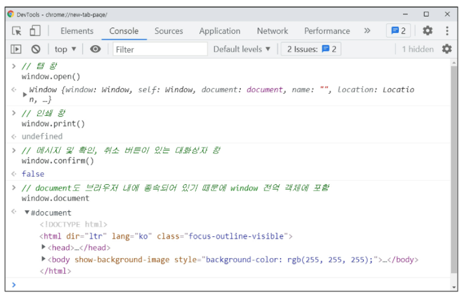

### 5. JavaScript Core

- 브라우저(BOM & DOM)을 조작하기 위한 명령어 약속(프로그래밍 언어)


### 6. 정리

브라우저(BOM)과 그 내부의 문서(DOM)를 조작하기 위해 ECMAScript(JS)를 학습


## 2. ECMAScript

### 1. ECMA란?

- ECMA(ECMA International)
  - 정보 통신에 대한 **표준을 제정하는 비영리 표준화 기구**
- ECMAScript는 ECMA에서 ECMA-262 규격에 따라 정의한 언어
  - ECMA-262: 범용적인 목적의 프로그래밍 언어에 대한 명세

- ECMAScript6는 ECMA에서 제안하는 **6번째 표준명세**를 말함
  - ECMAScript6의 발표 연도에 따라 ECMAScript2015라고도 불림
  - 이 이전과 이후의 JS는 많이 다르기 때문에, 기준적인 명세라고 보면 된다.


## 3. 세미콜론

- 자바스크립트는 세미콜론을 **선택적으로** 사용 가능
- 세미콜론이 없으면 ASI에 의해 자동으로 세미콜론이 삽입됨
  - ASI: 자동 세미콜론 삽입 규칙
- 본 수업에서는 자바스크립트의 문법 및 개념적 측면에 집중하기 위해 세미콜론을 사용하지 않고 진행
  - 프로그래머들 사이에서도 논란이 많은데, JS의 아버지 개발자도 필요 없지 않나? 하는중


## 4. 코딩 스타일 가이드

- 코딩 스타일 가이드의 **핵심은 합의된 원칙과 일관성**
  - 절대적인 하나의 정답은 없으며, 상황에 맞게 원칙을 정하고 일관성 있게 사용하는 것이 중요

- 코딩 스타일은 코드의 품질에 직결되는 중요한 요소
  - 코드의 가독성, 유지보수 또는 팀원과의 커뮤니케이션 등 **개발 과정 전체에 영향을 끼침**

- 다양한 자바스크립트 코딩 스타일 가이드
  - Airbnb Javascript Style Guide - 수업에서 약간의 변형 후 사용
  - Google Javascript Style Guide
  - standardjs


## 5. 변수와 식별자

### 1. 식별자 정의와 특징

- 식별자(identifier)는 변수를 구분할 수 있는 변수명을 말함
- 식별자는 반드시 문자, 달러($) 또는 밑줄(_)로 시작
- 대소문자를 구분하며, 클래스명 외에는 모두 소문자로 시작
- 예약어 사용 불가능
  - 예약어 예시:for, if, fucntion 등


### 2. 식별자 작성 스타일

- 카멜 케이스 (myInfo, camelCase : lower-camel-case)
  - 변수, 객체, 함수에 사용
  - 두 번째 단어의 첫 글자부터 대문자

- 파스칼 케이스(PascalCase : upper-camel-case)
  - 클래스, 생성자에 사용

- 대문자 스네이크 케이스(SNAKE_CASE, API_KEY)
  - 상수에 사용
    - 개발자의 의도에 따라 변경하지 말아야 할 값을 의미!
    - 건들지 마! 다 이거 써!


### 3. 선언, 할당, 초기화

- 변수 선언 키워드

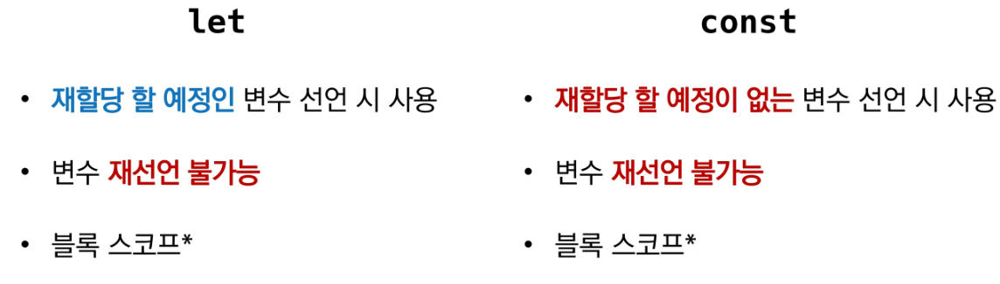

- 선언
  - **변수를 생성**하는 행위 또는 시점
  - const, let 둘 다 재선언 불가
- 할당
  - 선언된 **변수에 값을 저장**하는 행위 또는 시점
  - let은 재할당 가능, const는 불가
- 초기화
  - 선언된 변수에 **처음으로** **값을 저장**하는 행위 또는 시점
  - let은 선언과 동시에 임의의 값이 할당되지만, const는 그렇지 않기 때문에 선언과 동시에 직접 초기화를 해 주어야 한다.
    - 이는 const에 재할당이 불가능하다는 것에서도 유추 가능하다.

```javascript
let foo				// 선언
console.log(foo)	// undefined

foo = 11			// 할당
console.log(foo)	

let bar = 0			// 선언 + 할당
console.log(bar)
```

```js
let number 10		// 1. 선언 및 초기값 할당
number = 10			// 2. 재할당

console.log(number) // 10

const number = 10	// 1. 선언 및 초기값 할당
number = 10			// 2. 재할당 불가능

// Uncaught TypeError: Assignment to constant variable
// 못 하는 것은 값을 바꾸는 게 아니라 재할당!!!
// 값이 바꾸는 것은 가능! 재할당은 불가!
// '=' 다시 말해 불가
// 어떤 좌표를 가리키는 화살표가 바뀌는 것은 불가, 화살표 안의 내용물이 바뀌는 것은 가능
```

```js
let number = 10 // 선언 및 초기값 할당
let number = 50 // 2. 재선언 불가능

const number = 10 // 선언 및 초기값 할당
const number = 50 // 2. 재선언 불가능
```

- 언제 let? 언제 const?

  - let
    - 재할당 할 예정인 변수 선언 시 사용

  - const

    - 재할당 할 예정이 없는 변수 선언 시 사용

  - 실제 알고리즘 풀이를 제외한 코드에서는 let보다 const를 많이 쓴다.

    - 즉 let 쓸 일이 많지 않다.

    - 기본적으로 재할당 할 일이 없다고 가정해 const를 쓰고, 있을 때 let을 써라

      

### 4. 블록 스코프

- 블록 스코프
  - **if, for, 함수 등의** 중괄호 내부를 가리킴
  - 블록 스코프를 가지는 변수 - 블록 내부에서 선언된 변수 - 는 **블록 바깥에서 접근 불가능**
  - 하위 스코프는 상위 스코프에 접근할 수 있지만 반대는 불가능하다
    - 즉 블록 내부에서는 블록 바깥에서 정의된 변수에 접근할 수 있지만 반대는 불가능하다.

```js
let x = 1

if (x==1) {
    let x = 2
    console.log(x)  // 2
}

console.log(x)		// 1
```


### 5. 변수 선언 키워드 - 'var'

- var
  - var로 선언한 변수는 재선언 및 재할당 모두 가능
  - ES6 이전에 변수를 선언할 때 사용되던 키워드
    - ES6 이후부터는 var 대신 const와 let을 사용하는 것을 권장
  - 호이스팅되는 특성으로 인해 예기치 못한 문제 발생 가능

```js
var number = 10 // 1. 선언 및 초기값 할당
var number = 50 // 2. 재할당

// 재선언 및 재할당 모두 가능
```


- 함수 스코프(function scope)
  - **함수**의 중괄호 내부를 기리킴
  - 함수 스코프를 가지는 변수는 함수 바깥에서 접근 불가능

```js
function foo() {
    var x = 5
    console.log(x) // 5
}

console.log(x) // ReferenceError: x is not defined
```


- 호이스팅
  - 변수를 선언 이전에 참조할 수 있는 현상
  - 변수 선언 이전의 위치에서 접근 시 undefined를 반환
    - 에러가 나는 것이 바람직함

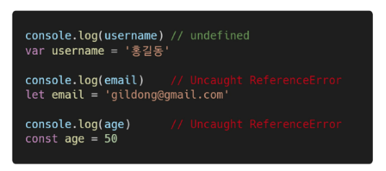


### 6. 정리: let, const, var 비교

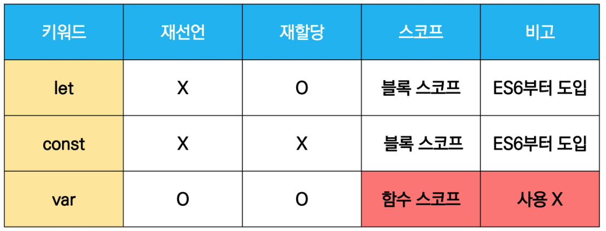

## 6. 데이터 타입

### 1. 데이터 타입 종류

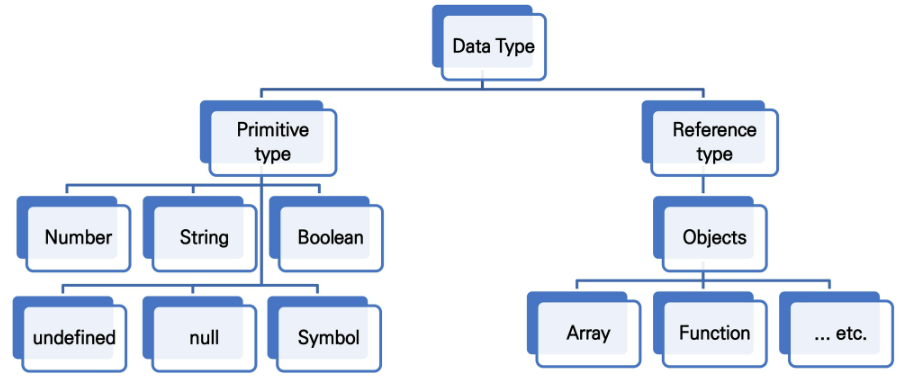

- 자바스크립트의 모든 값은 특정한 데이터 타입을 가짐
- 크게 원시 타입(Primitive type)과 참조 타입(Reference type)으로 분류됨


### 2. 원시 타입과 참조 타입 비교

- 원시 타입(Primitive type)
  - 객체(object가 아닌 기본 타입)
  - 변수에 해당 타입의 값이 담김
  - 다른 변수에 복사할 때 **실제 값이 복사됨**
- 참조 타입(Reference type)
  - 객체(object) 타입의 자료형
  - 변수에 해당 객체의 참조 값이 담김
  - 다른 변수에 복사할 때 **참조 값이 복사됨**

```js
// 원시 타입

let message = '안녕하세요' // message 선언 및 할당

let greeting = message // greeting에 message 복사
console.log(greeting) // 안녕하세요 출력

message = 'hello world' // message 재할당
console.log(greeting) // 그대로 안녕하세요 출력

// => 즉 원시 타입은 실제 해당 타입의 값을 변수에 저장한다.
```

```js
// 참조 타입

const message = ['안녕하세요']

const greeting = message // greeting에 message 복사
console.log(greeting) // ['안녕하세요'] 출력

message[0] = 'Hello, World!' // message 재할당
console.log(message) // ['Hello, World!'] 출력

// => 즉, 참조 타입은 해당 객체를 참조할 수 있는 참조 값을 저장한다.
```


### 3. 원시 타입

#### 1. 숫자(Number) 타입

- 정수, 실수, 구분 없는 하나의 숫자 타입
- 부동소수점 형식을 따름

- 참고: NaN(Not-a-Number)
  - 계산 불가능할 경우 반환되는 값
  - python에서처럼 에러를 내는 게 아니라 값을 반환한다.
  - 예시: `'아바바바' / 1004`  => NaN

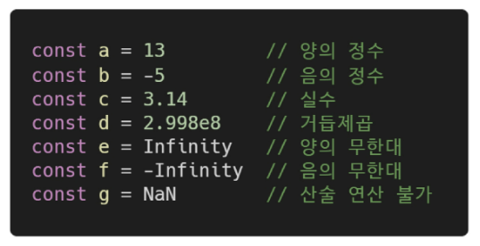

#### 2. 문자열(String)타입

- 텍스트 데이터를 나타내는 타입
- 16비트 유니코드 문자의 집합
- 작은따옴표 또는 큰따옴표 모두 가능
- 템플릿 리터럴(Template Literal)
  - ES6부터 지원
  - 따옴표 대신 backtick(``)으로 표현
  - ${expression} 형태로 표현식 삽입 가능
  - python에서의 f-string과 유사

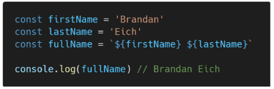

#### 3. undefined, null, Boolean

- undefined 타입
  - 변수의 값이 없음을 나타내는 데이터 타입
  - 변수 선언 이후 직접 값을 할당하지 않으면, 자동으로 undefined가 할당됨
- null 타입
  - 변수의 값이 없음을 의도적으로 표현할 때 사용하는 데이터 타입
  - 참고: null 타입은 ECMA 명세의 원시 타입의 정의에 따라 **원시 타입**에 속하지만, typeof 연산자의 결과는 객체(object)로 표현됨!
- undefined 타입과 null 타입 비교

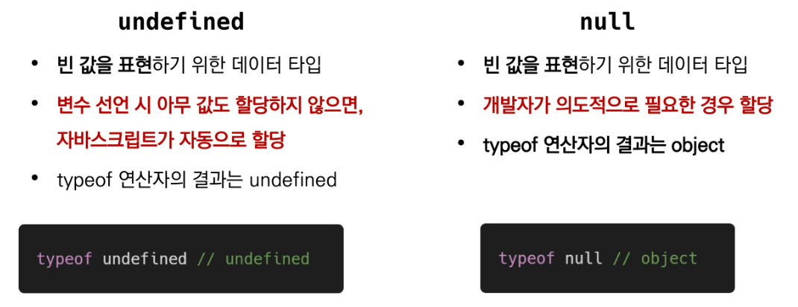

- Boolean 타입
  - 논리적 참 또는 것짓을 나타내는 타입
  - true 혹은 false로 표현 => 파이썬과는 다르게 두문자가 대문자가 아님
  - 조건문 또는 반복문에서 유용하게 사용
    - 조건문 또는 반복문에서 boolean이 아닌 데이터 타입은 자동 형변환 규칙에 따라 true 또는 false로 변환됨
  - 자동 형변환 정리
    - 파이썬과 다른 부분 숙지해 둘 것
      - 자바스크립트에서는 if([]) == True

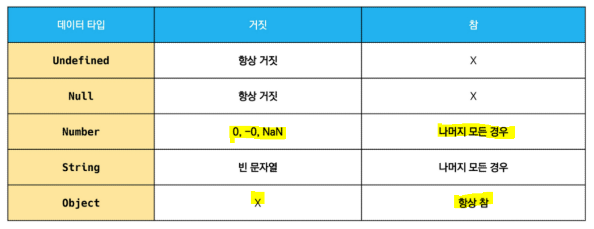


### 3. 참조 타입(Reference type)

- 자세한 내용은 해당 타입의 챕터 참고
- 타입 별 챕터
  - 함수(Functions)
  - 배열(Arrays)
  - 객체(Objects)


## 7. 연산자

### 1. 할당 연산자

- 파이썬과 비슷하지만, //가 없고 ++, --가 있다는 점이 다름
  - 아래에는 나와 있지 않지만 %(나머지) 도 지원
  - 몫을 구하는 // 연산자는 존재하지 않으므로 `parseInt(number)` 함수를 써서 구함

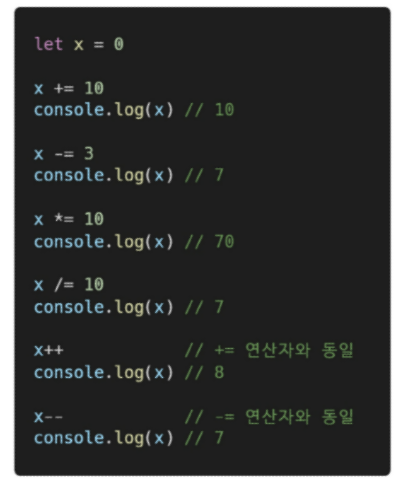

- 특이한 연산자
  - Increment(++): 피연산자의 값을 1 증가시키는 연산자
  - Decrement(--): 피연산자의 값을 1 감소시키는 연산자
  - Airbnb Style Guide에서는 +=나 -=과 같이 더 분명한 표현으로 적을 것을 권장

### 2. 비교 연산자

- 피연산자들(숫자, 문자, Boolean 등)을 비교하고 결과값을 boolean으로 반환하는 연산자
- 문자열은 유니코드 값을 사용하며 표준 사전 순서를 기반으로 비교
  - 알파벳끼리 비교할 경우
    - 알파벳 순서상 후순위가 더 큼
    - 소문자가 대문자보다 더 큼

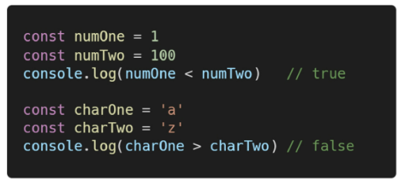

#### 1. == 동등 비교 연산자

- 두 피연산자가 같은 값으로 평가되는지 비교 후 boolean 값을 반환
- 비교할 때 암묵적 타입 변환을 통해 타입을 일치시킨 후 같은 값인지 비교
- 두 피연산자가 모두 객체일 경우 메모리의 같은 객체를 바라보는지 판별

- **예상치 못한 결과가 발생할 수 있으므로 특별한 경우를 제외하고는 사용하지 않음**

- `console.log(1 == '1')` => true!

  

#### 2. === 일치 비교 연산자

- python에서의 ==
- 두 피연산자가 같은 값으로 평가되는지 비교 후 boolean 값을 반환
- **엄격한 비교**가 이뤄지며 암묵적 타입 변환이 발생하지 않음
  - 엄격한 비교: 두 비교 대상의 타입과 값 모두 같은지 비교하는 방식
- 두 피연산자가 모두 객체일 경우 메모리의 같은 객체를 바라보는지 판별
- **!== 다르다는 것은 이렇게 표현**

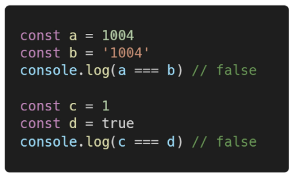


### 3. 논리 연산자

- 세 가지 논리 연산자로 구성
  - and => `&&`연산자를 이용
  - or 연산은 `||` 연산자를 이용
  - not 연산은 `!`연산자를 이용

- 단축 평가도 파이썬과 동일하게 지원
  - 1 && 2 && 3 && 4 => 4
  - 1 || 2 || 3 || 4 => 1
- !true => false
- !!true => true
- !'bonjure' => false


### 4. 삼항 연산자(Ternary Operator)

- 파이썬에서의 조건 표현식과 비슷
- **세 개의 피연산자를 사용**(삼항)하여 조건에 따라 값을 반환하는 연산자
- 가장 왼쪽의 조건식이 참이면 콜론 앞의 값을 사용하고 그렇지 않으면 콜론 뒤의 값을 사용
- 삼항 연산자의 **결과값**이기 때문에 변수에 할당 가능
  - 단항, 이항 연산자도 동일하게 결과값!

```js
console.log(true ? 1:2) // 1
console.log(false ? 1:2) // 2

const question = Math.PI > 4 ? 'Yes' : 'No'

console.log(question) // => No
```

- 참고
  - 단항 연산자 => `-1, !1`
  - 이항 연산자 => `1+2`


## 8. 조건문

### 1. 조건문의 종류와 특징

- `if` statement
  - 조건 표현식의 결과값을 Boolean 타입으로 변환 후 참/거짓을 판다
- `switch` statement
  - 조건 표현식의 결과값이 **어느 값(case)에 해당하는지 판별**
  - 참고
    - 주로 특정 변수의 값에 따라 조건을 분기할 때 활용
    - 조건이 많아질 경우 if 문보다 가독성이 나을 수 있음


### 2. if statement

- 조건은 소괄호(condition) 안에 작성
- 실행할 코드는 중괄호{} 안에 작성
- 블록 스코프 생성

- if, else if, else
  - 조건은 소괄호 안에 작성()
  - python에서의 elif 대신 else if를 씀
- if statement 예시

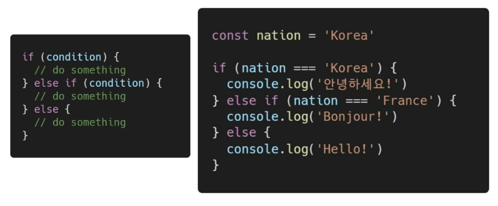


### 3. switch statement

- switch

  - **표현식**(expression)의 결과값을 이용한 조건문
    - **표현식의 결과값**과 **case문의 오른쪽** 값을 비교
  - break 및 default문은 [선택적]으로 사용 가능
    - break가 없으면 특정 case에서 걸린 후 이후 모든 조건문 실행
    - default는 if 문의 else와 유사
  - break문이 없는 경우 break문을 만나거나 default문을 실행할 때까지 다음 조건문 실행
  - 블록 스코프 생성

  - 최근에는 python에도 도입되었다.
  - switch statement 형식


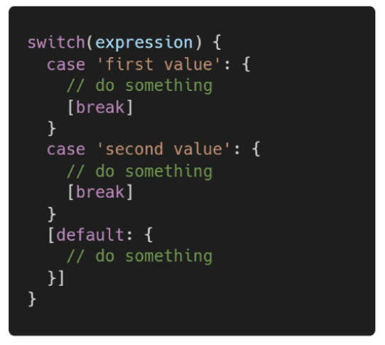

```js
// 1등일 경우에는 case 1에서 걸린 후 2, 3까지 실행

let n = 3
switch (n) {
    case 1:
        console.log('장학금')
        // break; // 주석을 남겨 놓고 이유까지 달아 줌 => 내가 일부로 break를 넣지 않았다고 표현
    case 2:
        console.log('메달')
        // break
    case 3:
        console.log('상장')
        // break 
        //default: // 3등 미만 없음
}
```

- if vs switch

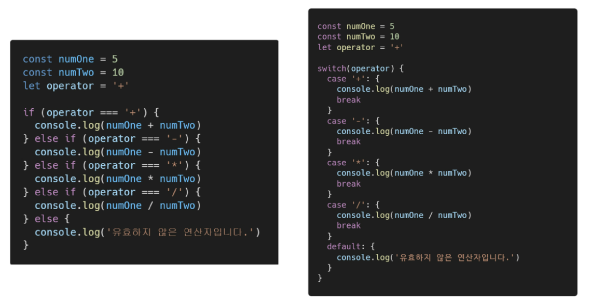

## 9. 반복문

### 1. 반복문의 종류와 특징

- while
- for
- for in
  - 주로 객체(object)의 속성들을 순회할 때 사용
  - 배열도 순회 가능하지만 인덱스 순으로 순회한다는 보장이 없으므로 권장하지 않음

- for of
  - 반복 가능한(iterable)* 객체를 순회하며 값을 꺼낼 때 사용
    - 반복 가능한(iterable) 객체의 종류: Array, Map, Set, String 등


### 2. while

- 조건문이 참인 동안 반복 시행
- break, continue 사용 가능
- 조건은 소괄호 안에 작성
- 실행할 코드는 중괄호 안에 작성
- 블록 스코프 생성
- while 반복문 형식

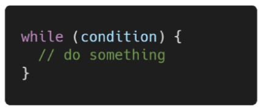

```js
let i = 0

while (i < 6) {
    console.log(i)
    i += 1
}

// 0, 1, 2, 3, 4, 5
// 이 경우, i는 while 문 바깥에서 선언되었기 때문에 전역 스코프를 가진다.
```


### 3. for

- 세미콜론(;)으로 구분되는 세 부분으로 구성
  1. initialization
     - 최초 반복문 진입 시 1회만 실행되는 부분
  2. condition
     - 매 반복 시행 전 평가되는 부분
  3. expression
     - 매 반복 시행 이후 평가되는 부분
- break, continue 사용 가능
- 블록 스코프 생성
- for 반복문 형식

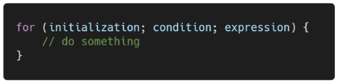

```js
// for문 예시

for (let i = 0; i < 6; i ++) {
	console.lot(i)
}

// 매 반복 시행 이후 i에 ++를 더해주기 때문에 let i 대신 const i 쓰면 망한다

// 0, 1, 2, 3, 4, 5
```


### 4. for...in

- 객체(object)에서 키가 지정된 모든 열거 가능한 속성(propertiy)들을 순회할 때 사용
  - key를 순회한다.

- 배열도 순회 가능하지만 권장하지 않는다.
  - 배열은 특수한 형식의 객체이기 때문에, 배열의 인덱스를 순환하게 된다.
  - 하지만 for...in 문에서는 인덱스의 순서에 따라 반환하는 것을 보장할 수 없기 때문에,
    사용하지 않는 것이 좋다.
  - 방문의 순서가 중요한 배열의 반복시에는 일반 for 문이나 for... of 문, forEach()를 사용하자

- 실행할 코드는 중괄호 안에 작성
- 블록 스코프 생성

- 참고: 자바스크립트에서의 객체는 파이썬에서의 딕셔너리와 유사하다.

```js
const fruits = {apple: '사과', strawberry:'딸기', 'pear': '배'}

for (let fruit in fruits) {
    console.log(`${fruit} : ${fruits[fruit]}`)
}
// apple: 사과, strawberry: 딸기, pear: 배
```


### 5. for ... of

- **반복 가능한(iterable)** 객체를 순회하며 값을 꺼낼 때 사용
  - 즉 일반 객체는 안 된다!
- 실행할 코드는 중괄호 안에 작성
- 블록 스코프 생성


```js
// for문 안에서 const로 반복하는 변수 fruit를 지정했을때도 오류가 나지 않을까?

const fruits = ['딸기', '사과', '수박']

for (const fruit of fruits) {
    console.log(fruit)
}

// 오류가 나지 않는다. 블록 스코프를 갖는 변수이기 때문에 반복 한 번이 끝나면 종료되기 때문

// 그러나 아래와 같이 for 문 안에서 const인 fruit에 재할당 하는 건 불가능하다
for (const fruit of fruits) {
    fruit = fruit + '!'
    console.log(fruit)
}
// Uncaught TypeError: Assignment to constant variable.

// 따라서 fruit를 안에서 변환해서 쓸거면 let을 필수적으로 사용해야 한다.

```


### 6. for ... in vs for...of


const 변수 => 특정 메모리 영역을 가리키는 것

가리키는 곳을 못 바꾼다는 것이지 내용물을 못 바꾼다는 것이 아님 따라서 리스트 안의 인자는 바꿀 수 있음


of 반복문을 쓸 때, 앞에 let을 안 붙이면 함수 바깥에서도 사용 가능 => 지양하자

 

### 7. 조건문과 반복문 정리

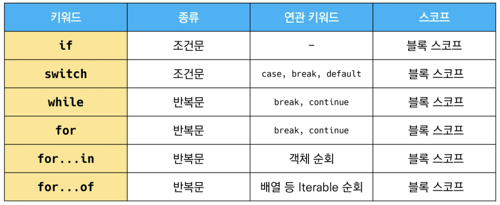
