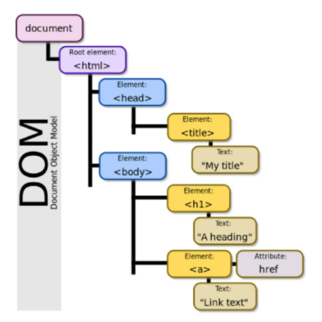
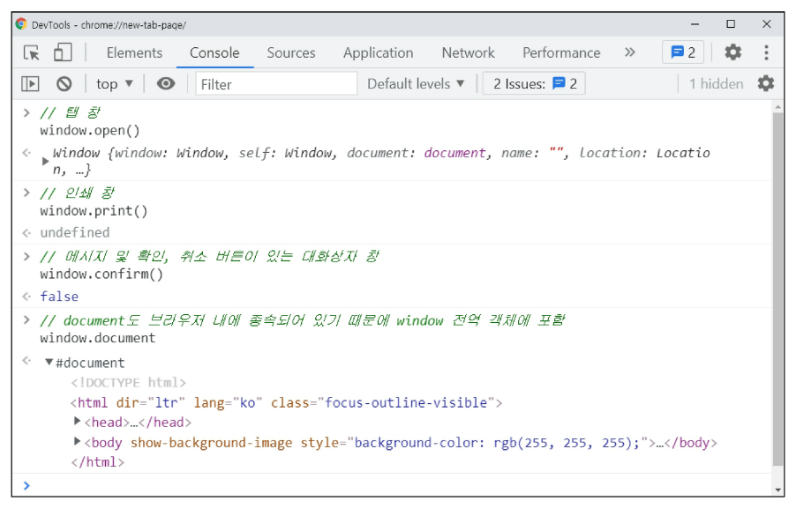
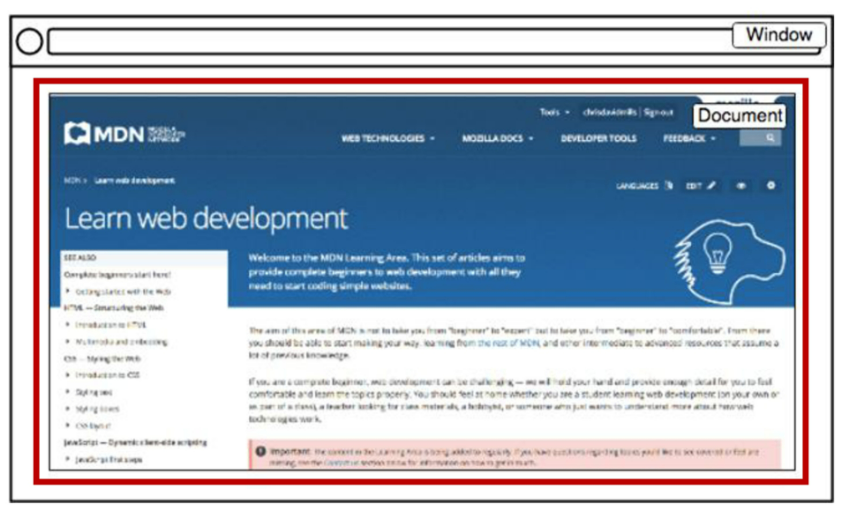
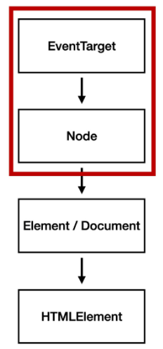

# JavaScript 02

## 1. History of JavaScript

### 1. 핵심 인물

- 팀 버너스리
  - WWW, URL, HTTP, HTML 최초 설계자
  - 웹의 아버지

- 브랜던 아이크
  - JavaScript 최초 설계자
  - 모질라 재단 공동 설립자
  - 코드네임 피닉스 프로젝트 진행
    - 파이어폭스의 전신

### 2. JavaScript의 탄생

- JavaScript의 탄생
  - 넷스케이프에 재직 중이던 브랜던 아이크가 HTML을 동적으로 동작하기 위한 회사 내부 프로젝트를 진행 중 JS를 개발
  - 이름이 Mocha -> LiveScript -> JavaScript(1995) 순서로 변경
  - 경쟁사 MS에서 이를 채택, 커스터마이징한 JScript를 만듦
  - 이를 IE 1.0에 탑재 => 1차 브라우저 전쟁의 시작

### 3. 제 1차 브라우저 전쟁

- 정리하자면, MS와 IE의 승리
- 1998년 넷스케이프에서 나온 브랜던 아이크 외 후계자들은 모질라 재단을 설립
  - 파이어폭스를 통해 IE에 대항하며 점유율을 늘려나감
- MS의 폭발적 성장, IE3에서 자체적인 JScript를 지원, 호환성 문제로 크로스 브라우징 등의 이슈 발생
- 크로스 브라우징(Cross Browsing)
  - W3C에서 채택된 표준 웹 기술을 채용하여 각각의 브라우저마다 다르게 구현되는 기술을 비슷하게 만들되, 어느 한쪽에 치우치지 않도록 웹 페이지를 제작하는 방법론(동일성이 아닌 동등성)
  - 브라우저마다 렌더링에 사용하는 엔진이 다르기 때문

### 4. 제 2차 브라우저 전쟁

- 크롬이 3년만에 파이어폭스 점유율을 돌파 후, 4년만에 정복

### 5. 파편화와 표준화

- 제 1차 브라우저 전쟁 이후 수많은 브라우저에서 자체 자바스크립트 언어를 사용하게 됨
- 결국 서로 다른 자바스크립트가 만들어지면서 크로스 브라우징 이슈가 발생하여 웹 표준의 필요성이 제기

- 1996년부터 넷스케이프는 표준 제정의 필요성을 주장
  - ECMA 인터내셔널(정보와 통신 시스템을 위한 국제적 표준화 기구)에 표준 제정 요청
- 1997년 ECMAScript 1 (ES1) 탄생
- 제 1차 브라우저 전쟁 이후 제기된 언어의 파편화를 해결하기 위해 각 브라우저 회사와 재단은 표준화에 더욱 적극적으로 힘을 모으기 시작

### 6. JavaScript ES6+

- 2015년 ES2015(ES6) 탄색
  - "Next-gen of JS"
  - JavaScript의 고질적인 문제들을 해결
  - JavaScript의 다음 시대라고 불릴 정도로 많은 혁신과 변화를 맞이한 버전
  - 이때부터 버전 순서가 아닌 출시 연도를 붙이는 것이 공식 명칭이나 통상적으로 ES6라 부름
  - 현재는 표준 대부분이 ES6+로 넘어옴

### 7. Vanilla JavaScript

- 크로스 브라우징, 간편한 활용 등을 위해 많은 라이브러리 등장(jQuery 등)
- ES6 이후, 다양한 도구의 등장으로 순수 자바스크립트 활용의 증대

### 8. 정리

- JS와 브라우저의 역사
  - 브라우저 전쟁
  - 파편화와 표준화의 투쟁

- 브라우저 전쟁의 여파
  - 크로스 브라우징 이슈
  - 표준화(통합을 위한 노력)
  - Vanilla JS

## 2. DOM

### 1. 브라우저에서 할 수 있는 일 

- DOM 조작
  - 문서(HTML) 조작
- BOM 조작
  - navigator, screen, location, frames, history, XHR
- JavaScript Core (ECMAScript)
  - Data Structure(Object, Array), Conditional Expression, Iteration

### 2. DOM(Document Object Model)이란?

- HTML, XML과 같은 **문서**를 다루기 위한 문서 프로그래밍 인터페이스
- 문서를 구조화하고 구조화된 구성 요소를 하나의 **객체**로 취급하여 다루는 논리적 트리 모델
- 문서가 구조화되어 있으며 각 요소는 객체(object - key:value로 이루어진)로 취급
- 단순한 속성 접근, 메서드 활용뿐만 아니라 프로그래밍 언어적 특성을 활용한 조작 가능
- 주요 객체
  - window: DOM을 표현하는 창. 가장 최상위 객체(작성 시 생략 가능)
  - document: 페이지 컨텐츠의 Entry Point 역할을 하며, `<body>` 등과 같은 수많은 다른 요소들을 포함
  - navigator, location, history, screen

### 3. DOM - 해석

- 파싱(Parsing)
  - 구문 분석, 해석
  - 브라우저가 문자열을 해석하여 DOM Tree로 만드는 과정

- 조작

### 4. BOM 이란?

- Browser Object Model
- 자바스크립트가 브라우저와 소통하기 위한 모델
- 브라우저의 창이나 프레임을 추상화해서 프로그래밍적으로 제어할 수 있도록 제공하는 수단
  - 버튼, URL 입력창, 타이틀 바 등 브라우저 윈도우 및 웹 페이지 일부분을 제어 가능
- window 객체는 모든 브라우저로부터 지원받으며 브라우저의 창(window)를 치징

- 조작

### 5. JS Core

- 프로그래밍 언어

## DOM 조작

### 1. DOM 조작 - 개념

- Document는 문서 한 장(HTML)에 해당하고 이를 조작
- DOM 조작 순서
  1. 선택(Select)
  2. 변경(Manipulation)
- Document 위치

### 2. DOM 관련 객체의 상속 구조

- EventTarget
  - Event Listener를 가질 수 있는 객체가 구현하는 DOM 인터페이스
- Node
  - 여러 가지 DOM 타입들이 상속하는 인터페이스
- Element
  - Document 안의 모든 객체가 상속하는 가장 범용적인 인터페이스
  - 부모인 Node와 그 부모인 EventTarget의 속성을 상속
- Document
  - 브라우저가 불러온 웹 페이지를 나타냄
  - DOM 트리의 진입점(entry point) 역할을 수행
- HTMLElement - 태그들
  - 모든 종류의 HTML 요소
  - 부모 element의 속성 상속

---

### 3. DOM 선택 - DOM 관련 객체의 상속 구조

- document.querySelector(selector)
  - 제공한 선택자와 일치하는 element 하나 선택
  - 제공한 CSS selector를 만족하는 첫 번째 element 객체를 반환(없다면 null)
- document.querySelectorAll(selector)
  - 제공한 선택자와 일치하는 여러 element를 선택
  - 매칭 할 하나 이상의 셀렉터를 포함하는 유효한 CSS selector를 인자(문자열)로 받음
  - 지정된 셀렉터에 일치하는 NodeList를 반환 => django에서 Queryset과 유사
- getElementById(id)
- getElementsByTagName(name)
- getElementsByClassName(names)
- **querySelector(), querySelectorAll()을 사용하는 이유**
  - id, class 그리고 tag 선택자 등을 모두 사용 가능하므로, 더 구체적이고 유연하게 선택 가능
  - e.g. document.querySelector('#id'), document, querySelectAll('.class')

### 4. DOM 선택 - DOM 관련 객체의 상속 구조

1. 단일 element
   - getElementById()
   - **queryselector()**

2. HTMLCollection

   - getElementsByTagName()

   - getElementsByClassName()

3. NodeList

   - **querySelectorAll()**

   

### 4. DOM 선택 - HTMLCollection & NodeList

- 둘 다 배열과 같이 각 항목에 접근하기 위한 index를 제공(유사 배열)
- HTMLCollection - 지금 안 쓸 것
  - name, id, index 속성으로 각 항목에 접근 가능
- NodeList
  - **index로만 각 항목에 접근 가능**
  - 단, HTMLColleciton과 달리 배열에서 사용하는 forEach 메서드 및 다양한 메서드 사용 가능
- 둘 다 Live Collection으로 DOM의 변경사항을 실시간으로 반영하지만, 
  **querySelctorAll()에 의해 반환되는 NodeList는 Static Collection으로 실시간으로 반영되지 않음**

### 5. DOM 선택 - Collection

- LiveCollection
  - 문서가 바뀔 때 실시간으로 업데이트 됨
  - DOM의 변경사항을 실시간으로 collection에 반영
  - e.g. HTMLCollection, NodeList
- Static Collection (non-live)
  - DOM이 변경되어도 collection 내용에는 영향을 주지 않음
  - querySelectorAll()의 반환 NodeList만 static collection

---

### 6. DOM 변경 - 변경 관련 메서드(Creation)

- document.createElement()
  - 작성한 태그 명의 HTML 요소를 생성하여 반환
- Element.append()
  - 특정 부모 Node의 자식 NodeList 중 마지막 자식 다음에 Node 객체나 DOMString을 삽입
  - 여러 개의 Node 객체, DOMString을 추가 할 수 있음
  - 반환 값이 없음
- Node.appendChild()
  - 한 Node를 특정 부모 Node의 자식 NodeList 중 마지막 자식으로 삽입(Node만 추가 가능)
  - 한번에 오직 하나의 Node만 추가할 수 있음
  - 만약 주어진 Node가 이미 문서에 존재하는 다른 Node를 참조한다면 새로운 위치로 이동

---

### 7. DOM 변경 - 변경 관련 속성(property)

- Node.innerText
  - Node 객체와 그 자손의 텍스트 컨텐츠(DOMString)를 표현 (해당 요소 내부의 raw text)(사람이 읽을 수 있는 요소만 남김)
- Element.innerHTML
  - 요소(element) 내에 포함된 HTML 마크업을 반환
  - 참고: XSS 공격에 취약하므로 사용 시 주의
- XSS(Cross-site Scripting)
  - 공격자가 입력요소를 사용하여(`<input>`)웹 사이트 클라이언트 측 코드에 악성 스크립트를 삽입해 공격하는 방법
  - 피해자(사용자)의 브라우저가 악성 스크립트를 실행하며 공격자가 엑세스 제어를 우회하고 사용자를 가장 할 수 있도록 함

### 8. DOM 삭제 - 삭제 관련 메서드

- ChildNode.remove()
  - Node가 속한 트리에서 해당 Node를 제거
- Node.removeChild()
  - DOM에서 자식 Node를 제거하고 제거된 Node를 반환
  - Node는 인자로 들어가는 자식 Node의 부모 Node

### 9. DOM 속성 - 속성 관련 메서드

- Element.setAttribute(name, value)
  - 지정된 요소의 값을 설정
  - 속성이 이미 존재하면 값을 갱신, 존재하지 않으면 지정된 이름과 값으로 새 속성을 추가
- Element.getAttribute(attributeName)
  - 해당 요소의 지정된 값(문자열)을 반환
  - 인자(attributeName)는 값을 얻고자 하는 속성의 이름

### 10. DOM 조작 - 정리

## Event

