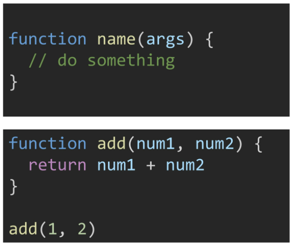

# Function & Methods

[toc]

## 1. 함수

### 1. 함수 in javascript

- 참조 타입 중 하나로써 function 타입에 속함
- JavaScript에서 함수를 정의하는 방법은 주로 2가지로 구분
  - 함수 선언식(function declaration)
  - 함수 표현식(fucntion expression)
- (참고) JavaScript의 함수는 일급 객체에 해당
  - 일급 객체: 다음의 조건들을 만족하는 객체를 의미함
    - 변수에 할당 가능
    - 함수의 **메개변수**(argument)로 전달 가능
    - 함수의 반환 값으로 사용 가능


### 2. 함수 선언식(function declaration)

- 함수의 이름과 함께 정의하는 방식
- 3가지 부분으로 구성
  - 함수의 이름(name)
  - 매개변수(arguments)
  - 몸통(중괄호 내부)



```js

function add(n1, n2) {
    return n1 + n2;
}

let c = add(10, 20)
console.log(c)

```


### 3. 함수 표현식

- 함수를 표현식 내에서 정의하는 방식
  - 표현식: 어떤 하나의 값으로 결정되는 코드의 단위

- 함수의 이름을 생략하고 익명 함수로 정의 가능
  - 익명 함수: 이름이 없는 함수
  - 익명 함수는 **함수 표현식에서만 가능**


```js
const add = function(num1, num2) {
    return num1 + num2
}

add(1, 2) // 3
```


```js
// 아래와 같은 식으로 함수를 선언하는 게 아니라 함수를 변수에 지정해서도 사용 가능

// 메모리에 함수 코드 자체가 들어가 있음 => add(10, 20)을 만나면 그 함수가 있는 곳으로 가서 코드를 실행하고 return을 만나면 돌아옴

// 함수가 저장될 주소 정보를 add가 갖고 있도록 함, 변수인 add를 이용해서 함수를 이용할 수 있게 함

// c언어의 함수 포인터 개념과 비슷
const add = function(n1, n2) {
    return n1 + n2;
}
// add(10, 20) => 30

// typeof(add) => function
```


### 4. 기본 인자

- 인자 작성 시 '=' 문자 뒤 기본 인자 선언 가능

```js
const greeting = function (name = 'Anonymous') {
    return `Hi ${name}`
}
console.log(greeting()) // 'Hi Anonymous'
```


### 5. 매개변수와 인자의 개수 불일치 허용

- 매개변수보다 인자의 개수가 많을 경우

```js
const noArgs = function () {
    return 0
}

noArgs(1, 2, 3) // 0
const twoArgs = function (arg1, arg2) {
    return [arg1, arg2]
}
noArgs(1, 2, 3) // [1, 2]
```

- 매개변수보다 인자의 개수가 적을 경우

```js
const threeArgs = function (arg1, arg2, arg3) {
    return [arg1, arg2, arg3]
}
threeArgs() // [undefined, undefined, undefined]
threeArgs(1) // [1, undefined, undefined]
threeArgs(1, 2) // [1, 2, undefined]

function add(n1, n2) {
    return n1 + n2;
}
add(1) // => NAN

function add(n1, n2) {
    return n1 + n2;
}
add(1) // => 1


const add2 = function(n1, n2=0){
    return n1 + n2
}
add2(1) // => 1
```


### 6. Rest Parameter

- rest parameter(`...`)를 사용하면 함수가 정해지지 않은 수의 매개변수를 배열로 받음(python의 *args와 유사)
  - 만약 rest parameter로 처리한 매개변수에 인자가 넘어오지 않을 경우에는 빈 배열로 처리


### 7. Spread operator

- spread operator(`...`)를 사용하면 배열 인자를 전개하여 전달 가능

```js
const spreadOpr = function (arg1, arg2, arg3) {
    return arg1 + arg2 + arg3
}

const numbers = [1, 2, 3]

spreadOpr(...numbers) // 6
```


## 2. 선언식 vs 표현식

### 1. 함수 선언식과 표현식 비교 정리


### 2. 함수의 타입

- 선언식 함수와 표현식 함수 모두 타입은 function으로 동일

```js
// 함수 표현식
const add = function (args) {}
function sub(args) {}

console.log(typeof add) // function
console.log(typeof sub) // function

// typeof는 연산자라서 위와 같이 쓸 수도 있다.
```


### 3. 호이스팅(hoisting) - 함수 선언식

- 함수 선언식으로 선언한 함수는 var로 정의한 변수처럼 hoisting 발생
- 함수 소출 이후에 선언 해도 동작
- 선언식을 쓸 때 호이스팅이 가능한 이유는 자바스크립트에서는 동작에 앞서 함수 테이블을 만들어주기 때문이다.

```js
add(2, 7)

function add (args1, args2) {
    return args1 + args2
}

// 9
```


### 4. 호이스팅(hoisting) - 함수 표현식

- 반면 함수 표현식으로 선언한 함수는 함수 정의 전에 호출 시 에러 발생
- 함후 표현식으로 정의된 함수는 변수로 평가되어 변수의 scope 규칙을 따름
- 표현식에서는 변수가 함수의 좌표를 지정하는지 모르기 때문에 호이스팅이 불가능하다

```js
sub(7, 2)

const sub = function (num1, num2) {
    return num1 - num2
}

// ReferenceError
```

- 참고
  - 함수 표현식을 var 키워드로 작성한 경우 변수가 선언 전 undefined로 초기화 되어 다른 에러가 발생

```js
console.log(add2(10, 10))
var add2 = function(n1=0, n2=0){
    return n1 + n2
}
// => 함수가 아님! 에러가 남
// 즉 var이니 호이스팅은 되는데, 뒤의 함수쪽은 표현식이므로 선언이 되지 않아서 이런 오류가 나는 것
// const add2 일때는 다른 오류가 난다.
```


### 5. 화살표 함수

- 함수를 비교적 간결하게 정의할 수 있는 문법
- function 키워드 생략 가능
- 함수의 매개변수가 단 하나 뿐이라면, '()' 도 생략 가능
- 함수 몸통이 return을 포함한 표현식 하나라면 '{}'과 return도 생략 가능
- 기존 function 키워드 사용 방식과의 차이점은 후반부 this 키워드를 학습하고 다시 설명

```js
// Arrow Function

const arrow1 = function (name) {
    return `hello, ${name}`
}

// 1. function 키워드 삭제

const arrow2 = (name) => { return `hello, ${name}` }

// 2. 매개변수가 1개일 경우에만 () 생략 가능

const arrow3 = name => { return `hello, ${name}` }

// 3. 함수 body가 return을 포함한 표현식 1개일 경우에 { } & return 생략 가능

const arrow4 = name => `hello, ${name}`


```


## 3. 문자열(String)

### - 문자열 관련 주요 메서드 목록


### 1. includes

- string.includes(value)
  - 문자열에 value가 존재하는지 판별 후 참 또는 거짓 반환

```js

const str = 'a santa at nasa'
str.includes('santa') // true
str.includes('asan') // false

```

### 2. split

- string.split(value)
  - value가 없을 경우, 기존 문자열을 **배열에 담아** **반환**
  - value가 빈 문자열일 경우 각 문자로 나눈 **배열을 반환**
  - value가 기타 문자열일 경우, 해당 문자열로 나눈 **배열을 반환**
    - 공백으로 나눌 경우, python에서는 빈 `()` 를 넣어 줬지만 js에서는 `(' ')`을 넣어 줘야 함

```js
const str = 'a cup'

str.split() // ['a cup']
str.split('') // ['a', ' ', 'c', 'u', 'p']
str.split(' ') // ['a', 'cup']
```

### 3. replace

- string.replace(from, to)
  - 문자열에 from 값이 존재할 경우, 1개만 to 값으로 교체하여 **반환**
- string.replaceAll(from, to)
  - 문자열에 from 값이 존재할 경우, 모두 to 값으로 교체하여 **반환**

```js
const str = 'a b c d'
str.replace(' ', '-') // 'a-b c d'
str.replaceAll(' ', '-') // 'a-b-c-d'

// 반환값이므로 재사용할 때 변수에 담아 주어야 함!
```

### 4. trim

- string.trim()
  - 문자열 시작과 끝의 모든 공백문자(스페이스, 탭, 엔터 등)를 제거한 문자열 반환
- string.trimStart()
  - 문자열 시작의 공백문자(스페이스, 탭, 엔터 등)를 제거한 문자열 반환
- string.trimEnd()
  - 문자열 끝의 공백문자(스페이스, 탭, 엔터)를 제거한 문자열 반환
- python에서의 strip()과 유사 

```js
const str = '	hello	'

str.trim() // 'hello'
str.trimStart() // 'hello	'
str.trimEnd()) // '    hello'
```


## 4. 배열(Arrays)

### - 배열의 정의와 특징

- 키와 속성들을 담고 있는 참조 타입의 객체(object)
- 순서를 보장하는 특징이 있음
- 주로 대괄호를 이용하여 생성하고, 0을 포함한 양의 정수 인덱스로 특정 값에 접근 가능
- 배열의 길이는 array.length 형태로 접근 가능
  - 참고: 배열의 마지막 원소는 [array.length-1] 로 접근(파이썬에서처럼 음수 인덱스 사용 불가)

```js
const numbers = [1, 2, 3, 4, 5]

console.log(numbers[0])		// 1
console.log(numbers[-1]) 	// undefined
console.log(numbers.length) // 5

console.log(numbers[numbers.length - 1]) // 5
console.log(numbers[numbers.length - 2]) // 4
console.log(numbers[numbers.length - 3]) // 3
console.log(numbers[numbers.length - 4) // 2
console.log(numbers[numbers.length - 5) // 1
```


### - 배열 관련 주요 메서드 목록 - 기본 배열 조작


### 1. reverse

- array.reverse()
  - 원본 배열의 요소들의 순서를 반대로 정렬

```js
const = numbers = [1, 2, 3, 4, 5]

numbers.reverse()

console.log(numbers) // [5, 4, 3, 2, 1]
```


### 2. push & pop

- array.push()
  - 배열의 가장 뒤에 요소 추가
- array.pop()
  - 배열의 마지막 요소 제거

```js
const = numbers = [1, 2, 3, 4, 5]

numbers.push(100)

console.log(numbers) // [1, 2, 3, 4, 5, 100]

numbers.pop()

console.log(numbers) // [1, 2, 3, 4, 5]
```


#### 3. unshift & shift

- array.unshift()
  - 배열의 가장 앞에 요소 추가
- array.shift()
  - 배열의 첫번째 요소 제거

```js
const numbers = [1, 2, 3, 4, 5]

numbers.unshift(100)

console.log(numbers) // [100, 1, 2, 3, 4, 5]

numbers.shift()

console.log(numbers) // [1, 2, 3, 4, 5]
```


### 4. includes

- array.includes(value)
  - 배열에 특정 값이 존재하는지 판별 후 참 또는 거짓 반환

```js
const numbers = [1, 2, 3, 4, 5]

console.log(numbers.include(1)) // true

console.log(numbers.include(100)) // false
```


### 5. indexOf

- array.indexOf(value)
  - 배열에 특정 값이 존재하는지 확인 후 가장 첫 번째로 찾은 요소의 인덱스 반환
  - 만약 해당 값이 없을 경우 -1 반환

```js
const numbers = [1, 2, 3, 4, 5]
let result

result = numbers.indexOF
```


### 6. join

- array.join([separator])
  - 배열의 모든 요소를 연결하여 반환
    - 배열의 요소 사이에 구분자를 넣어서 반환한다.
  - separator(구분자)는 선택적으로 지정 가능하며, 생략 시 **쉼표**를 기본 값으로 사용

```js

const numbers = [1, 2, 3, 4, 5]
let result

result = numbers.join()
console.log(result) // 1,2,3,4,5

result = numbers.join('')
console.log(result) // 12345

result = numbers.join(' ')
console.log(result) // 1 2 3 4 5

result = numbers.join('-')
console.log(result) // 1-2-3-4-5

result = numbers.join(', ')
console.log(result) // 1, 2, 3, 4, 5

```


### 7. Spread operator

- spread operator(...)를 사용하면 배열 내부에서 배열 전개 가능.
- ES5까지는 Array.content() 메서드를 사용.
- 얕은 복사에 활용 가능

```js
const array = [1, 2, 3]
const newArray = [0, ...array, 4]

console.log(newArray) // [0, 1, 2, 3, 4]

// 얕은 복사
const array2 = [...array]
array[0] = 7

console.log(array) = [7, 2, 3]
console.log(array2) = [1, 2, 3]
```


### - 배열 관련 주요 메서드 목록 - 심화

- 배열을 순회하며 특정 로직을 수행하는 메서드
- 메서드 호출 시 인자로 callback 함수를 받는 것이 특징
  - callback 함수란 어떤 함수의 내부에서 실행될 목적으로 인자로 넘겨받는 함수를 말함
  - 메서드 호출 시 인자로 받는 콜백 함수에 들어가는 인자들은 배열의 특정 요소가 자동으로 들어간다.
- 콜백 함수의 반환값을 반환하는 게 아니라, 다른 특정 값을 반환한다. 
  - 새로운 배열, 누적값, 해당 요소, 부울값 등!
  - 헷갈릴 수 있으니 주의하자!


- callback 함수의 예시 - django에서 path 함수 안의 함수


#### 1. forEach

- `array.forEach(callback(element[, index[,array]]))`
  - 배열의 각 요소에 대해 콜백 함수를 한 번씩 실행
  - 콜백 함수는 3가지 매개변수로 구성
    - element: 배열의 요소
    - index: 배열 요소의 인덱스
    - array: 배열 자체
  - **반환 값(return)이 없는 메서드**


```js
const fruits = ['딸기', '수박', '사과', '체리']


fruits.forEach((fruit, index) => {
    console.log(fruit, index)
}) // 딸기 0 수박 1 사과 2 체리 3

/*
const fruits = ['딸기', '수박', '사과', '체리']

fruits.forEach(function (fruit, index) {
    console.log(fruit, index)
}) // 딸기 0 수박 1 사과 2 체리 3
위와 같은 함수
*/


fruits.forEach((fruit) => {
    console.log(fruit)
}) // 딸기 수박 사과 체리
```


### 2. map

- `array.map(callback(element[, index[, array]]))`
  - 배열의 각 요소에 대해 콜백 함수를 한 번씩 실행
  - 콜백 함수의 반환 값을 요소로 하는 새로운 배열 반환(forEach와 이런 점에서 다름)
  - 기존 배열 전체를 다른 형태로 바꿀 때 유용

```js

const numbers = [1, 2, 3, 4, 5]

const doubleNums = numbers.map((num) => {
    return num * 2
})

console.log(doubleNums) // [2, 4, 6, 8, 10]

```


### 3. filter

- `array.filter(callback(element[, index[, array]]))`
  - 배열의 각 요소에 대해 콜백 함수를 한 번씩 실행
  - 콜백 함수의 반환 값이 참인 요소들만 모아서 새로운 배열을 반환
  - 기존 배열의 요소들을 필터링할 때 유용


```js
const numbers = [1, 2, 3, 4, 5]

const oddNums = numbers.filter((num) => {
    return num % 2
})

console.log(oddNums) // [1, 3, 5]
```


### 4. reduce


- `array.reduce(callback(acc, element, [index[, array]]))[, initialValue]`
  - 배열의 각 요소에 대해 콜백 함수를 한 번씩 실행
  - 콜백 함수의 반환 값들을 **하나의 값(acc)에 누적 후 반환**
  - 즉 acc에는 이전의 반환값이 들어간다!
  - reduce 메서드의 주요 매개변수
    - acc
      - 이전 callback 함수의 반환 값이 누적되는 변수
    - initialValue(optional)
      - 최초 callback 함수 호출 시 acc에 할당되는 값, 기본값은 배열의 첫 번째 값
      - 만약 initialValue를 넣어준다면, acc의 할당값에 지정값이 들어간 후, 배열의 첫 번째 요소부터 콜백 함수를 실행
      - 만약 initialValue가 없다면, acc의 할당값에 배열의 첫 번째 값이 들어간 상태에서, 배열의 두 번째 요소부터 콜백 함수를 실행 => 즉 첫 번째 요소에는 콜백 함수를 적용받지 않은 채로 acc에 들어가게 된다
      - 따라서 initial value를 주는 것이 더 안전하다
  - 참고: 빈 배열의 경우 initialValue를 제공하지 않으면 에러 발생

```js

// initialValue를 제공할 경우

const numbers = [1, 2, 3]

let result = numbers.reduce((acc, num) => {
    return acc + num * 2
}, 0)

console.log(result) // 12 
// 콜백 함수 총 3번 호출


// initialValue를 제공하지 않을 경우
let result = numbers.reduce((acc, num) => {
    return acc + num * 2
}) // 11

// 콜백 함수 총 2번 호출
// 첫 번째 인자는 콜백 함수가 먹히지 않고 그대로 acc에 들어갔기 때문에 1 * 2가 아닌 1이 들어감

```


### 5. find

- `array.find(callback(element[, index [, array]]))`
  - 배열의 각 요소에 대해 콜백 함수를 한 번씩 실행
  - 콜백 함수의 **반환 값이 참**이면, 조건을 만족하는 **첫 번째 요소를 반환**
    - 콜백 함수의 반환 값을 반환하는 것이 아니라, 요소를 반환하는 것!
  - 찾는 값이 배열에 없으면 undefined 반환


```js
const avengers = [
    {name: 'Tony Stark', age: 45},
    {name: 'Steve Rogers', age: 32},
    {name: 'Thor', age: 40},
]

const result = avengers.find((avenger) => {
    return avenger.name = 'Steve Rogers'
})

console.log(result) // {name: 'Steve Rogers', age: 32}
```


### 6. some

- array.some(callback(element[, index[, array]]))
  - 배열의 요소 중 하나라도 주어진 판별 함수를 통과하면 **참을 반환**
  - 모든 요소가 통과하지 못하면 거짓 반환
  - 참고: 빈 배열은 항상 거짓 반환


```js
const numbers = [1, 3, 5, 7, 9]

const hasEvenNumber = numbers.some((num) => {
    return !(num % 2)
    // return num % 2 === 0
})

console.log(hasEvenNumber) // false

const hasOddNumber = numbers.some((num) => {
    return num % 2
})

console.log(hasOddNumber) // true
```


### 7. every

- array.every(callback(element[, index[, array]]))
  - 배열의 모든 요소가 주어진 판별 함수를 통과하면 참을 반환
  - 하나의 요소라도 통과하지 못하면 거짓 반환
  - 참고: 빈 배열은 항상 참 반환


```js

const numbers = [1, 3, 5, 7, 9]

const isEveryNumberOdd = numbers.some((num) => {
    return num % 2 === 1
})

console.log(isEveryNumberOdd) // true

const isEveryNumberEven = numbers.some((num) => {
    return num % 2 === 0
})

console.log(isEveryNumberEven) // false

```

### 8. 배열 순회 방법 비교


## 5. 객체(Objects)

### 객체의 정의와 특징

- 객체는 속성(property)의 집합이며, 중괄호 내부에 key와 value의 쌍으로 표현
- key는 문자열 타입*만 가능
  - 참고: key 이름에 띄어쓰기 등의 구분자가 있으면 따옴표로 묶어서 표현
- value는 모든 타입(함수포함) 가능
- 객체 요소 접근은 점 또는 대괄호로 가능
  - 점 접근일 때는 키에 따옴표를 붙이지 않아도 되지만, 대괄호 접근일 때는 붙여주어야 한다.
    - 파이썬과 다르게 key가 string일 때도 띄어쓰기가 없으면 `''`를 붙여주지 않아도 된다.
  - 참고: key 이름에 띄어쓰기 같은 구분자가 있으면 대괄호 접근만 가능

```js
const me = {
    name: 'Jack',
    phoneNumber: '01012345678',
    'samsung products' : {
    buds: 'Galaxy Buds pro',
    galaxy: 'Galaxy s20'
}
}

console.log(me.name) // === console.log(me['name'])
console.log(me.phoneNumber) // === console.log(me[phoneNumber])
console.log(me['samsung products'].buds)
```


### 객체와 메서드

- 메서드는 어떤 객체의 속성이 참조하는 함수.
- 객체.메서드명() 으로 호출 가능.
- 메서드 내부에서는 this 키워드가 객체를 의미함
  - fullName은 메서드가 아니기 때문에 정상출력 되지 않음(NaN)
  - getFullName은 메서드이기 때문에 해당 객체의 firstName과 lastName을 정상적으로 이어서 반환


JSON

- key-value쌍의 형태로 데이터를 표기하는 언어 독립적 표준 포맷
- 자바스크립트의 객체와 유사하게 생겼으나 실제로는 문자열 타입
  - 따라서 JS의 객체로써 조작하기 위해서는 구문 분석(parsing)이 필수
  - JSON(JavaScript Object Notation)예시

```js
function getFullName() {
    return this.firstName + this.lastName
}

const me = {
    firstName: 'John',
    last
}
```


구조 분해 할당

```js
const user = {
    name: '유태영',
    age: 20,
    balance: 100
}

// 객체의 특정 key의 value값을 변수에 넣을 일이 많다.
const name = user.name

name // '유태영'

const age = user.age

age // 20

const balance = user.balance

balance // 100

// 반복되는 부분이 많음
// 아래 두 코드는 같다!
const {name} = user 
const name = user.name

// user라는 객체에서 key와 {} 안의 변수명을 일치시켜야 한다!

// 이렇게 사용도 가능하다!
const {name, age, balance} = user
// name => '유태영'
// age => 20
// balance => 100


// 아래 두 함수는 동일하게 작동한다.

fucntion printuser(user) {
    console.log(user.name, user.age, user.balance)
}

function printUSer({name, age, balance}) {
    console.name(age, balance, name)
}

printUser(user) // 20 100 '유태영'
```


this 정리

JS에서 this는 딱 세 가지를 가리킨다.

- class 내부의 생성자(constructor)함수에서
  - this는 생성되는 객체를 가리킴(Python의 self)
  - 우리 과정에서는 js로 클래스를 건드리지 않는다.
- **메서드(객체.메서드명() 으로 호출 가능한 함수)에서**
  - **this는 해당 메서드가 소속된 객체를 가리킴**
  - 메서드는 `.함수명()` 으로 실행하는 함수

- 위의 두가지 경우를 제외하면 모두 최상위 객체(window)를 가리킴
  - 이런 방식으로 쓸일이 없다. 걍 window 쓰자

```js
const me ={
    name:'neo',
    printName: function () {
        console.log(this.name)
    }
}
// this는 어디서 왔을까?
// python의 self와 헷갈리는 이유는 명시적으로 등장하지 않기 때문

```

```js
function getFullName() {
    return this.firstname + this.lastName
}


const me = {
    firstName = '태영',
    lastName = '유',
    'getFullName' : getFullname // getFullName : getFullname 또는 그냥 getFullName으로도 사용 가능 
}								// key와 value가 같은 경우 후자와 같은 방식으로도 사용 가능

getFullName() // => NAN

// 위의 함수는 메서드가 아님 => this는 window를 가리킴

me.getFullName() // => '유태영'

// 위의 함수는 메서드 => .을 통해서 불러옴 => this는 객체 me를 가리킴

// 함수는 바뀐 적이 없지만 어떤 용도로 호출되느냐에 따라서 반환값이 달라짐

const you = {
    firstName: '준호',
    lastName: '김',
    qwer: getFullName
}

you.qwer() // '준호김'

// 메서드는 동일하지만 어떤 실행 문맥(execution context)에서 불러오느냐에 따라 결과가 달라짐
// me가 호출하냐 you가 호출하냐 window가 호출하냐에 따라 달라짐
```

```js
// 예시에서 안쪽의 함수는 . 찍고 부르지 않음(못함)/ obj.함수명 으로 호출 불가!!! => 메서드가 아니라서 this는 window
// 따라서 .bind(this)를 붙여주어야 함
// bind를 매번 붙여주는 게 귀찮기 때문에 => 화살표 함수가 나옴
```

- 정리
  - 함수 내부에 this 키워드가 존재할 경우
    - 화살표 함수와 function 키워드로 선언한 함수가 다르게 동작
  - 함수 내부에 this 키워드가 존재하지 않을 경우
    - 완전히 동일하게 동작 => 즉 신경쓸 필요 없음