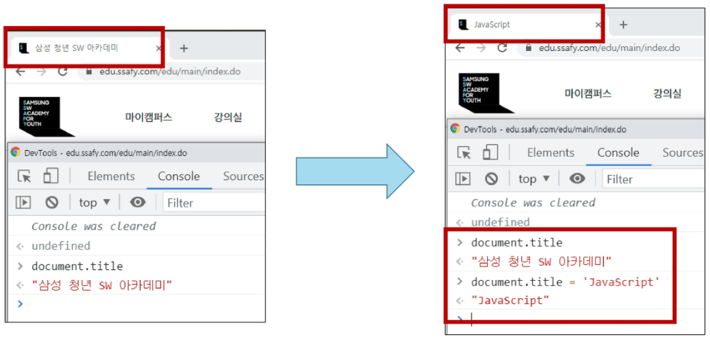
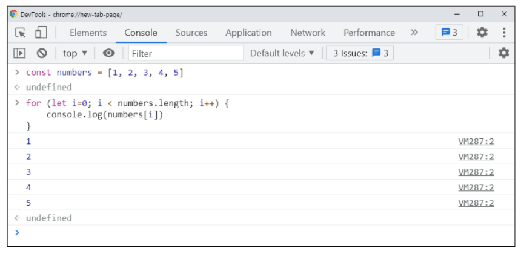
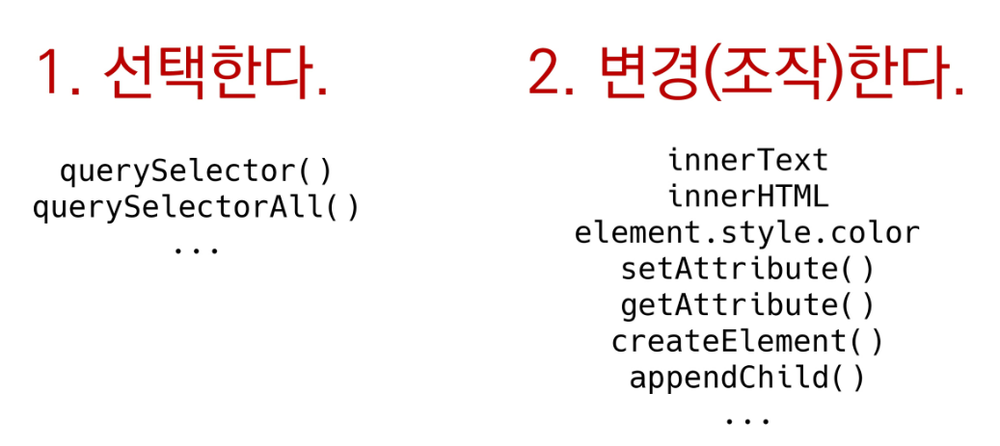

# JavaScript 02

## 1. History of JavaScript

### 1. 핵심 인물

- 팀 버너스리
  - WWW, URL, HTTP, HTML 최초 설계자
  - 웹의 아버지

- 브랜던 아이크
  - JavaScript 최초 설계자
  - 모질라 재단 공동 설립자
  - 코드네임 피닉스 프로젝트 진행
    - 파이어폭스의 전신


### 2. JavaScript의 탄생

- JavaScript의 탄생
  - 넷스케이프에 재직 중이던 브랜던 아이크가 HTML을 동적으로 동작하기 위한 회사 내부 프로젝트를 진행 중 JS를 개발
  - 이름이 Mocha -> LiveScript -> JavaScript(1995) 순서로 변경
  - 경쟁사 MS에서 이를 채택, 커스터마이징한 JScript를 만듦
  - 이를 IE 1.0에 탑재 => 1차 브라우저 전쟁의 시작


### 3. 제 1차 브라우저 전쟁

- 정리하자면, MS와 IE의 승리
- 1998년 넷스케이프에서 나온 브랜던 아이크 외 후계자들은 모질라 재단을 설립
  - 파이어폭스를 통해 IE에 대항하며 점유율을 늘려나감
- MS의 폭발적 성장, IE3에서 자체적인 JScript를 지원, 호환성 문제로 크로스 브라우징 등의 이슈 발생
- 크로스 브라우징(Cross Browsing)
  - W3C에서 채택된 표준 웹 기술을 채용하여 각각의 브라우저마다 다르게 구현되는 기술을 비슷하게 만들되, 어느 한쪽에 치우치지 않도록 웹 페이지를 제작하는 방법론(동일성이 아닌 동등성)
  - 브라우저마다 렌더링에 사용하는 엔진이 다르기 때문


### 4. 제 2차 브라우저 전쟁

- 크롬이 3년만에 파이어폭스 점유율을 돌파 후, 4년만에 정복


### 5. 파편화와 표준화

- 제 1차 브라우저 전쟁 이후 수많은 브라우저에서 자체 자바스크립트 언어를 사용하게 됨
- 결국 서로 다른 자바스크립트가 만들어지면서 크로스 브라우징 이슈가 발생하여 웹 표준의 필요성이 제기

- 1996년부터 넷스케이프는 표준 제정의 필요성을 주장
  - ECMA 인터내셔널(정보와 통신 시스템을 위한 국제적 표준화 기구)에 표준 제정 요청
- 1997년 ECMAScript 1 (ES1) 탄생
- 제 1차 브라우저 전쟁 이후 제기된 언어의 파편화를 해결하기 위해 각 브라우저 회사와 재단은 표준화에 더욱 적극적으로 힘을 모으기 시작


### 6. JavaScript ES6+

- 2015년 ES2015(ES6) 탄색
  - "Next-gen of JS"
  - JavaScript의 고질적인 문제들을 해결
  - JavaScript의 다음 시대라고 불릴 정도로 많은 혁신과 변화를 맞이한 버전
  - 이때부터 버전 순서가 아닌 출시 연도를 붙이는 것이 공식 명칭이나 통상적으로 ES6라 부름
  - 현재는 표준 대부분이 ES6+로 넘어옴


### 7. Vanilla JavaScript

- 크로스 브라우징, 간편한 활용 등을 위해 많은 라이브러리 등장(jQuery 등)
- ES6 이후, 다양한 도구의 등장으로 순수 자바스크립트 활용의 증대


### 8. 정리

- JS와 브라우저의 역사
  - 브라우저 전쟁
  - 파편화와 표준화의 투쟁

- 브라우저 전쟁의 여파
  - 크로스 브라우징 이슈
  - 표준화(통합을 위한 노력)
  - Vanilla JS


## 2. DOM

### 1. 브라우저에서 할 수 있는 일 

- DOM 조작
  - 문서(HTML) 조작
- BOM 조작
  - navigator, screen, location, frames, history, XHR
- JavaScript Core (ECMAScript)
  - Data Structure(Object, Array), Conditional Expression, Iteration


### 2. DOM(Document Object Model)이란?


- HTML, XML과 같은 **문서**를 다루기 위한 문서 프로그래밍 인터페이스
- 문서를 구조화하고 구조화된 구성 요소를 하나의 **객체**로 취급하여 다루는 논리적 트리 모델
- 문서가 구조화되어 있으며 각 요소는 객체(object - key:value로 이루어진)로 취급
- 단순한 속성 접근, 메서드 활용뿐만 아니라 프로그래밍 언어적 특성을 활용한 조작 가능
- 주요 객체
  - window: DOM을 표현하는 창. 가장 최상위 객체(작성 시 생략 가능)
  - document: 페이지 컨텐츠의 Entry Point 역할을 하며, `<body>` 등과 같은 수많은 다른 요소들을 포함
  - navigator, location, history, screen


### 3. DOM - 해석

- 파싱(Parsing)
  - 구문 분석, 해석
  - 브라우저가 문자열을 해석하여 DOM Tree로 만드는 과정

- 조작




### 4. BOM 이란?

- Browser Object Model
- 자바스크립트가 브라우저와 소통하기 위한 모델
- 브라우저의 창이나 프레임을 추상화해서 프로그래밍적으로 제어할 수 있도록 제공하는 수단
  - 버튼, URL 입력창, 타이틀 바 등 브라우저 윈도우 및 웹 페이지 일부분을 제어 가능
- window 객체는 모든 브라우저로부터 지원받으며 브라우저의 창(window)를 치징

- 조작


### 5. JS Core

- 프로그래밍 언어




## DOM 조작

### - 실습 스크립트

```html
<!-- 00_dom.html -->
<!DOCTYPE html>
<html lang="en">
<head>
  <meta charset="UTF-8">
  <meta http-equiv="X-UA-Compatible" content="IE=edge">
  <meta name="viewport" content="width=device-width, initial-scale=1.0">
  <title>Document</title>
  <style>
    .ssafy-location {
      color: blue;
    }
  </style>
</head>
<body>
  <h1>Hello SSAFY</h1>
  <h2 id="location-header">Location</h2>
  <div>
    <ul>
      <li class="ssafy-location">서울</li>
      <li class="ssafy-location">대전</li>
      <li class="ssafy-location">광주</li>
      <li class="ssafy-location">구미</li>
      <li class="ssafy-location">부울경</li>
    </ul>
  </div>
  <script>
    // 실습 코드 목록
    // 한 줄씩 복사하여 개발자 도구에 붙여넣기

    // 1. Selection
    // 1-1. window & document
    console.log(window) // 하나의 탭과 그 내부 => 내부적으로 window.은 생략 가능
    console.log(document) // typeof(document) => 'object'
    console.log(window.document) // 당연히 얘도 가능

    // 1-2. querySelector
    const h1 = document.querySelector('h1') // h1 선택 => Inspector로 찍는 것과 같은 기능

    // 아래 두 개는 같지만, 명시적으로 지정해 주는 아래가 더 좋다.
    // css를 할 때, id값으로 style을 먹이는 것을 지양했던 이유가 id를 js셀렉터로 쓰기 위함이었다.
    const h2 = document.querySelector('h2')
    const secondH2 = document.querySelector('#location-header')
    
    const selectUlTag = document.querySelector('div > ul')

    // 1-3. querySelectorAll
    const liTags = document.querySelectorAll('li')
    // 어떤 클래스는 js를 위한 클래스임을 명시하기 위해 camel-case를 쓰기도 한다.
    const secondLiTags = document.querySelectorAll('.ssafy-location')

    // h1은 객체 => typeof(h1) => 'object'
    
    // console.log(h1) => <h1>Hello SSAFY</h1>
    // h1.innerText => 'hello SSAFY'

    // 객체에 접근해 수정가능
    // h1.innerText = '수정가능'

    // 2. Creation & Append
    // 2-1. createElement
    const ulTag = document.querySelector('ul')
    const newLiTag = document.createElement('li')

    // 2-2. append
    const ulTag = document.querySelector('ul')
    const newLiTag = document.createElement('li')
    newLiTag.innerText = '새로운 리스트 태그'
    ulTag.append(newLiTag)
    ulTag.append('문자열도 추가 가능')

    const new1 = document.createElement('li')
    new1.innerText = '리스트 1'
    const new2 = document.createElement('li')
    new2.innerText = '리스트 2'
    const new3 = document.createElement('li')
    new3.innerText = '리스트 3'
    ulTag.append(new1, new2, new3)

    // 여기서 new1을 다시 append 하면 기존의 new1 li가 없어지고 끝에 붙는다.
    // 같은 객체를 가리키고 있으니 두 개를 만들 수는 없고, 이유가 있으니 이런 명령을 내렸겠지 하고 동작한다.
    

    // 2-3. appendChild
    const ulTag = document.querySelector('ul')
    const newLiTag = document.createElement('li')
    newLiTag.innerText = '새로운 리스트 태그'
    ulTag.appendChild(newLiTag)
    ulTag.appendChild('문자열은 추가 불가')

    const new1 = document.createElement('li')
    new1.innerText = '리스트 1'
    const new2 = document.createElement('li')
    new2.innerText = '리스트 2'
    ulTag.appendChild(new1, new2)
    // 오류가 나지는 않지만, new 1만 append 되는 것을 확인할 수 있다.
    // appendChild는 하나의 객체만 append 가능

    listTwo = ulTag.appendChild(new2)
    listTwo.innerText = '반환됨'
    // appendChild는 append된 객체를 반환하기 때문에, 이렇게도 활용 가능하다
    


    // 2-2. innerText & innerHTML
    // innerHTML은 내부 텍스트의 html 태그를 인식해서 적용한다
    // 위험하니 쓰지 말자!
    const ulTag = document.querySelector('ul')
    const liTag1 = document.createElement('li')
    liTag1.innerText = '<strong>춘천</strong>'
    const liTag2 = document.createElement('li')
    liTag2.innerHTML = '<strong>춘천</strong>'
    ulTag.append(liTag1, liTag2)

    // XSS 공격
    const ulTag = document.querySelector('ul')
    ulTag.innerHTML = '<li><a href="javascript:alert(\'당신의 개인정보 유출\')">춘천</a></li>'


    // 3. Delete
    // 3-1. remove
    const header = document.querySelector('#location-header')
    header.remove()

    // 3-2. removeChild
    const parent = document.querySelector('ul')
    const child = document.querySelector('ul > li')
    const removedChild = parent.removeChild(child)
    console.log(removedChild)
    
    // 기존 child는 삭제되었으므로 다음 목록을 삭제하려면 다시 할당 해주어야 함

    // 4. 속성
    // 4-1. setAttribute
    const header = document.querySelector('#location-header')
    header.setAttribute('class', 'ssafy-location')

    // 클래스를 입력하는 방법은 이런 방법도 있다.
    header.classList = ['ssafy-location', 'hello', 'world']
    header.classList.add('new-class')

    // 4-2. getAttribute
    const getAttr = document.querySelector('.ssafy-location')
    getAttr.getAttribute('class')
    getAttr.getAttribute('style')

    //2-5. Element Styling
    // li1, 2, 3에 특정 태그를 지정해준 후 실행
    li1.style.cursor = 'pointer'
    li2.style.color = 'blue'
    li3.style.background = 'red'

    // 이렇게 일일히 조작하는 것 보다, css에 class를 지정한 후 class로 먹여주는 것이 바람직하다.
  </script>
</body>
</html>

```


### 1. DOM 조작 - 개념

- Document는 문서 한 장(HTML)에 해당하고 이를 조작
- DOM 조작 순서
  1. 선택(Select)
  2. 변경(Manipulation)
- Document 위치


### 2. DOM 관련 객체의 상속 구조


- EventTarget
  - Event Listener를 가질 수 있는 객체가 구현하는 DOM 인터페이스
- Node
  - 여러 가지 DOM 타입들이 상속하는 인터페이스
- Element
  - Document 안의 모든 객체가 상속하는 가장 범용적인 인터페이스
  - 부모인 Node와 그 부모인 EventTarget의 속성을 상속
- Document
  - 브라우저가 불러온 웹 페이지를 나타냄
  - DOM 트리의 진입점(entry point) 역할을 수행
- HTMLElement - 태그들
  - 모든 종류의 HTML 요소
  - 부모 element의 속성 상속


---


### 3. DOM 선택 - DOM 관련 객체의 상속 구조

- document.querySelector(selector)
  - 제공한 선택자와 일치하는 element 하나 선택
  - 제공한 CSS selector를 만족하는 첫 번째 element 객체를 반환(없다면 null)
- document.querySelectorAll(selector)
  - 제공한 선택자와 일치하는 여러 element를 선택
  - 매칭 할 하나 이상의 셀렉터를 포함하는 유효한 CSS selector를 인자(문자열)로 받음
  - 지정된 셀렉터에 일치하는 NodeList를 반환 => django에서 Queryset과 유사
- getElementById(id)
- getElementsByTagName(name)
- getElementsByClassName(names)
- **querySelector(), querySelectorAll()을 사용하는 이유**
  - id, class 그리고 tag 선택자 등을 모두 사용 가능하므로, 더 구체적이고 유연하게 선택 가능
  - e.g. document.querySelector('#id'), document, querySelectAll('.class')


### 4. DOM 선택 - DOM 관련 객체의 상속 구조

1. 단일 element
   - getElementById()
   - **queryselector()**

2. HTMLCollection

   - getElementsByTagName()

   - getElementsByClassName()

3. NodeList

   - **querySelectorAll()**

   

### 4. DOM 선택 - HTMLCollection & NodeList

- 둘 다 배열과 같이 각 항목에 접근하기 위한 index를 제공(유사 배열)
- HTMLCollection - 지금 안 쓸 것
  - name, id, index 속성으로 각 항목에 접근 가능
- NodeList
  - **index로만 각 항목에 접근 가능**
  - 단, HTMLColleciton과 달리 배열에서 사용하는 forEach 메서드 및 다양한 메서드 사용 가능
- 둘 다 Live Collection으로 DOM의 변경사항을 실시간으로 반영하지만, 
  **querySelctorAll()에 의해 반환되는 NodeList는 Static Collection으로 실시간으로 반영되지 않음**


### 5. DOM 선택 - Collection

- LiveCollection
  - 문서가 바뀔 때 실시간으로 업데이트 됨
  - DOM의 변경사항을 실시간으로 collection에 반영
  - e.g. HTMLCollection, NodeList
- Static Collection (non-live)
  - DOM이 변경되어도 collection 내용에는 영향을 주지 않음
  - querySelectorAll()의 반환 NodeList만 static collection

```html
<!-- 실시간으로 반영되는 게 꼭 좋은 게 아니다. -->
<!-- 99_collection.html에서 -->

<!DOCTYPE html>
<html lang="en">
<head>
  <meta charset="UTF-8">
  <meta http-equiv="X-UA-Compatible" content="IE=edge">
  <meta name="viewport" content="width=device-width, initial-scale=1.0">
  <title>HTMLCollection & NodeList</title>
  <style>
		.red {
			color: red;
		}

		.blue {
			color: blue;
		}
	</style>
</head>
<body>
  <div>
    <p class="live">Live</p>
    <p class="live">Live</p>
    <p class="live">Live</p>
  </div>
	
	<hr>
  
	<div>
    <p class="non-live">Non-Live</p>
    <p class="non-live">Non-Live</p>
    <p class="non-live">Non-Live</p>
  </div>
	<script>
    // 1
    const liveNodes = document.getElementsByClassName('live')
    // console.log(liveNodes)

    for (let i = 0; i < liveNodes.length; i++) {
      liveNodes[i].className = 'red'
      console.log(liveNodes)
    }

    // 모든 liveNodes 자식 nod에게 red style을 먹여주었는데 첫 번째와 세 번째만 적용되었다.
    // 이유는 다음과 같다.
    // i === 0인 class live를 red로 변경
    // 실시간으로 반영된 결과, i는 1로 올라가지만 기존 class가 live였던 p 태그는 class가 red로 바뀌었으므로
    // i === 1이 가리키는 태그는 3번째 p 태그가 됨 => liveNodes.length도 2가 됨
    // 3번째 p 태그도 red로 바뀐 후, liveNodes.length가 1이 되므로 반복문 종료


    // 2
    const nonLiveNodes = document.querySelectorAll('.non-live')

    for (let i = 0; i < nonLiveNodes.length; i++) {
      nonLiveNodes[i].className = 'blue'
      console.log(nonLiveNodes)
    }

    // querySelectorAll()은 static collection으로 실시간 반영이 되지 않는다.
  </script>
</body>
</html>

```


---


### 6. DOM 변경 - 변경 관련 메서드(Creation)

- document.createElement()
  - 작성한 태그 명의 HTML 요소를 생성하여 반환
- Element.append()
  - 특정 부모 Node의 자식 NodeList 중 마지막 자식 다음에 Node 객체나 DOMString을 삽입
  - 여러 개의 Node 객체, DOMString을 추가 할 수 있음
    - 즉 Node와 문자열을 추가 가능하다는 의미
  - 반환 값이 없음
- Node.appendChild()
  - 한 Node를 특정 부모 Node의 자식 NodeList 중 마지막 자식으로 삽입(Node만 추가 가능)
  - 한번에 오직 하나의 Node만 추가할 수 있음
  - 만약 주어진 Node가 이미 문서에 존재하는 다른 Node를 참조한다면 새로운 위치로 이동

#### 	ParentNode.append() vs Node.appendChild()

- append()를 사용하면 DOMString 객체를 추가할 수도 있지만, .appendChild()는 Node객체만 허용
- append()는 반환 값이 없지만, appendChild()는 추가된 Node 객체를 반환
- append()는 여러 Node 객체와 문자열을 추가할 수 있지만, .appendChild()는 하나의 Node 객체만 추가할 수 있음


---


### 7. DOM 변경 - 변경 관련 속성(property)

- Node.innerText
  - Node 객체와 그 자손의 텍스트 컨텐츠(DOMString)를 표현 (해당 요소 내부의 raw text)
    (사람이 읽을 수 있는 요소만 남김)
  - 즉 html 태그를 넣어도 문자열로 들어간다
- Element.innerHTML
  - 요소(element) 내에 포함된 HTML 마크업을 반환
    - html 태그를 넣으면 태그로 인식
  - 참고: XSS 공격에 취약하므로 사용 시 주의
    - 위험하니 쓰지 말자
    - 사용자가 악성코드를 웹 페이지에 삽입할 수 있기 때문!
- XSS(Cross-site Scripting)
  - 공격자가 입력요소를 사용하여(`<input>`)웹 사이트 클라이언트 측 코드에 악성 스크립트를 삽입해 공격하는 방법
  - 피해자(사용자)의 브라우저가 악성 스크립트를 실행하며 공격자가 엑세스 제어를 우회하고 사용자를 가장 할 수 있도록 함


---


### 8. DOM 삭제 - 삭제 관련 메서드

- ChildNode.remove()
  - Node가 속한 트리에서 **해당 Node**를 제거
- ParentNode.removeChild(ChildNode)
  - DOM에서 자식 Node를 제거하고 제거된 자식 Node를 반환
  - Node는 인자로 들어가는 자식 Node의 부모 Node


### 9. DOM 속성 - 속성 관련 메서드

- Element.setAttribute(name, value)
  - 지정된 요소의 값을 설정
  - 속성이 이미 존재하면 값을 갱신, 존재하지 않으면 지정된 이름과 값으로 새 속성을 추가
- Element.getAttribute(attributeName)
  - 해당 요소의 지정된 값(문자열)을 반환
  - 인자(attributeName)는 값을 얻고자 하는 속성의 이름
  - `style` ,`class` 등을 가져올 수 있다.
- setAttribute와 getAttribute 이외에도 속성을 설정하는 많은 방법들이 있다.
  - 예를 들어, class를 설정할 때,
  - `header.classList = ['ssafy-location', 'hello', 'world']`
  - `header.classList.add('new-class')`
    - classList는 읽기 전용 프로퍼티이지만 특이하게 .add()나 .remove()를 사용해 조정 가능


### 10. DOM 조작 - 정리




## Event

### 1. Event(이벤트) 개념

- 네트워크 활동이나 사용자와의 상호작용 같은 사건의 발생을 알리기 위한 객체
- 이벤트 발생
  - 마우스를 클릭하거나 키보드를 누르는 등 사용자 행동으로 발생할 수도 있음
  - 특정 메서드를 호출(Element.click())하여 프로그래밍적으로도 만들어 낼 수 있음


### 2. Event 기반 인터페이스

- AnimationEvent, ClipboardEvent, DragEvent 등
- UIEvent
  - 간단한 사용자 인터페이스 이벤트
  - Event의 상속을 받음
  - MouseEvent, KeyboardEvent, InputEvent, FocusEvent등의 부모 객체 역할을 함


### 3. Event의 역할

- ~하면, ~한다.
- 클릭하면, 경고창을 띄운다.
- 특정 이벤트가 발생하면, 할 일을 등록한다. => **할 일을 한다가 아님!**
- **함수는 일(동작)의 단위**


### 4. Event handler - addEventListener()

- EventTarget**.addEventListener()**

  - 지정한 이벤트가 대상에 전달될 때마다 호출할 함수를 설정
  - 이벤트를 지원하는 모든 객체(Element, Document, Window 등)를 대상으로 지정 가능

- target.addEventListener(type, listener[, options])

  - type

    - 반응 할 이벤트 유형(대소문자 구분 문자열)
    - 이벤트 종류
  
  - listener
  
    - 지정된 타입의 이벤트가 발생했을 때 알림을 받는 객체
  
      EventListener 인터페이스 혹은 JS function 객체(콜백 함수)여야 함
    
    - 수행할 동작, 일, 명세


### 5. DOM 관련 객체의 상속 구조 복습

- EventTarget

  - Event Listener를 가질 수 있는 객체가 구현하는 DOM 인터페이스
  - 최상단에 있다 => 모든 요소는 다 이벤트를 달아줄 수 있다.

  

### 6. Event 취소

- `event.preventDefault()`
- 현재 **이벤트**의 **기본 동작을 중단**
- HTML 요소의 기본 동작을 작동하지 않게 막음
  - 예시: a 태그의 기본 동작은 클릭 시 링크로 이동 / form 태그의 기본 동작은 form 데이터 전송
- 이벤트를 취소할 수 있는 경우, 이벤트의 전파를 막지 않고 그 이벤트를 취소

