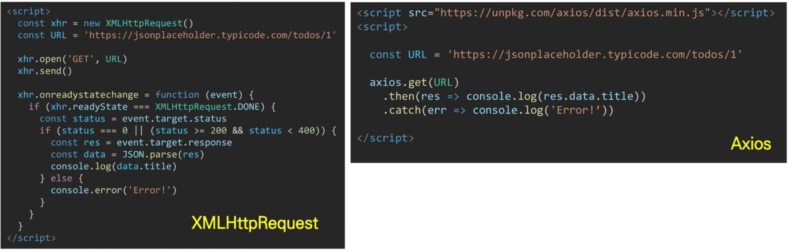

# AJAX

[toc]

## AJAX

### 1. AJAX란

- Asynchronous JavaScript And XML(비동기식 JavaScript와 XML: eXtended Markup Language)
- 서버와 통신하기 위해 XMLHttpRequest 객체를 활용하는 일종의 접근법
- JSON, XML, HTML 그리고 일반 텍스트 형식 등을 포함한 다양한 포맷을 주고 받을 수 있음
  - 참고: AJAX의 X가 XML을 의미하긴 하지만, 요즘은 더 가벼운 용량과 JavaScript의 일부라는 장점 때문에 JSON을 더 많이 사용함
  - 왜 JSON을 더 많이 사용 하는가?
    - XML은 데이터를 주고 받을때 불필요한 데이터들이 더 많다
    - 그렇다고 XML을 쓰지 않는 것은 아님


### 2. AJAX 특징

- 페이지 전체를 reload(새로 고침)을 하지 않고서도 **비동기성**
  - 서버의 응답에 따라 전체 페이지가 아닌 일부분만을 업데이트 할 수 있음
  - 내가 필요한 일부분만 업데이트!

- AJAX의 주요 두가지 특징은 아래의 작업을 할 수 있게 해줌
  1. 페이지 새로 고침 없이 서버에 요청
  2. 서버로부터 데이터를 받고 작업을 수행


### 3. AJAX 배경

- 2005년 Google Maps & Gmail 등에 활용되는 기술을 설명하기 위해 AJAX라는 용어를 최초로 사용

- AJAX는 특정 기술이 아닌 기존의 여러 기술을 사용하는 새로운 접근법을 설명하는 용어
  - 기존 기술을 잘 활용할 수 있는 방식으로 구성 및 재조합한 새로운 접근법
- Google에서의 사용 예시
  - Gmail
    - 메일 전송 요청이 모두 처리 되기 전 다른 페이지로 넘어가더라도 메일은 전송됨
  - Google Maps
    - 스크롤 행위 하나하나가 모두 요청이지만 페이지는 갱신되지 않음
- 실생활에서의 사용 예시
  - 로딩바 등 사용자 경험을 향상시키는 요소들


### 4. XMLHttpRequest 객체

- 서버와 상호작용하기 위해 사용되며 전체 페이지의 새로고침 없이 데이터를 받아올 수 있음
- 사용자의 작업을 방해하지 않으면서 페이지 일부를 업데이트 할 수 있음
- 주로 AJAX 프로그래밍에 사용
- 이름과 달리 XML뿐만 아니라 모든 종류의 데이터를 받아올 수 있음
- 생성자
  - XMLHttpRequest()
  - 앞에 new를 붙여서 활용(python의 init 느낌)


### 5. XMLHttpRequest 예시

- console에 todo 데이터가 출력되지 않음
- 데이터 응답을 기다리지 않고 console.log()를 먼저 실행했기 때문
- 이후 todo = request.response로 다시 읽어들이면 읽어짐

```js
// 새 탭에서 하면 안 됨!!!

const request = new XMLHttpRequest()
// DRF로 API 짤 수 없으므로 요청에 더미 데이터를 보내주는 아래의 사이트를 활용
const URL = 'https://jsonplaceholder.typicode.com/todos/1/'

// 발사 준비
request.open('GET', URL)

// 요청 발신
// request에 저장한 GET 요청을 URL로 보냄
request.send()

// 요청에 대한 응답을 변수에 저장
const todo = request.response

// 근데 빈 문자열이 뜬다. => 위부터 여기 코드까지 동시에 넣으면 안 된다!
// 데이터 응답을 기다리지 않고 빈 문자열을 todo에 저장한 후 console.log()를 먼저 실행해 버린다.
console.log(todo)

// 이후 request.response를 재할당해서 출력하면 string으로 넘어와 있는 것을 알 수 있다.
// 객체로 활용하려면, JSON.parse(string) 명령을 사용해 주어야 한다.


// send 위 까지의 명령은 미리 해 놓아도 상관 없지만, 이후 명령은 한 번에 하면 안 된다
// send 명령은 Non-block, asynchronous로 작동하기 때문에


```

- 참고
  - 두 개념은 다른 개념
    - block / non-block
      - 내가 함수를 호출했을 때, 그 함수 안의 모든 내용이 실행되고 다음 단계로 넘어가느냐 아니냐
      - block => e.g. alert => 확인 버튼 누르기 전까지 멈춰있음
    - 동기 / 비동기
      - A 작업과 B 작업이 동시에 일어난다 => 비동기
        - addEventListener => html페이지를 받아왔을 때, 이후에 있는 코드들도 실행된다.
        - addEventListner 안에 있는 콜백 함수를 Web API에게 넘겨 버리고 할 일 하는 것.
          - addEventListner가 어떻게 Web API에서 대기하는지는 vue를 보며 알아보자
      - A 작업이 끝나야 B 작업이 일어난다 => 동기


## Asynchronous JavaScript

### 1. 동기식

- 순차적, 직렬적 Task 수행
- 요청을 보낸 후 응답을 받아야만 다음 동작이 이루어짐(blocking)
- 버튼 클릭 후 alert 메시지의 확인 버튼을 누를 때까지 문장이 만들어지지 않음
- 즉 alert 이후의 코드는 alert의 처리가 끝날 때까지 실행되지 않음

- 왜 이런 현상이 발생할까?
  
  => JavaScript는 single threaded이기 때문


### 2. 비동기식

- 병렬적 Task 수행
- 요청을 보낸 후 응답을 기다리지 않고 다음 동작이 이루어짐(non-blocking)

- 3번째 코드 까지는 동기식이지만, `request.send()` 코드는 요청을 보낸 후 응답을 기다리지 않고 다음 코드가 실행됨

- 결과적으로 변수 todo에는 응답 데이터가 할당되지 않고 결국 빈 문자열이 출력

- 그렇다면 JS는 왜 기다려주지 않는 방식으로 동작하는가?

  => JavaScript는 single threaded


### 3. 왜 비동기(Asynchronous)를 사용하는가?

- '사용자 경험'
  - 매우 큰 데이터를 동반하는 앱이 있다고 가정
  - 동기식 코드라면 데이터를 모두 불러온 뒤 앱이 실행됨
    - 즉, 데이터를 모두 불러올 때 까지는 앱이 모두 멈춘 것처럼 보임
    - **코드 실행을 차단하여 화면이 멈추고 응답하지 않는 것 같은 사용자 경험을 제공**
  - 비동기식 코드라면 데이터를 요청하고 응답 받는 동안, 앱 실행을 함께 진행함
    - **데이터를 불러오는 동안 지속적으로 응답하는 화면을 보여줌**으로써 더욱 쾌적한 사용자 경험을 제공
  - 때문에 많은 웹 API 기능은 현재 비동기 코드를 사용하여 실행됨

#### # 참고: Threads

- 프로그램이 작업을 완료하기 위해 사용할 수 있는 단일 프로세스
- 각 thread(스레드)는 한 번에 하나의 작업만 수행할 수 있음
- 예시
  - Task A => Task B => Task C
  - 다음 작업을 시작하려면 반드시 앞의 작업이 완료되어야 함
  - 컴퓨터 CPU는 여러 코어를 가지고 있기 때문에 한 번에 여러 가지 일을 처리할 수 있음
  - 브라우저도 multi-Threaded이기 때문에 한 번에 여러 가지 일을 처리할 수 있다.


#### # Blocking vs Non-Blocking 1


#### # Blocking vs Non-Blocking 2 => 위 코드와 동일한 코드(url만 변수할당)


### 4. JavaScript는 single threaded 이다.

- 컴퓨터가 여러 개의 CPU를 가지고 있어도 main thread라 불리는 단일 스레드에서만 작업 수행
- 즉, 이벤트를 처리하는 **Call Stack**이 하나인 언어라는 의미
- 이 문제를 해결하기 위해 JavaScript는
  1. (JS Engine이) 즉시 처리하지 못하는 이벤트들을 다른 곳(Web API: 브라우저 내부의 고마운 친구들)으로 보내서 처리하도록 하고
  2. 처리된 이벤트들은 처리된 순서대로 대기실(Task queue)에 줄을 세워 놓고
  3. Call Stack이 비면 담당자(Event Loop)가 대기실의 가장 오래된(제일 앞의) 이벤트를 Call Stack으로 보냄(대기실이 Queue이므로)
- Web API는 multi threaded이다


### 5. Concurrency model

- Event loop를 기반으로 하는 동시성 모델(Concurrency model)

1. Call Stack
   - 요청이 들어올 때 마다 해당 요청을 순차적으로 처리하는 Stack(LIFO) 형태의 자료 구조
   - 파이썬은 얘만 있는 거라고 생각하면 된다
   
   
   
2. Web API(Browser API)
   - JavaScript 엔진이 아닌 브라우저 영역에서 제공하는 API
   - **setTimeout(), DOM events 그리고 AJAX로 데이터를 가져오는 시간이 소요되는 일들을 처리**
     - 클릭 등 사용자의 입력을 인식하는 것도 브라우저의 역할(EventListener)
     - AJAX, 시간 관련 명령들은 언제 끝날지 모름
   
   
   
3. Task Queue (Event Queue, Message Queue)
   - 비동기 처리된 callback 함수가 대기하는 Queue(FIFO) 형태의 자료 구조
   - main thread가 끝난 후 실행되어 후속 JavaScript 코드가 차단되는 것을 방지
   
   
   
4. Event Loop
   - Call Stack이 비어 있는지 확인
   - 비어 있는 경우 Task Queue에서 실행 대기 중인 callback 함수가 있는지 확인
   - Task Queue에 대기중인 callback 함수가 있다면 가장 앞에 있는 callback 함수를 Call Stack으로 push


### 6. Runtime

- JS 시각화 사이트인 Loupe에서 확인하자
  - http://latentflip.com/loupe/?code=Y29uc29sZS5sb2coIlN0YXJ0ISIpOwoKZnVuY3Rpb24gemVyb1NlY29uZHMoKSB7CiAgICBjb25zb2xlLmxvZygnMCcpCn0KCmZ1bmN0aW9uIHRocmVlU2Vjb25kcygpIHsKICAgIGNvbnNvbGUubG9nKCczJykKfQoKc2V0VGltZW91dCh0aHJlZVNlY29uZHMsIDMwMDApOwoKc2V0VGltZW91dCh6ZXJvU2Vjb25kcywgMCk7Cgpjb25zb2xlLmxvZygiRW5kIik7!!!PGJ1dHRvbj5DbGljayBtZSE8L2J1dHRvbj4%3D

- 예시 1

```js
console.log('Hi!')

setTimeout(function ssafy () {
    console.log('Punk!')
})

console.log('Bye!')
```

- 예시 2

```js
console.log("Start!");

function zeroSeconds() {
    console.log('0')
}

function threeSeconds() {
    console.log('3')
}
// 콜백 함수 threeSeconds를 Web API에 넘겨줌 => 3초간 맡아줘
setTimeout(threeSeconds, 3000);

// 콜백 함수 threeSeconds를 Web API에 넘겨줌 => 0초간 맡아주고 끝나면 콜백 
setTimeout(zeroSeconds, 0);

console.log("End");

// 1단계 => Call Stack에서 console.log를 실행
// 2단계 => Call Stack에서 setTimeout 3000을 실행

// 3단계 => setTimeout의 실행결과 webAPI에게 threeseconds를 넘겨줌
// 넘겨주는 명령은 함수를 실행하는 명령이 아니라, 3초를 기다렸다 callback Queue에 threesecond를 넣어 달라는 명령 
// => threesecond 함수는 Web API에서 대기만 하고 있는 것

// 4단계 => Call Stack에서 setTimeout 0을 실행
// 5단계 => setTimeout의 실행결과 webAPI에게 zeroseconds를 넘겨줌

// 6단계 => call stack에서 console.log End가 실행

// 7단계 => zerosecond 0이 실행 완료된 후 zerosecond 함수가 콜백 큐에 쌓임(3000 보다 빨리 끝나므로)
// 8단계 => setTimeout 3000이 실행 완료된 후 threesecond 콜백 큐에 쌓임

// 9단계 => callback Queue에 있던 zerosecond가 call stack으로 넘어가고 call stack에서 zerosecond 함수가 실행

// 10단계 => Call stack에 있는 zerosecond가 우선순위가 있으므로, 실행, console.log 실행
// console.log가 끝난 후 함수도 끝남


// 11단계 => call stack이 비었으므로 threesecond가 call stack으로 넘어간 후 9, 10단계와 같이 반복

// Web API로 넘어갔다 돌아온, callback Queue에 쌓여있는 콜백 함수들이 
// Call Stack 내부에 있는 것들보다 실행 우선순위가 낮으므로, 이후에 실행된다.

// 마지막 console.log()를 여러개 만들어 놓고 실행해 보자.
```


### 7. Zero Delays


- 뒤의 이미지에서, 실제로 0ms 후에 callback 함수가 시작된다는 의미가 아님
- 실행은 Task Queue에 대기 중인 작업 수에 따라 다르며 해당 예시에서는 callback 함수의 메시지가 처리되기 전에 'Hi'와 'Bye'가 먼저 출력됨
- 왜냐하면 delay(지연)는 JS가 요청을 처리하는 데 필요한 최소 시간이기 때문(보장된 시간이 아님)
- 기본적으로 setTimeout 함수에 특정 시간제한을 설정했더라도 대기 중인 메시지의 모든 코드가 완료될 때까지 대기해야 함


### 8. 순차적인 비동기 처리하기

- Web API로 들어오는 순서는 중요하지 않고, 어떤 이벤트가 먼저 처리되느냐가 중요(즉, 실행 순서 불명확)
- 이를 해결하기 위해 순차적인 비동기 처리를 위한 2가지 작성 방식

1. Async Callbacks
   - 백그라운드에서 실행을 시작할 함수를 호출할 때 인자로 지정된 함수
   - 예를 들어, addEventListener()의 두 번째 인자
2. Promise-Style
   - Modern Web APIs에서의 새로운 코드 스타일
   - XMLHttpRequest 객체를 사용하는 구조보다 조금 더 현대적인 버전


## Callback Function

>JS에서 볼 수 있는 순차적인 비동기 처리 방식은 두 가지가 있다. 
>
>예전 방식인 callbacks과 최근 쓰는 방식인 promise-style 코드이다.


### 1. Callback fucntion

- 다른 함수에 인자로 전달된 함수
- 외부 함수 내에서 호출되어 일종의 루틴 또는 작업을 완료함
- 동기식, 비동기식 모두 사용됨
  - 그러나 비동기 작업이 완료된 후(예시에서는 3초, 0초가 지난 후) 코드 실행을 계속하는 데(콜백 함수 실행) 주로 사용됨
- 비동기 작업이 완료된 후 코드 실행을 계속하는 데 사용되는 경우를 비동기 콜백(Asynchronous Callback)이라고 함
- 예전에 쓰던 비동기 처리 방식
  - 우리는 이렇게 안 짤 것이다


### 2. JavaScript의 함수는 일급 객체이다.

- 일급 객체(일급 함수)
  - 다른 객체들에 적용할 수 있는 연산을 모두 지원하는 객체(함수)
- 일급 객체의 조건
  - 인자로 넘길 수 있어야 함
  - 함수의 반환 값으로 사용할 수 있어야 함
  - 변수에 할당할 수 있어야 함

```js

const a = function () {} // 변수 할당 가능

function asdf(x) {
    return x
}

asdf(a) // 인자로 넘기기 가능

// => f () {} => 반환 값으로 사용 가능


```


### 3. Callback Function 사용 예시(JavaScript, Python, Django)


### 4. Async callbacks

- 백그라운드에서 코드 실행을 시작할 함수를 호출할 때 인자로 지정된 함수
- 백그라운드 코드 실행이 끝나면(예: 클릭하면) callback 함수를 호출하여 작업이 완료되었음을 알리거나, 다음 작업을 실행하게 할 수 있음
  - 사용 예시: addEventListener()의 두 번째 매개변수
- callback 함수를 다른 함수의 인수로 전달할 때, 함수의 참조를 인수로 전달할 뿐이지 즉시 실행되지 **않고**, 함수의 body에서 'called back' 됨. 
  - 정의된 함수는 때가 되면 callback 함수를 실행하는 역할을 함


### 5. Why use callback?

- callback 함수는 명시적인 호출이 아닌 특정 루틴 혹은 action에 의해 호출되는 함수
- Django의 경우 '요청이 들어오면', event의 경우 ''특정 이벤트가 발생하면' 이라는 조건으로 함수를 호출할 수 있었던 건 'Callback fucntion' 개념 때문에 가능
- 비동기 로직을 수행할 때 callback 함수는 필수
  - 명시적인 호출이 아니라 다른 함수의 매개변수로 전달하여 해당 함수 내에서 특정 시점에 호출


### 6. Callback Hell


- 순차적인 연쇄 비동기 작업을 처리하기 위해 callback 함수를 호출하고, 그 다음 callback 함수를 호출하고, 또 그 함수의 callback 함수를 호출하고... 의 패턴이 지속적으로 반복됨
- 즉 여러 개의 연쇄 비동기 작업을 할 때 마주하는 상황
  - 의도한 순서대로 함수를 실행하기 위해서는 코드를 저렇게 짤 수 밖에 없다.
- 이를 callback Hell(콜백 지옥) 혹은 pyramid of doom(파멸의 피라미드)라고 함
- 위와 같은 상황이 벌어질 경우 아래 사항들을 통제하기 어려움
  - 디버깅
  - 코드 가독성

 

### 7. callback Hell 해결하기

1. Keep your code shallow (코드의 깊이를 얕게 유지)
2. Modularize(모듈화)
3. Handle every single error(모든 단일 오류 처리)
4. **Promise callbacks(Promise 콜백 방식 사용)**


## Promise

### 1. Promise object

- 비동기 작업의 최종 완료 또는 실패를 나타내는 객체
  - 미래의 완료 또는 실패와 그 결과 값을 나타냄
  - 미래의 어떤 상황에 대한 약속
- 성공(이행)에 대한 약속
  - `.then()`
- 실패(거절)에 대한 약속
  - `.catch()`
- 메서드의 return 값이 promise 객체
- 콜백 지옥과 다른 점은 코드가 피라미드 형태로 들어가지 않는다는 것!


### 2. Promise methods


- `.then(callback)`
  - 이전 작업(promise)이 성공했을 때(이행했을 때) 수행할 작업을 나타내는 callback 함수
  - 그리고 각 callback 함수는 이전 작업의 성공 결과를 인자로 전달받음
  - 따라서 성공했을 때의 코드를 callback 함수 안에 작성
  
  
  
- `.catch(callback)`
  - .then이 하나라도 실패하면(거부 되면) 동작(동기식의 'try - except' 구문과 유사)
  - 이전 작업의 실패로 인해 생성된 error 객체는 catch 블록 안에서 사용할 수 있음
  
  
  
- 각각의 `.then()` 블록은 서로 다른 promise를 반환
  - 즉, `.then()`을 여러 개 사용(chaining)하여 연쇄적인 작업을 수행할 수 있음
  - 결국 여러 비동기 작업을 차례때로 수행할 수 있다는 뜻
  
  
  
- `.then()`과 `.catch()`메서드는 모두 promise를 반환하기 때문에 chaining 가능


- 주의
  - **반환 값이 반드시 있어야 함!**
  - 없다면 callback 함수가 이전의 promise 결과를 받을 수 없음

  

- `.finally(callback)`

  - Promise 객체를 반환
  - 결과와 상관없이 무조건 지정된 callback 함수가 실행
  - 어떠한 인자도 전달받지 않음
    - Promise가 성공되었는지 거절되었는지 판단할 수 없기 때문
  - 무조건 실행되어야 하는 절에서 활용
    - .then()과 .catch() 블록에서의 코드 중복을 방지


### 3. Promise가 보장하는 것

- Async callback 작성 스타일과 달리 Promise가 보장하는 특징

1. callback 함수는 JavaScript의 Event Loop가 현재 실행 중인 CallStack을 완료하기 이전에는 절대 호출되지 않음
   - Promise callback 함수는 Event Queue에 배치되는 엄격한 순서로 호출됨
2. 비동기 작업이 성공하거나 실패한 뒤에 `.then()` 메서드를 이용하여 추가한 경우에도 1번과 똑같이 동작
3. `.then()`을 여러 번 사용하여 여러 개의 callback 함수를 추가할 수 있음(Chainint)
   - 각각의 callback은 주어진 순서대로 하나하나 실행하게 됨
   - Chaining은 Promise의 가장 뛰어난 장점


### 4. callBack Hell => promise


## Axios

### 1. Axios

- 'Promise based HTTP client for the browser and Node.js'
- 브라우저를 위한 **Promise 기반의 클라이언트**
  - Promise는 객체, Axios는 라이브러리!

- 원래는 XHR이라는 브라우저 내장 객체를 활용해 AJAX 요청을 처리하는데, 이보다 편리한 AJAX 요청이 가능하도록 도움을 줌
  - 확장 가능한 인터페이스와 함께 패키지로 사용이 간편한 라이브러리를 제공
  - 파이썬의 requests같은 거


### 2. XMLHttpRequest => Axios 변경




### 3. Axios 예시


## async & await

### 1. async & await

- 요즘은 이렇게 다 처리하지만
  - 연습을 위한 코스트가 발생하기 때문에 지금은 Axios로 연습

- 비동기 코드를 작성하는 새로운 방법
  - ECMAScript 2017(ES8)에서 등장
- 기존 Promise 시스템 위에 구축된 syntatic sugar
  - Promise 구조의 then chaining을 제거
  - 비동기 코드를 조금 더 동기 코드처럼 표현
  - Syntatic sugar
    - 더 쉽게 읽고 표현할 수 있도록 설계된 프로그래밍 언어 내의 구문
    - 즉, 문법적 기능은 그대로 유지하되 사용자가 직관적으로 코드를 읽을 수 있게 만듦


### 2. Promise => async & await 적용


## # 왜 비동기(Asynchronous) 방식이 필요할까?

- **human-centered design with UX**
  - 인간 중심으로 설계된 사용자 경험
  - 실제 AJAX라는 용어를 처음 논문에서 사용한 Jesse James Garrett이 Ajax를 소개하며 강조한 한 마디

