# Vue.js

[toc]

## Intro

### 1. Front-End Development

- HTML, CSS 그리고 JavaScript를 활용해서 데이터를 볼 수 있게 만들어 줌
  - 이 작업을 통해 사용자(User)는 데이터와 상호작용(Interaction) 할 수 있음
- 대표적인 프론트엔드 프레임워크
  - Vue.js, React, Angular

### 2. Vue.js

- 사용자 인터페이스(화면)를 만들기 위한 점진적인(진보적인 X) 자바스크립트 프레임워크
  - 어떤 서비스를 만들 때 점진적으로 - 자기가 원하는 부분 만큼 Vue를 사용하며 - 쓸 수 있다.
- 현대적인 tool과 다양한 라이브러리를 통해 SPA(Single Page Application)를 완벽하게 지원
- 참고: Evan You에 의해 발표 (2014)
  - 구글의 Angular 개발자 출신
  - 학사 미술, 미술사 전공/ 석사 디자인 & 테크놀로지 전공
  - 구글 Augular보다 더 가볍고, 간편하게 사용할 수 있는 프레임워크를 만들기 위해 개발

### 3. SPA(Single Page Application)

- Single Page Application (단일 페이지 어플리케이션)
- 현재 페이지를 동적으로 렌더링함으로써 사용자와 소통하는 웹 애플리케이션
- 단일 페이지로 구성되며 서버로부터 최초에만 페이지를 다운로드하고, 이후에는 동적으로 DOM을 구성
  - 처음 페이지를 받은 이후부터는 서버로부터 새로운 전체 페이지를 불러오는 것이 아닌, 현재 페이지 중 필요한 부분만 동적으로 다시 작성함
- 연속되는 페이지 간의 사용자 경험(UX)를 향상
  - 모바일 사용량이 증가하고 있는 현재, 트래픽의 감소와 속도, 사용성, 반응성의 향상은 매우 중요하기 때문
- 동작 원리의 일부가 CSR(Client Side Rendering)의 구조를 따름

### 4. SPA 등장 배경

- 과거 웹 사이트들은 요청에 따라 매번 새로운 페이지를 응답하는 방식이었음
  - MPA(Multi Page Application)
- 스마트폰이 등장하면서 모바일 최적화의 필요성이 대두됨
  - 모바일 네이티브 앱과 같은 형태의 웹 페이지가 필요해짐
  - 웹서핑 중 앱을 쓰는 것 같은 느낌을 주기 위해
- 이러한 문제를 해결하기 위해 Vue.js와 같은 프론트엔드(Front-End) 프레임워크가 등장
  - CSR(Client Side Rendering), SPA(Single Page Application)의 등장
- 1개의 웹 페이지에서 여러 동작이 이루어지며 모바일 앱과 비슷한 형태의 사용자 경험을 제공

### 5. CSR(Client Side Rendering)

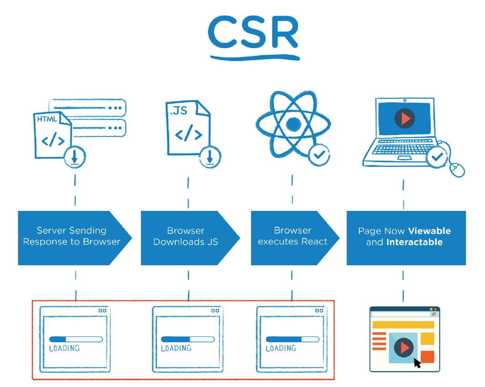

- Client Side Rendering
- 서버에서 화면을 구성하는 SSR 방식과 달리 클라이언트에서 화면을 구성
  - 누가 html을 만드냐의 문제
- 최초 요청 시 HTML, CSS, JS등 데이터를 제외한 각종 리소스를 응답받고 이후 클라이언트에서는 필요한 데이터만 요청해 JS로 DOM을 렌더링하는 방식
- **즉, 처음엔 뼈대만 받고 브라우저에서 동적으로 DOM을 그림**
- SPA가 사용하는 렌더링 방식
- 장점
  1. 서버와 클라이언트 간 트래픽 감소
     - 웹 애플리케이션에 필요한 모든 정적 리소스를 최초에 한 번 다운로드 후 **필요한 데이터만 갱신**
  2. 사용자 경험(UX) 향상
     - 전체 페이지를 다시 렌더링하지 않고 변경되는 부분만을 갱신하기 때문
- 단점
  1. SSR에 비해 전체 페이지 **최종 렌더링 시점이 느림**
  2. SEO(검색 엔진 최적화)에 어려움이 있음(최초 문서에 데이터 마크업이 없기 때문)

### 6. SSR(Server Side Rendering)

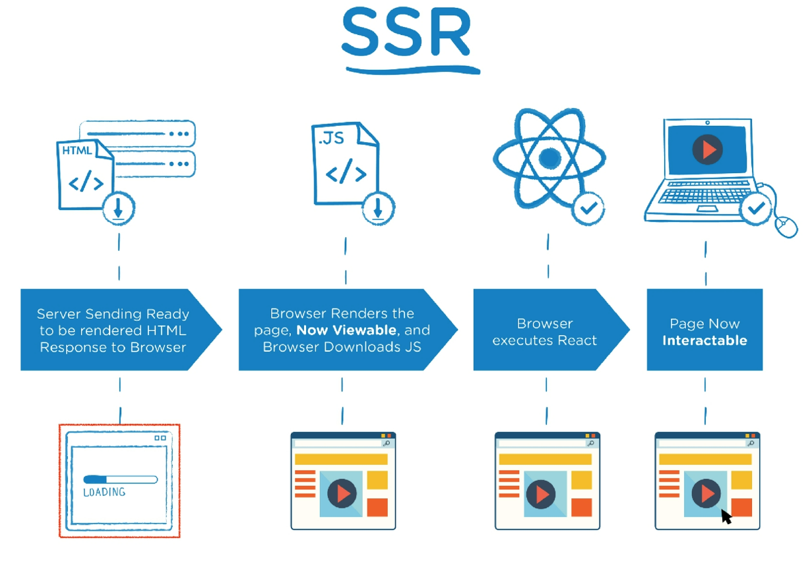

- Server Side Rendering
- 서버에서 클라이언트에게 보여줄 페이지를 모두 구성하여 전달하는 방식
- JS 웹 프레임워크 이전에 사용되던 전통적인 렌더링 방식
- 장점
  1. 초기 구동 속도가 빠름
     - 클라이언트가 빠르게 컨텐츠를 볼 수 있음
  2. SEO(검색 엔진 최적화)에 적합
     - DOM에 이미 모든 데이터가 작성되어 있기 때문
- 단점
  - 모든 요청마다 새로운 페이지를 구성하여 전달
    - 반복되는 전체 새로고침으로 인해 사용자 경험이 떨어짐
    - 상대적으로 트래픽이 많아 서버의 부담이 클 수 있음

### 7. SSR & CSR (Server Side Rendering & Client Side Rendering)

- 두 방식의 차이는 렌더링의 주최가 누구인가에 따라 결정
- 즉, 실제 브라우저에 그려질(렌더링) HTML을 서버가 만든다면 SSR / 클라이언트가 만든다면 CSR
  - 회사가 선호하는 방식은 CSR => 서버가 일을 덜함 => 돈을 덜 씀
- SSR과 CSR 중 내 서비스 또는 프로젝트 구성에 맞는 방법을 적절하게 선택하는 것이 중요
- 예를 들어, Django에서 Axios를 활용한 좋아요/팔로우 로직의 경우 대부분은 Server에서 완성된 HTML을 제공하는 구조(SSR)
- 단 특정 요소(좋아요/팔로우)만 JS(AJAX & DOM 조작)를 활용(CSR)
  - AJAX를 활용해 비동기 요청으로 필요한 데이터를 클라이언트에서 서버로 직접 요청을 보내 받아오고 JS를 활용해 DOM을 조작

### 8. SEO

- Search Engine Optimization (검색 엔진 최적화)
- 웹 페이지 검색엔진이 자료를 수집하고 순위를 매기는 방식에 맞게 웹 페이지를 구성해서 검색 결과의 상위에 노출될 수 있도록 하는 작업
- 인터넷 마케팅 방법 중 하나
- 구글의 등장 이후 검색엔진들이 컨텐츠의 신뢰도를 파악하는 기초 지표로 사용됨
  - 다른 웹 사이트에서 얼마나 인용되었나를 반영
  - 결국 타 사이트에 인용되는 횟수를 늘리는 방향으로 최적화

### 9. SEO 대응

- Vue.js 또는 React등의 SPA 프레임워크는 SSR을 지원하는 SEO 대응 기술이 이미 존재
  - SEO 대응이 필요한 페이지에 대해서는 선별적 SEO 대응 가능
- 혹은 추가로 별도의 프레임워크를 사용하기도 함
  - Nuxt.js
    - Vue.js 응용 프로그램을 만들기 위한 프레임워크
    - SSR 지원
  - Next.js
    - React 응용 프로그램을 만들기 위한 프레임워크
    - SSR 지원

- Vue.js의 역할

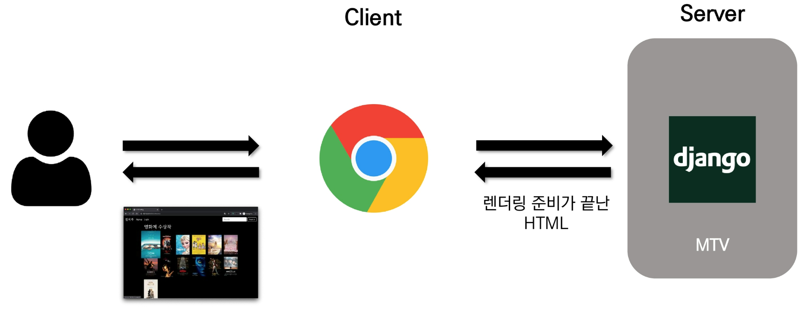

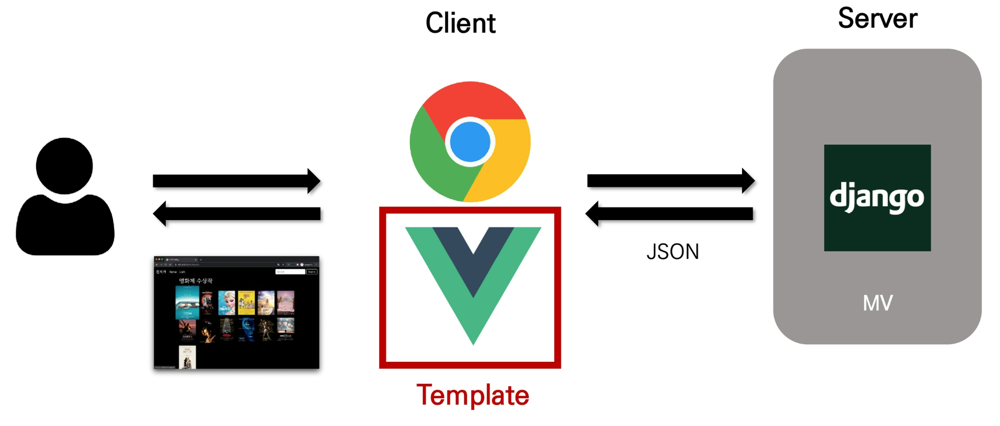

## Why Vue.js?

### 1. 왜 사용할까?

- 가장 인기있는 프론트엔드 프레임워크

- 현대 웹 페이지는 페이지 규모가 계속해서 커지고 있으며, 그만큼 사용하는 데이터도 늘어나고 사용자와의 상호작용도 많이 이루어짐

- 결국 Vanilla JS만으로는 관리하기가 어려움

  - 예시: 페이스북 친구가 이름을 수정했을 경우, 화면상에서 변경되어야 하는 것들

  - 타임라인의 이름, 페이스북 메시지 상의 이름, 내 주소록에서의 친구 이름 등

    => 페이스북이 React를 개발한 이유

  - Vanilla JS로만 짠 코드와와 vue.js 사용 코드

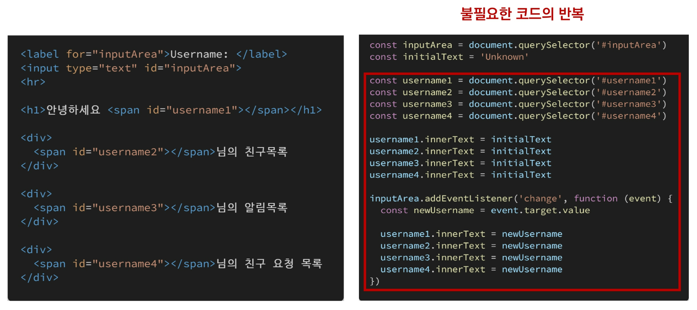

​		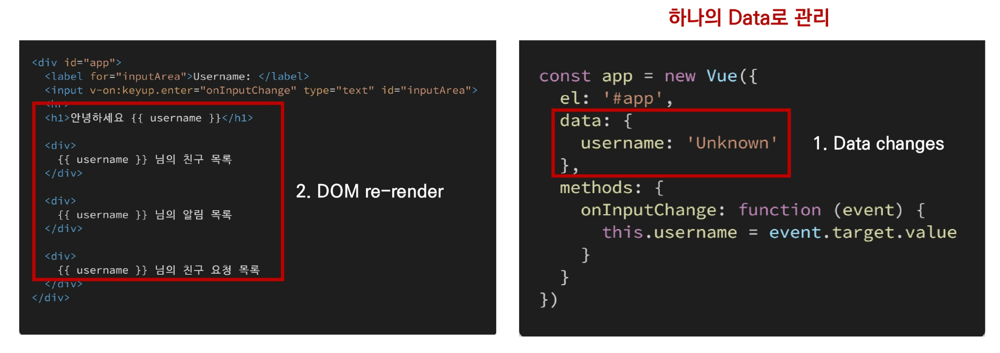

- Django 좋아요 with Vanilla JS

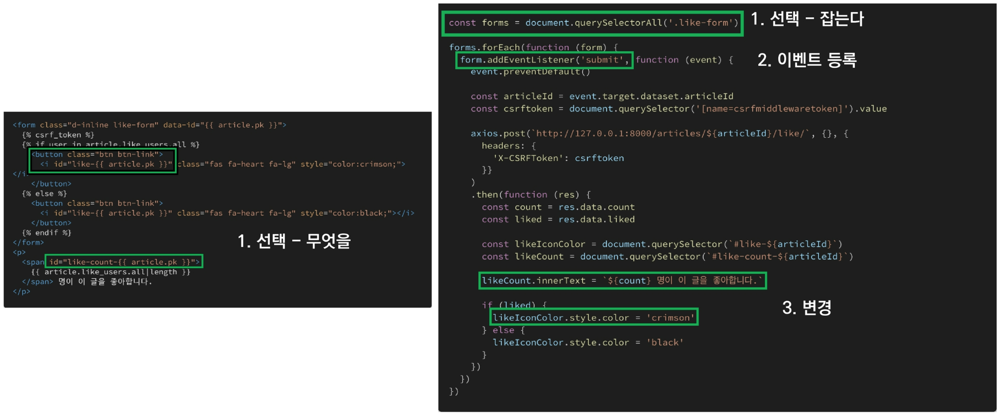

### 2. 비교

- Vanilla JS
  - 한 유저가 작성한 게시글이 DOM상에 100개 존재
  - 이 유저가 닉네임을 변경하면, DB의 Update와 별개로 DOM상의 100개 작성자 이름이 모두 수정되어야 함
  - 모든 요소를 선택해서 이벤트를 등록하고 값을 변경해야 함
- Vue.js
  - DOM과 Data가 연결되어 있고
  - **Data를 변경하면 이에 연결된 DOM은 알아서 변경**
  - 즉, 우리가 신경 써야 할 것은 오직 Data에 대한 관리 (DX: Developer Exp 향상)

## Concepts of Vue.js

### 1. MVVM Pattern

- 애플리케이션 로직을 UI로부터 분리하기 위해 설계된 디자인 패턴
- 구성 요소
  1. Model
  2. View
  3. View Model

### 2. MVVM Pattern in Vue.js

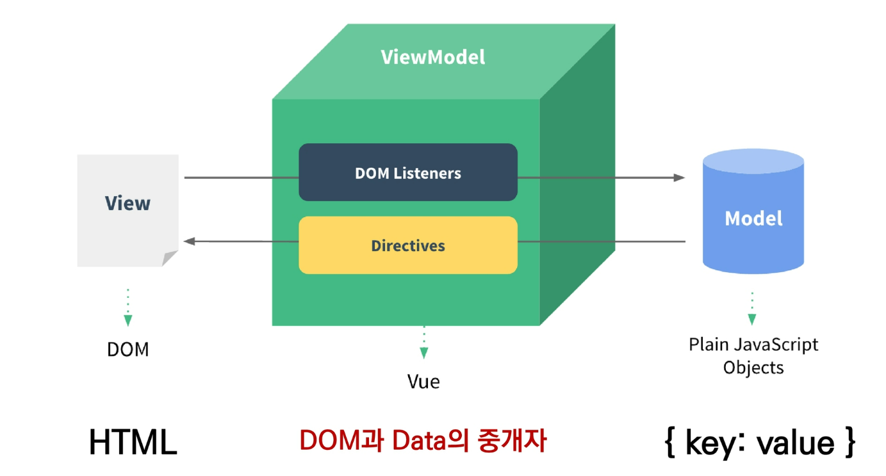

### 3. MV~VM~

- Model
  - Vue에서 Model은 JavaScript Object다.
  - Object === {key: value}
  - Model은 Vue Instance 내부에서 data라는 이름으로 존재
  - 이 data가 바뀌면 View(DOM)가 반응
- View
  - Vue에서 View는 DOM(HTML)이다.
  - Data의 변화에 따라서 바뀌는 대상

### 4. ~MV~VM

- ViewModel
  - Vue에서 ViewModel은 모든 Vue Insatance이다.
  - View와 Model 사이에서 Data와 DOM에 관련된 모든 일을 처리
  - ViewModel을 활용해 Data를 얼마만큼 잘 처리해서 보여줄 것인지(DOM)를 고민하는 것

## Vue ver.2 vs v.3

### 1. Official main version === Vue 3

- Vue 3
  - 2022년 2월부터 vue 프레임워크의 기본 버전이 3.x로 전환
  - CDN or npm을 통한 설치시 자동으로 Vue 3로 설정
- Vue 2
  - 실무에서는 여전히 Vue 2가 많이 사용됨(legacy code)
  - Vue 2의 생태계(문서, 튜토리얼, 자료, QnA등)가 더 성숙함
  - 코어/커뮤니티 라이브러리의 호환 역시 Vue 2가 더 안정적
  - **참고자료가 많은 Vue 2로 학습 후, Vue 3로 이전(migration)하는 게 가장 효과적**

## Quick Start of vue.js

### 1. Django & Vue.js 코드 작성 순서

- Django
  - 데이터의 흐름
  - url => views => template

- Vue.js
  - **Data가 변화하면 DOM이 변경**
    1. Data 로직 작성
    2. DOM 작성

## Basic syntax of Vue.js

### 1. Vue instance

- 모든 Vue 앱은 Vue 함수로 새 인스턴스를 만드는 것부터 시작
- Vue 인스턴스를 생성할 대는 Option 객체를 전달해야 함
- 여러 Options들을 사용하여 원하는 동작을 구현
- Vue Instance === Vue Component

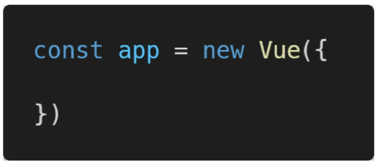

### 2. Options/DOM - 'el'

- Vue 인스턴스에 연결(마운트) 할 기존 DOM 요소가 필요
- CSS 선택자 문자열 혹은 HTML Element로 작성
- new를 이용한 인스턴스 생성 때만 사용

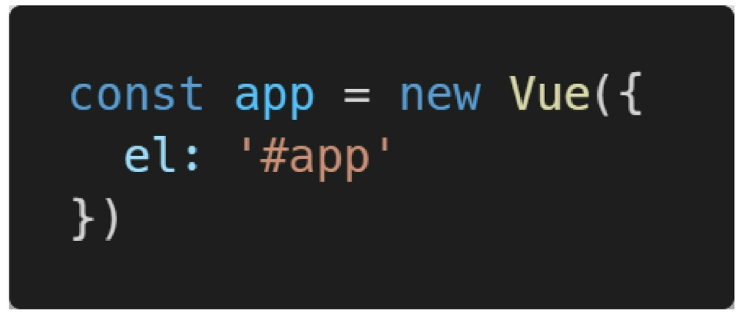

### 3. Options/Data - 'data'

- Vue 인스턴스의 데이터 객체
- Vue 인스턴스의 상태 데이터를 정의하는 곳
- Vue template에서 interpolation을 통해 접근 가능
- v-bind, v-on과 같은 directive에서도 사용 가능
- Vue 객체 내 다른 함수에서 this 키워드를 통해 접근 가능

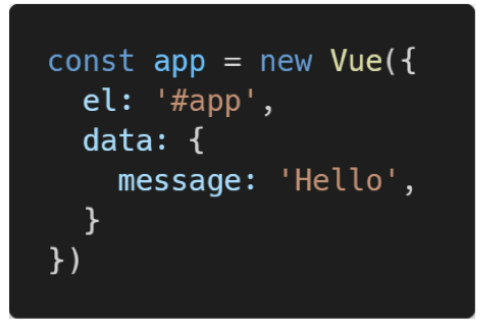

### 3. Options/Data - 'methods'

- Vue 인스턴스에 추가할 메서드

- Vue template에서 interpolation을 통해 접근 가능

- v-on과 같은 directive에서도 사용 가능

- Vue 객체 내 다른 함수에서 this 키워드를 통해 접근 가능

- 주의

  - 화살표 함수를 메서드를 정의하는 데 사용하면 안 됨

  - 화살표 함수가 부모 컨텍스트를 바인딩하기 때문에 'this'는 Vue 인스턴스가 아님

    

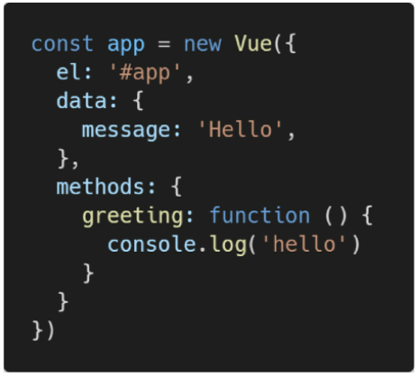

### 4. 'this' keyword in vue.js

- Vue 함수 객체 내에서 vue 인스턴스를 가리킴 
- 화살표 함수를 사용하면 안 되는 경우
  1. data
  2. method 정의

## Template Syntax

### 1. Template Syntax

- 렌더링 된 DOM을 기본 Vue 인스턴스의 데이터에 선언적으로 바인딩 할 수 있는 HTML 기반 템플릿 구문을 사용
  1. Interpolation
  2. Directive

### 2. Interpolation(보간법)

1. Text
   - `메시지: {{ msg }} `
2. Raw HTML
   - ``
3. Attributes
   - `

`
4. JS 표현식
   - `{{ number + 1 }}`
   - `{{ message.split('').reverse().join('') }}`

### 3. Directive(디렉티브)

- **v-접두사가 있는 특수 속성**
- 속성 값은 단일 JS 표현식이 됨(v-for는 예외)
-  표현식의 값이 변경될 때 반응적으로 DOM에 적용하는 역할을 함

- 더욱 자세한 내용들은 html 파일들 참조
