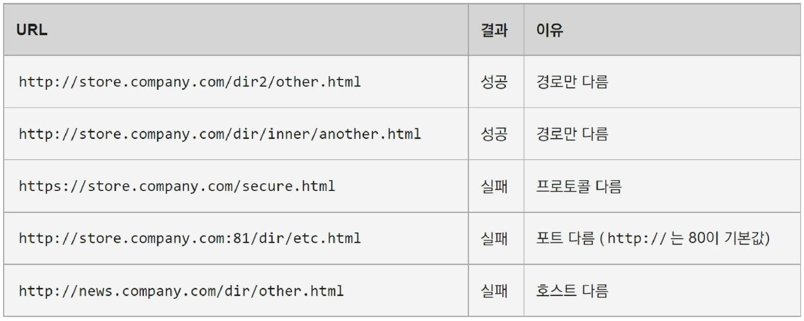
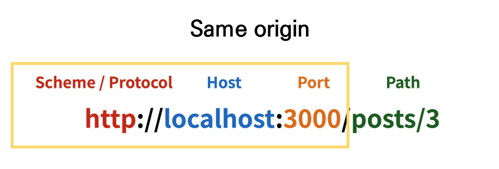
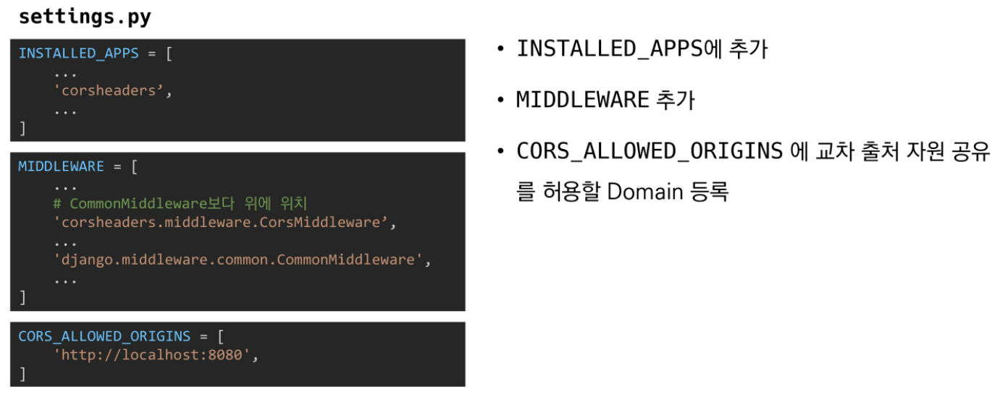
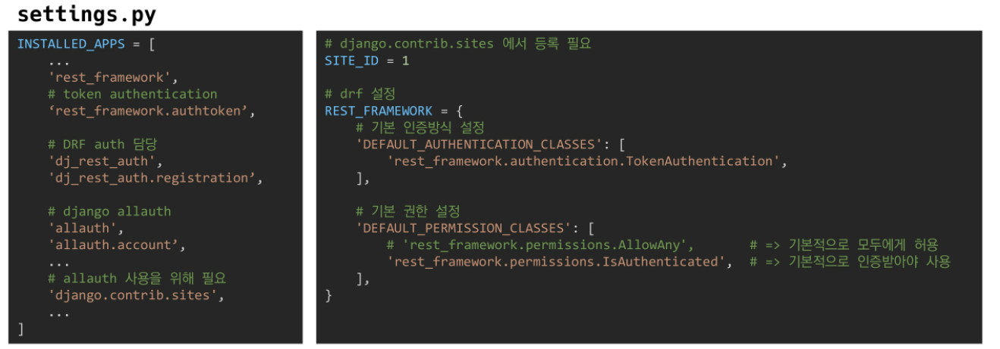

## Server & Client

### 1. Server

- 클라이언트에게 '정보', '서비스'를 제공하는 컴퓨터 시스템
- 정보 & 서비스
  - Django를 통해 응답한 template
    - html을 브라우저에 제공
  - DRF를 통해 응답한 JSON
    - JSON을 클라이언트에 제공


### 2. Client

- 서버에게 그 서버가 맡는(서버가 제공하는) **서비스를 요청**하고, 서비스 요청을 위해 필요한 인자를 **서버가 요구하는 방식에 맞게 제공**하며, 서버로부터 반환되는 응답을 **사용자에게 적절한 방식으로 표현**하는 기능을 가진 시스템


### 3. 정리

- Server는 **"정보 제공"**
  - DB와 통신하며 **데이터**를 CRUD
  - 요청을 보낸 Client에게 이러한 정보를 응답
- Client는 **"정보 요청 & 표현"**
  - Server에게 정보(데이터)를 요청
  - 응답 받은 정보를 잘 가공하여 화면에 보여줌


## CORS

### 1. Same-origin policy (SOP)

- 동일 출처 정책 - MDN 참고
- 특정 출처(origin) - url - 에서 불러온 문서나 스크립트가 다른 출처에서 가져온 리소스와 상호작용 하는 것을 제한하는 보안 방식
- 잠재적으로 해로울 수 있는 문서를 분리함으로써 공격받을 수 있는 경로를 줄임


### 2. Origin (출처)

- 두 URL의 Protocol, Port, Host가 모두 같아야 동일한 출처라 할 수 있음
- URL `http://store.company.com/dir/page.html`의 출처를 비교한 예시



- Same-origin 예시
  - Protocol, Host, Port까지 똑같아야 같은 origin이라고 인지



### 3. Cross-Origin Resource Sharing(CORS)

- "교차 출처 리소스(자원) 공유"
- **추가 HTTP header를 사용**하여, 특정 출처에서 실행중인웹 애플리케이션이 **다른 출처의 자원에 접근할 수 있는 권한을 부여하도록 브라우저에 알려주는 체제**
- 리소스가 자신의 출처(Domain, Protocol, Port)와 다를 때 교차 출처 HTTP 요청을 실행
- 보안 상의 이유로 브라우저는 교차 출처 HTTP 요청을 제한(SOP)
  - 예를 들어 XMLHttpRequest는 SOP를 따름
  - 데이터를 막는 것은 브라우저 => 서버는 어떤 경우에도 응답을 보내긴 함
- 다른 출처의 리소스를 불러오려면 그 출처에서 **올바른 CORS header를 포함한 응답을 반환**해야 함
  - 응답에 헤더를 포함해 해결하는 것은 Server의 역할
- POSTMAN은 이 정책을 사용하지 않아서 문제가 생기지 않았던 것


### 4. Cross-Origin Resource Sharing Policy (CORS Policy)

- 교차 출처 리소스(자원) 공유 정책
  - 자원은 JSON이 될 수도, XMLHttpRequest, 혹은 이외의 것이 될 수도 있다.
- 다른 출처(origin)에서 온 리소스를 공유하는 것에 대한 정책
-  <=> SOP 


### 5. 교차 출처 접근 허용하기

- CORS를 사용해 교차 출처 접근을 허용하기
- CORS는 HTTP의 일부로, 어떤 호스트에서 자신의 컨텐츠를 불러갈 수 있는지 **서버에 지정할 수 있는 방법**


### 6. Why CORS?

1. 브라우저 & 웹 애플리케이션 보호
   - 악의적인 사이트의 데이터를 가져오지 않도록 사전 차단
   - 응답으로 받는 자원에 대한 최소한의 검증
   - 서버는 정상적으로 응답하지만 브라우저에서 차단
2. Server의 자원 관리
   - 우리 회사가 내부에서 쓰려고 큰 돈 들여 만은 API서버에 대한 외부로부터의 접근 차단


### 7. How CORS?

- CORS 표준에 의해 추가된 HTTP Header를 통해 이를 통제

- CORS HTTP 응답 헤더 예시
  - Access-Control-Allow-Origin
  - Access-Control-Allow-Credentials
  - Access-Control-Allow-Headers
  - Access-Control-Allow-Methods


### 8. Access-Control-Allow-Origin 응답 헤더

- 이 응답이 주어진 출처(origin)로 부터 요청 코드와 공유 될 수 있는지를 나타냄
- 예시
  - Access-Control-Allow-Origin: *
    - 브라우저 리소스에 접근하는 임의의 origin으로부터 요청을 허용한다고 알리는 응답에 포함
    - '*'는 모든 도메인에서 접근할 수 있음을 의미
    - '*'외에 특정 origin 하나를 명시 할 수 있음


### 9. CORS 시나리오 예시

- `https://localhost:8080`(Vue.js)의 웹 컨텐츠가 `https://lab.ssafy.com`(Django) 도메인의 컨텐츠를 호출하기를 원하는 상황


- 요청 헤더의 Origin을 보면 localhosr:8080으로부터 요청이 왔다는 것을 알 수 있음
- 서버는 이에 대한 응답으로 Access-Control-Allow-Origin 헤더를 다시 전송
- **만약 서버 리소스 소유자가 오직 localhost:8080의 요청에 대해서만 리소스에 대한 접근을 허용하려는 경우, '*'가 아닌 Access-Control-Allow-Origin: localhost:8080을 전송해야 함**


#### # 정리

1. vue.js에서 A 서버로 요청
2. A 서버는 Access-Control-Allow-Origin에 특정한 origin을 포함 시켜 응답
   - 서버는 CORS Policy와 직접적인 연관이 **없고** 그저 요청에 응답함
3. 브라우저는 응답에서 Access-Control-Allow-Origin을 확인 후 허용 여부를 결정
4. 프레임워크 별로 이를 지원하는 라이브러리가 존재
   - django는 django-cors-headers 라이브러리를 통해 응답 헤더 및 추가 설정 가능


### 10. Django-cors-headers 라이브러리

- 응답에 CORS header를 추가해주는 라이브러리
- 다른 출처에서 보내는 Django 애플리케이션에 대한 브라우저 내 요청을 허용함
- Django App이 header 정보에 CORS를 설정한 상태로 응답을 줄 수 있게 도와주며, 이 설정을 통해 브라우저는 다른 origin에서 요청을 보내는 것이 가능해짐
- `$ pip install django-cors-headers`
- 특정 origin을 허용하려면 아래 사진과 같이 설정하고, 
  모두 허용하려면 `CORS_ALLOW_ALL_ORIGINS = True`로 붙이면 된다.
- github 주소
  - https://github.com/adamchainz/django-cors-headers




## Authentication & Authorization

### 1. Authentication

- 인증, 입증
- 자신이라고 주장하는 사용자가 누구인지 확인하는 행위
- 모든 보안 프로세스의 첫 번째 단계(가장 기본 요소)
- 즉, 내가 누구인지를 확인하는 과정
- 401 Unauthorized
  - 비록 HTTP 표준에서는 "미승인(unauthorized)"을 하고 있지만, 의미상 이 응답은 "비인증(unauthenticated)"를 의미


### 2. Authorization

- 권한 부여, 허가
- 사용자에게 특정 리소스 또는 기능에 대한 액세스 권한을 부여하는 과정(절차)
- 보안 환경에서 권한 부여는 항상 인증을 따라야 함
  - 예를 들어, 사용자는 조직에 대한 액세스 권한을 부여 받기 전에 먼저 자신의 ID가 진짜인지 먼저 확인해야 함
- 서류의 등급, 웹 페이지에서 글을 조회 & 삭제 & 수정 할 수 있는 방법, 제한 구역
  - 인증이 되었어도 모든 권한을 부여 받는 것은 아님
- 403 Forbidden
  - 401과 다른 점은 서버는 클라이언트가 누구인지 알고 있음


### 3. Authentication vs Authorization

- Authentication(인증)
  - ''Authentication is the process of verifying who a user is''
  - 401 Unauthorized
  - 자신이라고 주장하는 유저 확인
  - Credentials(비밀번호, 얼굴인식) 검증
  - Django => 게시판 서비스 로그인
  - 인증 이후에 획득하는 권한 (생성, 수정, 삭제)


- Authorization(권한/허가)
  - ''Authorization is the process of verifying what they have access to''
  - 403 Forbidden
  - 유저가 자원에 접근할 수 있는지 여부 확인
  - 규칙/규정에 의해 접근할 수 있는지 확인
  - Django => 일반 유저 vs 관리자 유저
  - 인증 이후에 부여되는 권한
    - 예시 - 로그인 후 글 작성 여부


### 4. Authentication and authorization work together

- 회원 가입을 하고 로그인을 하면 할 수 있는 권한 생성
  - 인증 이후에 권한이 다라오는 경우가 많음
- 단, 모든 인증을 거쳐도 권한이 동일하게 부여되는 것은 아님
  - Django에서 로그인을 했더라도 다른 사람의 글가지 수정 / 삭제가 가능하진 않음
- 세션, 토큰, 제 3자를 활용하는 등의 다양한 인증 방식이 존재


## DRF Authentication

### 1. 다양한 인증 방식

1. Session Based: django에서 사용
2. Token Based
   - **Basic Token**
   - JWT

3. Oauth
   - google
   - facebook
   - github


### 2. Basic Token Authentication

- 사실상 방식은 session based와 비슷함
- token을 저장하는 곳은 Local Storage


### 3. JWT

- JSON Web Token


- JSON 포맷을 활용하여 요소 간 안전하게 정보를 교환하기 위한 표준 포맷
- 암호화 알고리즘에 의한 디지털 서명이 되어 있기 때문에 JWT 자체로 검증 가능
- JWT 자체가 필요한 정보를 모두 갖기 때문에(self-contained) 이를 검증하기 위한 다른 검증 수단(ex. table)이 필요 없음

- 사용처
  - Authentication, Information Exchange

#### # JWT 특징

- 기본 토큰 인증 체계와 달리 JWT 인증 확인은 데이터베이스를 사용하여 토큰의 유효성을 검사할 필요가 없음
  - 즉, JWT는 데이터베이스에서 유효성 검사가 필요 없음
  - JWT 자체가 인증에 필요한 정보를 모두 갖기 때문(self-contained)
  - 이는 세션 혹은 기본 토큰을 기반으로 한 인증과의 핵심 차이점
  - 토큰 탈취시 서버 측에서 토큰 무효화가 불가능(블랙리스팅 테이블 활용)
  - 매우 짧은 유효기간(5min)과 Refresh 토큰을 활용하여 구현
  - MSA(Micro Server Architecture) 구조에서 서버간 인증에 활용
  - One Source(JWT) Multi Use 가능


## 실습

### 1. dj-rest-auth & django-allauth 라이브러리

- `$ pip install django-allauth`
- `$ pip install dj-rest-auth`
- settings.py에서
  - `'rest_framework.authentication.TokenAuthentication'`
    - 기본 인증방식을 토큰으로 함




- BASE_DIR/urls.py
  - 앞 부분의 url 패턴은 마음대로 설정 가능


- postman으로 login 요청(POST) 보내기
  - body의 raw 탭에서 아래와 같은 형식으로 보냄
  - 보내는 형식을 JSON으로 바꿔줄 것!
  - 요청을 보내면 key가 응답되어 온다
    - 본 key는 DB의 authtoken_token에 위치
  - log in 요청을 보내는 접두 url은 이전에 있던 로그인과 겹쳐도 상관 없다
    - 위 url을 따라 간 url에서 찾은 후, 없으면 아래 있는 url을 검사하기 때문
  - 이후 header
- postman으로 logout 요청(POST) 보내기
  - 요청의 headers 탭에서
    - key는 `Authorization`, value는 `Token <로그인 할때 받은 key>` 로 요청을 보낸다.
    - key와 value를 넣지 않고 로그아웃 요청을 보낼 시, 로그아웃 되었다는 메시지는 나오지만 로그아웃 되지 않는다.
  - 로그아웃은, authtoken_token에서 key를 삭제함으로써 이루어진다.

```python
{
    "username": "admin2",
    "password": "1q2w3e4r!!"
}
```

- registration은 기본 url로 제공해주지 않는다.
  - 추가해주어야 할 앱들과 url이 더 있다
    - url은 위 사진, 앱들은 아래
    - https://django-rest-auth.readthedocs.io/en/latest/installation.html#social-authentication-optional 참고
  - 빈 상태로 post 요청을 보내보면, 필요한 key와 value들을 보내준다.
  - 따로 로그인을 하지 않아도, 생성을 하면 로그인까지 해 준다.

- 회원가입은 가능하다! => post 요청을 보낼 때, 양식에 맞게 보내는 것도 가능하다.
- 필요에 따라, 우리가 커스터마이징 view를 가능할 수도 있다


```python
# accounts/serializers.py

from rest_framework import serializers
from django.contrib.auth import get_user_model
from articles.models import Article


class PorfileSerializer(serializers.ModelSerializer):
    
    
    # 내부에다 하나 더 만드든 이유 => 내 입맛대로 데이터를 가져다 쓰기 위해
    class ArticleSerializer(serializers.ModelSerializer):
        class Meta:
            model = Article
    		fields = ('pk', 'title')
            
    like_articles = ArticleSerializer(many=True)
    articles = ArticleSerializer(many=True)
    
    class Meta:
        model = get_user_model()
        # fields = '__all__'
        fields = ('pk', 'username', 'email',)
```

```python
# accounts/urls.py

urlpatterns = [
    path('profile/<username>/', views,profile)
]
```

```python
# views.py

from django.shortcuts import get_object_or_404
from django.contrib.auth import get_user_model
from rest_framework.decorators import api_view
from rest_framework.response import Response

from .serializers import ProfileSerializer

User = get_user_model()

@api_view(['GET'])
def profile(request, username):
    user = get_object_or_404(User)
    serializer = ProfileSerializer(user)
    return Response(serializer.data)
```

- 프로필 페이지에서 작성한 게시글, 좋아요 게시글 등을 보여줄 수 있다.