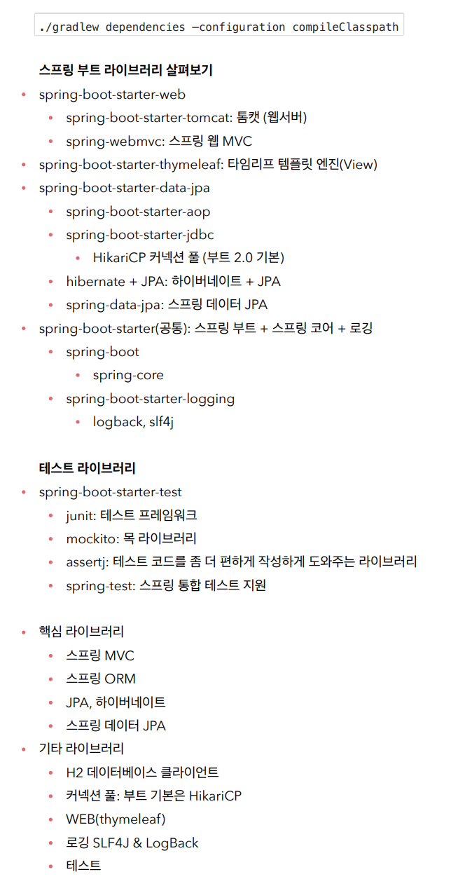

#  Project Configuration

## 1. Spring Boot Starter

`https://start.spring.io/`

1. gradle - groovy project 선택

2. Spring Boot 3.0 이상 선택시 주의할 점

   1. Java 17 이상을 사용 필요

   2. javax 패키지 이름을 jakarta로 변경 필요
      - 오라클과 자바 라이센스 문제로 모든 javax 패키지를 jakarta로 변경
      - 패키지 이름 변경 예 - javax를 jakara로 바꿔주면 된다.) 
      
        - JPA 애노테이션 javax.persistence.Entity -> jakarta.persistence.Entity 
      
   3. H2 데이터베이스를 2.1.214 버전 이상 사용

3. dependency에 다음 사항 추가
   1. spring web(starter)
   2. thymeleaf(server side rendering engine)
   3. spring data jpa
   4. H2 database(개발 및 테스트용에 좋은 DB)
   5. lombok

## 2. 프로젝트 실행

- 에러: 프로젝트 실행 시 finished with non-zero exit value 1 오류 발생
  1. File > Settings
  2. Build, Excution, Deployment > Build Tools > Gradle 클릭
  3. Build and run using과 Run tests using을 Gradle(Default)** -> **Intellij IDEA**

- 에러: TOMCAT 기본 포트인 8080을 사용중에 포트 변경
  - src/main/resources/applicaqtion.properties에`server.port=8081` 코드 추가

- intellij lombok 사용 설정
  - setting -> annotation processors -> enable annotation processing 체크

- 자동으로 빌드가 안 되는 경우
  - jdk가 정상적으로 설치되었는지 확인
  - intellij 설정 - gradle - gradle JVM에서 jdk 버전 확인 후 맞춤 -> 시스템 종료 후 다시실행

- 서버 종류 시 Exception이 발생하는 경우
  - intellij 설정 - buildtools - gradle - build and run using & run test using -> intellij idea로 변경

## 3. 의존성 확인

1번과 2번 중 사용해서 확인

1. 프로젝트 폴더에서 `./gradlew dependencies` 명령 실행

2. IntelliJ 우측의 Gradle 탭 dependencies에서 확인 가능

### 1. main

1. springboot starter web

   1. springboot starter tomcat
      - embeded된 톰캣을 포함하고 있음

   2. spring-webmvc에 의존함을 확인

2. thymeleaf 확인

3. starter data-jpa 확인

   - springboot-starter-jdbc를 포함
   - HikariCP: DB 커넥션 툴
   - Hibernate 포함
   - jpa 포함
   - aop - starter - logging - logback 확인
   - slf4j
   - spring core 확인

### 2. test

1. junit

2. springtest
3. mockito
4. assertj

### 3. 강의자료 라이브러리 확인

- view template은 thymeleaf 사용
- 로깅은 SLF4J 인터페이스에 LogBack 구현체를 꽂아 씀

