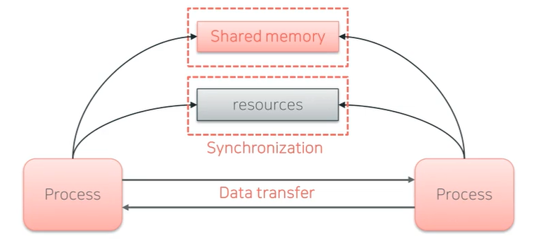
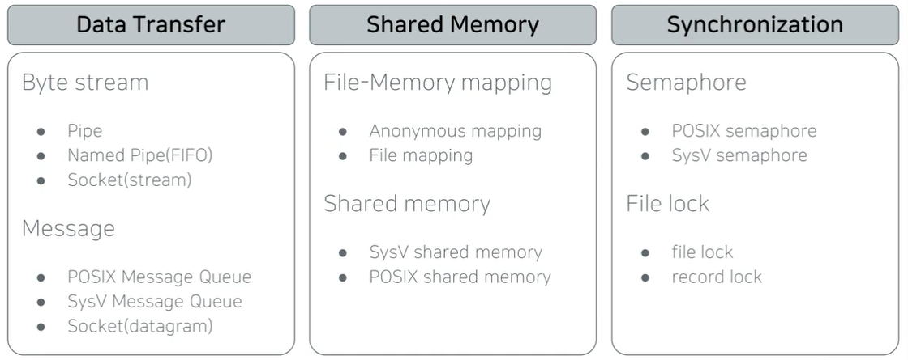

# Intro

## IPC란?

Inter-Process Communication

프로세스간 통신

프로세스들 사이에서 데이터를 주고받는 행위 또는 그에 대한 방법, 경로

1. Data Transfer
   - 데이터 직접 전송
2. Shared Memory
   - 공유 메모리
3. Synchronization
   - 직접 데이터를 주고받는것은 아니지만, 동시화를 통해 순서에 맞게 resources를 사용

규모가 있는 프로그램에서는, 여러 개의 프로세스가 각자 맡은 일을 수행하고 프로세스들 간에 필요한 데이터 교환, 상태를 검사함

## 강좌 목표 / 구성

### 목표

Linux IPC 도구의 종류와 특징을 파악한다.

IPC 도구를 이용해 프로그래밍 하는 방법을 익힌다.

소프트웨어 요구사항에 맞는 IPC 도구를 선택해 설계/구현할 수 있는 능력을 배양한다.

- 보다 더 짜임새 있는 소프트웨어를 만들어낼 수 있다. 

### 주제별 강의 구성

주요 개념 설명

주요 API 소개 및 사용법

라이브 프로그래밍으로 실습

### Linux IPCs

- POSIX, SysV의 API가 다르므로 둘 다 알아야 한다.

 

## 강의 종료 후 할 수 있는 것

- Linux IPC 도구의 종류와 특징에 대해 알 수 있다.
  - IPC 도구 종류와 특징, API 소개, 유사 IPC 도구 간 비교 분석
  - IPC 도구 별 프로그래밍 실습
- **소프트웨어 요구사항에 적합한 IPC 도구를 선택하여 설계/구현할 수 있다.**
  - 선택 가능한 도구들 중 가장 적합한 도구 선택 가능
- 경쟁력 있는 리눅스 시스템 개발자의 기반을 쌓았다고 말할 수 있다.

