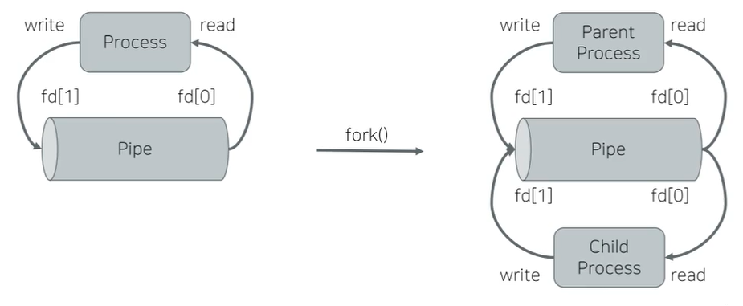
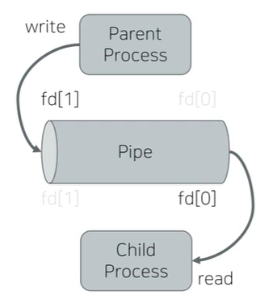
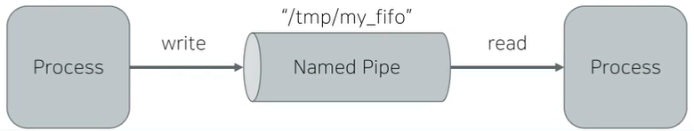

# Pipe and Named Pipe

## I. Pipe/Named Pipe란?

- Data Transfer(데이터 전송)하는 도구

- Byte Stream 형식의 데이터를 전송할 수 있다.

## II. Pipe


1. Uni-directional byte Stream
   - 한 방향으로 향하는 바이트 스트림

2. name or ID가 없음

3. related process 간에 사용 가능(e.g. fork())
   - name or ID가 없기 때문에 서로 상관 없는 프로세스간에는 사용할 수 없다.




- 좌측
  - 하나의 프로세스가 생성되었을 때
  - read를 할 수 있는 쪽과 write를 할 수 있는 쪽이 한 방향으로 연결되어 있음 
    - read, write 가능
- 우측(fork() 후)
  - parent와 child로 나누어졌을 때
  - 부모의 파일 디스크립터를 복제해서 자식에게 공유
    - 즉 하나의 파이프가 두 개의 프로세스에 의해 공유
  - 문제 발생 가능
    - write한 data가 원하는 곳이 아니라, 다른 곳으로 향할 수 있음


- 문제 해결 방식
  - close unused fds
    - 사용하지 않는 파일 디스크립터를 닫는다.



### 1. Pipe APIs

`int pipe(int pipefd[2]);`

- pipe를 생성
- parameter
  - pipefd[2] : 생성될 pipe fd들을 저장할 버퍼
    - pipefd[0] : reader-side fd
    - pipefd[1] : writer-side fd

- return
  - 성공시 0
  - 실패시 -1

### 2. Pipe I/O

- pipe가 full일때 write 시도하면 blocking
  - pipe란 바이트스트림을 저장할 수 있는 메모리 공간 - 버퍼
  - 즉, write를 하다 해당 공간이 가득 차면 blocking
- pipe가 empty일 때 read 시도하면 blocking
- write size가 PIPE_BUF보다 작으면 atomic - 온전히 들어감, 크면 interleaved - 메모리상에 쪼개져서 저장 - 될 수 있음
  - Linux PIPE_BUF: 4 KB
  - multiple writer 환경에서 유의해야 함


## II. Named Pipe(FIFO)



1. Uni-directional byte stream
2. **파일 경로가 ID**
   - unrelated process 간에도 사용 가능
3. FIFO생성과 open이 분리되어 있음
   - API가 분리되어 있음
   - 생성된 FIFO를 open()해서 사용
     - syscall api - read() write() 등을 사용해 communication
4. open() 시 read-side와 write-side가 동기화 됨
   - **즉, 양쪽 모두 open 시도가 있어야 성공**
     - 한쪽이 성공할 때 다른쪽도 동시에 성공
   - open시 O_NONBLOCK이 유용하게 사용될 수 있음.

### 1. Named Pipe APIs

`int mkfifo(const char *pathname, mode_t mode);`

- named pipe 파일을 생성
- parameter
  - pathname : 생성될 named pipe 파일 경로
  - mode: permission

- return
  - 성공시 0
  - 실패시 -1

## III. Pipe 실습

- fork()를 통해 자식 프로세스를 실행
  - 부모 프로세스와 자식 프로세스의 pid가 다른 것을 확인할 수 있다.

```c
// pipe.c -> parent에게서 child에게 메시지를 보냄
// cc -Wall -Werror -pthread -o pipe pipe.c -lrt

#include <stdio.h>
#include <stdlib.h>
#include <string.h>
#include <unistd.h>
#include <sys/types.h>
#include <sys/wait.h>

int main (int argc, char **argv)
{
    int pipe_fds[2];                    // pipe 생성
    pid_t pid;                          // 프로세스 번호를 저장하는 타입 
                                        // -> 시스템에 따라 프로세스번호가 int가 아닐 수 있기에 사용
    char buf[1024];
	int wstatus;
    
    printf("[%d] start of function \n", getpid());
    memset(buf, 0, sizeof(buf));

    if (pipe(pipe_fds))
    {
        perror("pipe()");
        return -1;
    };
   
    pid = fork();                       // fork()를 통해 child process 실행
    									// pid값으로 parent or child process 또는 error 확인 가능
    									// 현재 프로세스가 부모 프로세스일 경우에는 자식 프로세스의 pid를 return
    									// 현재 프로세스가 자식 프로세스일 경우에는 0을 return
    if (pid == 0)
    {
        /* child process */
        
        close(pipe_fds[1]);
        read(pipe_fds[0], buf, sizeof(buf));
        printf("[%d] parent said that %s\n", getpid(), buf);	// 읽은 data를 출력
        close(pipe_fds[0]);						// 이후 닫음
    }
    else if (pid > 0)
    {
        /* parent process */
        
        close(pipe_fds[0]);             // parent가 데이터를 보내므로, reader side를 닫음
        strncpy(buf, "hello, child~", sizeof(buf)-1);
        write(pipe_fds[1], buf, strlen(buf));
        close(pipe_fds[1]);						// 이후 닫음
        pid = wait(&wstatus);					// child가 종료되었을 때 pid를 받아와 종료처리
    }
    else
    {
        /* error case */
        perror("fork()");
        goto err;
    }  
    return 0;
    
err:
    close(pipe_fds[0]);
    close(pipe_fds[1]);
    return -1;
}

```


### IV. Named Pipe 실습

```c
#include <stdio.h>
#include <stdlib.h>
#include <string.h>
#include <unistd.h>
#include <sys/types.h>
#include <sys/wait.h>
#include <fcntl.h>

#define FIFO_FILENAME "./testfifo"

static void print_usage(char *progname)
{
    printf("%s (s|r)\n", progname);
    return;
}

static int do_reader(void)
{
    int fd;
    char buf[128];
    
    fd = open(FIFO_FILENAME, O_RDONLY);
    if (fd < 0) 
    {
        perror("open()");
        return -1;
    }
    read(fd, buf, sizeof(buf));
    printf("writer said that %s\n", buf);
    close(fd);
    
    return 0;
}

static int do_writer(void)
{
    int fd;
    char buf[128];
    
    unlink(FIFO_FILENAME);
    if (mkfifo(FIFO_FILENAME, 0644))
    {
        perror("mkfifo()");
        return -1;
    }
    fd = open(FIFO_FILENAME, O_WRONLY);
    if (fd < 0) 
    {
        perror("open()");
        return -1;
    }
    strncpy(buf, "hello", sizeof(buf));
    write(fd, buf, strlen(buf));
    close(fd);
    
    return 0;
}

/* fifl (s|r) */
int main(int argc, char **argv)
{
    if (argc < 2)
    {
        print_usage(argv[0]);
        return -1;
    }
    
    if (!strcmp(argv[1], "r"))
    {
        /* reader */
        do_reader();
    } 
    else if (!strcmp(argv[1], "s"))
    {
		/* writer */
        do_writer();
    }
    else
    {
        print_usage(argv[0]);
        return -1;
    }
    return 0;
}
```

