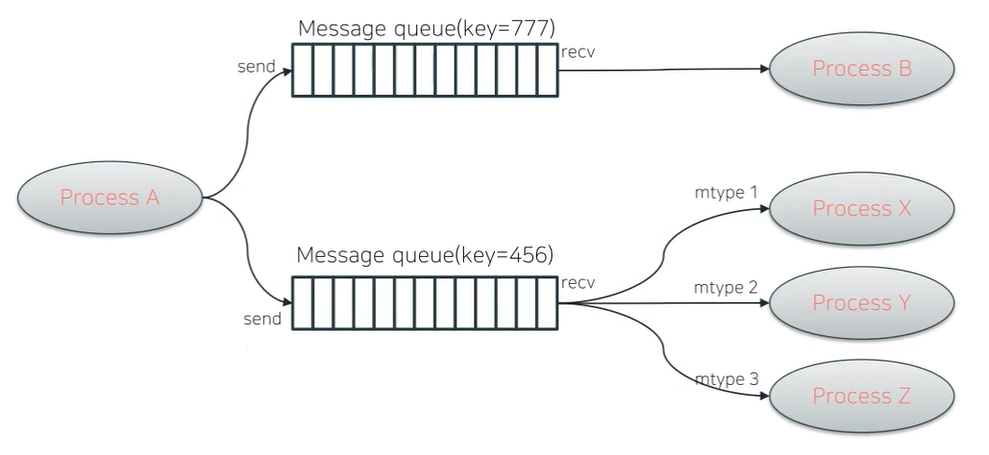
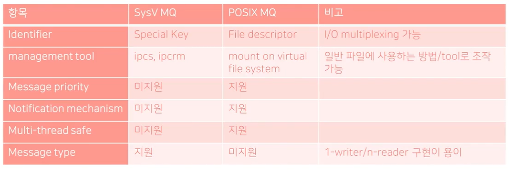

# Message Queue


- Message 기반 communication
  - Byte Stream이 아님
  - 하나의 메시지는 하나의 덩어리처럼 처리됨
- FIFO(First in, First out)을 이용한 message queue
- unrelated process 간에도 사용이 가능하다.


## I. SysV Message Queue

> System Five라고 읽는다.
>
> SysV API가 POSIX API보다 먼저 나왔다.
>
> 따라서 POSIX Message Queue API가 우월하지만, 
> SysV Message Queue API가 더 오래되어 더 많이 사용된다.
>
> 이는 Shared Memory 등도 마찬가지이다.
>
> 따라서, 유지보수에는 SysV가 많이 쓰이고, 새 개발에는 POSIX를 선호한다.

- Message 기반 communication
  - message 별 message type 지원
    - message마다 type을 지정해서 송, 수신할 수 있다.
    - **SysV만의 특징**
- Message queue
  - FIFO(First in, First out)
  - IPC Key 기반 Identifier(not fd)
    - **int type이지만 fd가 아님!**
    - I/O multiplexing API에서 사용이 불가능하다는 의미(select 등)

- Management tools
  - bash에서 실행 가능한 tool들
  - ipcs: IPC object 관련 정보 조회
  - ipcrm: IPC object 삭제




- 상단의 메시지 큐는 pipe와 비슷
- 하단의 구조는 여러 개의 프로세스가 하나의 프로세스에서 수신
  - 특정 프로세스에만 send하고 싶으면 송/수신시 메시지 타입 지정

### 1. SysV MQ APIs

> 1. 데이터 송수신
>    - msgsnd()
>    - msgrcv()
> 2. 기타
>    - msgctl()
>    - msgget()
>    - ftok()
>      - SysV계열 API에서 범용적으로 사용

1. `int msgget(key_t key, int msgflg);`

   - 설명

     - Message queue ID를 구한다.

     - 옵션에 따라 생성도 가능

   - parameters
     - key: IPC object Key or IPC_PRIVATE
       - IPC_PRIVATE: 지정 시 새로운 message queue ID 생성
     - msgflg: permission + mask
       - IPC_CREAT: key에 매치되는 message queue ID 없으면 생성
       - IPC_EXCL: key에 매치되는 message queue ID가 있으면 에러 발생
   - return
     - 성공: message queue ID
     - 실패: -1

2. `key_t ftok(const char * pathname, int proj_id)`

   - 설명

     - filepath와 proj_id를 조합하여 key값을 구한다.

     - best effort, unique하다 보장은 안됨

   - parameters
     - pathname
       - 조합할 파일 경로
       - 파일이 존재해야 하고, readable 해야 함
     - proj_id
       - 임의의 project ID
       - 예: 'a'
   - return
     - 성공: IPC Key
     - 실패: -1

3. `int msgsnd(int msqid, const void *msgp, size_t msgsz, int msgflg);`

   - 설명
     - message 전송
   - parameters
     - msqid: message queue id
     - msgq: 전송할 메시지 버퍼
     - msgsz: 전송 메시지 사이트(mtext의 길이 in bytes)
   - msgflg
     - IPC_NOWAIT: non-blocking I/O
   - return
     - 성공: 0
     - 실패: -1

4. `ssize_t msgrcv(int msqid, void *msgp, size_t msgsz, long msgtyp, int msgflg);`

   - 설명
     - message 수신
   - parameters
     - msqid: message queue id
     - msgp: message 수신 버퍼
     - msgsz: 최대 수신 길이 (mtext의 길이 in bytes)
     - msgtyp: 수신할 message type
       - 0: 첫번째 메시지 수신
       - 양수: msgtype에 매치되는 첫번째 메시지 수신
       - 음수: 지정된 절대값보다 작거나 같은 msgtype에 매치되는 첫번째 메시지 수신
     - msgflg
       - IPC_NOWAIT: non-blocking I/O
       - MSG_COPY
         - n번째 메시지를 복사해서 수신
         - 반드시 IPC_NOWAIT와 같이 사용해야 함
       - MSG_EXCEPT: msgtyp과 매치되지 않는 메시지를 수신
       - MSG_NOERROR: 메시지 사이즈가 msgsz보다 크다면 truncate 시킴
   - return
     - 성공: 실제로 받은 데이터 길이(mtext의 길이 in bytes)
     - 실패: -1

5. `int msgctl(int msqid, int cmd, struct msqid_ds *buf);`

   - 설명
     - message queue 제어
   - parameters
     - msqid: message queue id
     - cmd
       - IPC_STAT: kernel의 msgid_ds 정보 습득
       - IPC_SET: kernel의 msgid_ds에 설정
       - IPC_RMID: message queue 제거
     - buf
   - return
     - 성공: 0
     - 실패: -1

## 2. 실습 1

- `$ ./mq_sysv send` 이후 `$ ./mq_sysv recv`
- `$ ipcs -q` command를 통해 message queue에 대한 정보를 알 수 있다.
  - send 후 used-byte와 messages를 확인하자.
  - recv 후에는, 해당 부분이 다시 감소한다.

```c
// mq_sysv.c
#include <stdio.h>
#include <stdlib.h>
#include <string.h>
#include <unistd.h>

#include <sys/types.h>
#include <sys/ipc.h>
#include <sys/msg.h>

#define IP_KEY_FILENAME "/proc"
#define IPC_KEY_PROJ_ID 'a'

struct msgbuf {
    long mtype;
#define MSGBUF_STR_SIZE 64
    char string[MSGBUF_STR_SIZE];
}

static void print_usage(const char *progname)
{
    printf("%s (send|recv)\n", progname);
}

static int init_msgq(void)
{
    int msgq;
    key_t key;

    key = ftok(IP_KEY_FILENAME, IPC_KEY_PROJ_ID);
    
    if (key == 1) {
        perror("ftok()");
        return 1;
    }

    msgq = msgget(key, 0655 | IPC_CREAT);
    if (msgq == 1) {
        perror("msgget()");
        return 1;
    }

    return msgq;
}

static int do_send(void) 
{
    int msgq;
    struct msgbuf mbuf;

    msgq = init_msgq();

    if (msgq == -1) {
        perror("init_msgq()");
        return 1;
    }
    
    memset(mbuf, 0, sizeof(mbuf));
    
    mbuf.mtype = 0;
    strncpy(mbuf.string, "hello world", sizeof(mbuf.string) - 1);
    if (msgsnd(msgq, &mbuf, sizeof(mbuf, string), 0) == 1) { // 실제 보내려는 데이터의 size -> parameters 3
        perror("msgsnd()");
        return 1;
    }
    return 0;
}
static int do_recv(void) 
{
    int msgq;
    struct msgbuf mbuf;

    msgq = init_msgq();

    if (msgq == -1) {
        perror("init_msgq()");
        return 1;
    }
    
    memset(mbuf, 0, sizeof(mbuf));
    ret = msgrcv(msgq, &mbuf, sizeof(mbuf.string), 0, 0) // 역시 3번째 인자로는 실제로 받아올 수 있는 size
    if (ret == -1) {
        perror("msgrcv()");
        return -1;
    }

    printf("received msg: mtype %ld, msg [%s]\n",
        mbuf.mtype, mbuf.string);

    return 0;
}

int main(int argc, char **argv)
{
    int ret;

    if (argc < 2){
        print_usage(argv[0]);
        return 1;
    }

    if (!strcmp(argv[1], "send")) {
        ret = do_send();
    } else if (!strcmp(argv[1]), "recv") {
        ret = do_recv();
    } else {
        print_usage(argv[0]);
        return 1;
    }
    return 0;
} 
```

### 3. 실습 2 - message type 설정

```c
// mq_sysv.c
#include <stdio.h>
#include <stdlib.h>
#include <string.h>
#include <unistd.h>

#include <sys/types.h>
#include <sys/ipc.h>
#include <sys/msg.h>

#define IP_KEY_FILENAME "/proc"
#define IPC_KEY_PROJ_ID 'a'

struct msgbuf {
    long mtype;
#define MSGBUF_STR_SIZE 64
    char string[MSGBUF_STR_SIZE];
}

static void print_usage(const char *progname)
{
    printf("%s (send|recv) MTYPE\n", progname);
}

static int init_msgq(void)
{
    int msgq;
    key_t key;

    key = ftok(IP_KEY_FILENAME, IPC_KEY_PROJ_ID);
    
    if (key == 1) {
        perror("ftok()");
        return 1;
    }

    msgq = msgget(key, 0655 | IPC_CREAT);
    if (msgq == 1) {
        perror("msgget()");
        return 1;
    }

    return msgq;
}

static int do_send(long mtype) 
{
    int msgq;
    struct msgbuf mbuf;

    msgq = init_msgq();

    if (msgq == -1) {
        perror("init_msgq()");
        return 1;
    }
    
    memset(mbuf, 0, sizeof(mbuf));
    
    mbuf.mtype = mtype;

    snprintf(mbuf.string, sizeof(mbuf.string),
            "hello world mtype %ld", mtype); // snprintf() : 글자가 buffer보다 커도, 끝에 자동으로 \0 삽입됨
    
    if (msgsnd(msgq, &mbuf, sizeof(mbuf, string), 0) == 1) { // 실제 보내려는 데이터의 size -> parameters 3
        perror("msgsnd()");
        return 1;
    }
    return 0;
}
static int do_recv(long mtype) 
{
    int msgq;
    struct msgbuf mbuf;

    msgq = init_msgq();

    if (msgq == -1) {
        perror("init_msgq()");
        return 1;
    }
    
    memset(mbuf, 0, sizeof(mbuf));
    
    ret = msgrcv(msgq, &mbuf, sizeof(mbuf.string), mtype, 0) // 역시 3번째 인자로는 실제로 받아올 수 있는 size
    if (ret == -1) {
        perror("msgrcv()");
        return -1;
    }

    printf("received msg: mtype %ld, msg [%s]\n",
        mbuf.mtype, mbuf.string);

    return 0;
}

int main(int argc, char **argv)
{
    int ret;
	long mtype;
    
    if (argc < 3){
        print_usage(argv[0]);
        return 1;
    }

    mtype = strtol(argv[2], NULL, 10);

    
    if (!strcmp(argv[1], "send")) {
        if (mtype <= 0) {
            print_usage(argv[0]);
            return 1;
        }
        ret = do_send(mtype);
    } else if (!strcmp(argv[1]), "recv") {
        ret = do_recv(mtype);
    } else {
        print_usage(argv[0]);
        return 1;
    }
    return 0;
} 
```


## II. POSIX Message Queue

- Message 기반의 커뮤니케이션
  - Partila read 없음
  - Multiple message read 없음
- 하나의 message queue로 read/write 가능
- Multi-reader/Multi-writer 가능
- File I/O기반의 동작-> I/O multiplexing 가능
- Message 우선순위 적용 가능
- Message Notification 기능
- link시 -ltr 반드시 추가해야 함


### 1. POSIX MQ APIs

> 1. MQ 관리
>    - mq_open()
>    - mq_close()
>    - mq_unlink()
> 2. 데이터 송수신
>    - mq_send()
>    - mq_receive()
> 3. 기타
>    - mq_setattr()
>    - mq_getattr()
>    - mq_notify()

1. `mqd_t mq_open(const char*name, int oflag);`

   - 설명
     - MQ 열기

   `mqd_t mq_open(const char*name, int oflag, mode_t mode, struct mq_attr *attr);`

   - 설명
     - MQ **생성**하며 열기

   - parameters
     - name: MQ 이름(반드시 /로 시작해야 함. e.g. `/tmp/testmq`)
     - oflag: mask of `O_RDONNLY, O_WRONLY, O_RDWR, O_CREAT, O_CLOEXEC, O_EXCL, O_NONBLOCK`
     - mode: permission
     - attr: 속성 지정
   - return
     - 성공: messag equeue descriptor 리턴
     - 실패: -1

2. `int mq_close(mqd_t mqdes);`

   - 설명
     - MQ 닫기

   - parameters
     - mqdes: message queue descriptor
   - return
     - 성공: 0
     - 실패: -1

3. `int mq_unlink(const char *name);`
   - 설명
     - MQ 삭제
   - parameters
     - name: message queue descriptor name
   - return
     - 성공: 0
     - 실패: -1

4. `int mq_send(mqd_T mqdes, const char *msg_ptr, size_t msg_len, unsigned int msg_prio);`
   - 설명
     - 메시지 전송
   - parameters
     - mqdes: Message queue descriptor
     - msg_ptr: pointer to send
     - msg_len: length to sen
     - msg_prio: priority
       - 0(lowest)~32768(highest)
   - return
     - 성공: 0
     - 실패: -1

 5. `ssize_t mq_receive(mqd_t mqdes, char *msg_ptr, size_t msg_len, unsigned int *msg_prio);`

    - 설명
      - 메시지 수신
    - parameters
      - mqdes: Message queue descriptor
      - msg_prt: pointer to receive
      - msg_len: length to receive
        - 반드시 attr.mq_msgsize보다 크거나 같아야 함
      - msg_prio:priority
        - 0(lowest)~32768(highest)

    - return
      - 성공: 읽은 바이트 수
      - 실패: -1

 6. `int mq_getattr(mqd_t mqdes, struct mq_attr *attr);`
    `int mq_setattr(mqd_t mqdes, const struct mq_attr *newattr, struct mq_attr *oldattr);`

    - parameters
      - mqdes: Message queue descriptor
      - attr: attribute
    - return
      - 성공: 0
      - 실패: -1

7. `int mq_notify(mqd_t mqdes, const struct sigevent *sevp);`

   - 설명
     - 메시지 notification 설정

   - parameters
     - mqdes: Message queue descriptor
     - sevp: notification 설정
   - return
     - 성공: 0
     - 실패: -1

## 3. SysV MQ vs POSIX MQ

