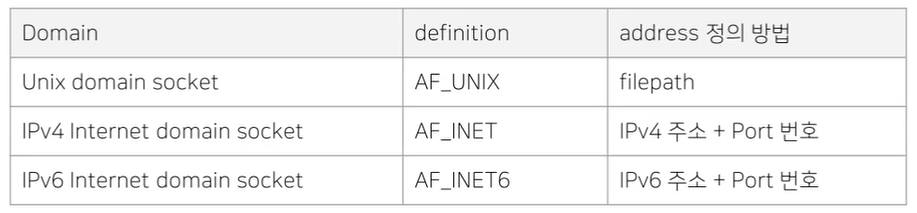
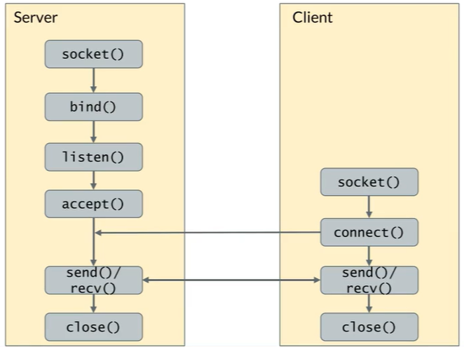
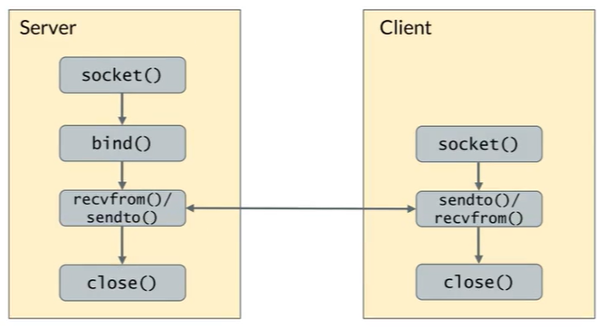

# Socket

- Data Transfer에 사용됨
- stream type socket: Byte stream
- datagram type socket : Message

 

## I. Socket이란?

- Socket
  - **컴퓨터 네트워크 상**에서 **데이터를 교환하는 내부 종점(endpoint)**을 정의하기 위한 **추상적 개념**
  - 두 Socket이 서로 연결되어야 데이터 통신이 가능
  - 각 Socket은 Address가 있어 서로 Identifying 가능
    - 하나의 호스트 시스템(컴퓨터) 내에도 여러 개의 소켓이 존재하기 때문에 식별 필요
- Socket Interface
  - 데이터 통신을 위해 커널이 제공하는 애플리케이션 프로그래밍 인터페이스
  - 애플리케이션이, 커널이 서비스하는 TCP/IP network stack을 쉽게 이용할 수 있음
- **IPC on Socket**
  - 소켓을 이용해서 IPC를 할 수 있음  
    - 즉 프로세스 간 통신 가능
  - 호스트 전용 도메인(Unix domain socket) 혹은 인터넷 도메인 상에서 Local Address 사용
    - 원격지와는 통신 불가능,한 호스트 내의 프로세스간에만 통신을 할 수 있음
  - 양방향 통신
- Domain Type
  - 모든 Socket은 domain과 type을 지정해 

## II. Socket - Domain

- Domain
  - Socket을 어떻게 identifying 하는가
  
  - Socket에 어떤 방법으로 address를 부여하는가
  
  - 종류
    
    
    
    - IPC에는 Unix domain socket을 주로 사용할 것
    - 사실 Internet domain socket을 사용해도 상관은 없음
      - port 번호를 다르게 해서 사용 가능
    - 하지만 그럼에도 불구하고 IPC 에서는 Unix domain socket을 사용하는 것이 좋다
      - IP주소 + Port번호라는 한정된 자원을 이용하지 않을 수 있다.
      - fork()등 API를 사용할 수 있다.

## III. Socket - Type
- Type
  - **어떤 방식**으로 데이터 교환을 할 것인가?
  - 종류

| Socket Type | Definition  | 특징                                                         | Internet Domain Socket과의 매핑 |
| ----------- | ----------- | ------------------------------------------------------------ | ------------------------------- |
| Stream      | SOCK_STREAM | Connect-orient(두 Process가 Connection을 먼저 맺어야함), byte stream, reliable, 양방향 | TCP                             |
| Datagram    | SOCK_DGRAM  | Connectionless(서로 Socket으로 연결되지 않은 상태에서 보낼 수 있음), unreliable(단, Unix Domain Socket에서 사용할 때는 한 host 내에서의 전달이기 때문에 손실 가능성은 없다), 양방향 | UDP                             |


## IV. Unix Domain Socket

- **Host-only socket**
  - **네트워크 통신 안됨**
- filepath로 address
- 양방향 통신
- stream/datagram 모두 **신뢰성 보장됨**
- **file descriptor 전송 가능**
  - unrelated process 간에도 fd를 passing해서 같은 fd를 이용할 수 있다.
    -  구글링 해 볼것
  - fork()를 해서 parent-child가 fd를 복제해 갖고 있는 것과 유사하다.


## V. Socket - Programming control flow

### 1. stream



### 2. datagram




## VI. Socket APIs

> 1. 열기 / 닫기
>    - socket()
>    - close()
> 2. Socket 설정
>    - Server-side
>      - bind()
>      - listen()
>      - accept()
>    - Client-side
>      - connect()
> 3. 데이터 송수신
>    - send() / sendto()
>    - recv()/ recvfrom()


1. `int socket(int domain, int type, int protocol);`

   - 설명
     - socket 생성
   - parameter
     - fdomain: socket
       - AF_UNIX, AF_INET, AF_INET6, ...
     - type: 통신 종류
       - SOCK_STREAM, SOCK_DGRAM
     - protocol
       - IPPROTO_TCP, IPPROTO_UDP, ...
       - unix domain socket에는 0 입력
   - return
     - 성공: socket descriptor
     - 실패: -1

   

2. `int bind(int sockfd, const struct sockaddr *addr, socklen_t addrlen)`;

   - 설명
     - socket에 address를 붙임
   - parameter
     - sockfd
     - addf: socket에 붙일 address
     - addrlen: addr parameter의 길이
   - return
     - 성공: 0
     - 실패: -1


3. `int listen(int sockfd, int backlog);`

   - 설명
     - 접속 대기큐 설정
   - parameter
     - sockfd
     - backlog: 접속 대기큐의 최대 길이
   - return
     - 성공: 0
     - 실패: -1


4. `int accept(int sockfd, struct sockaddr *addr, socklen_t *addrlen);`

   - 설명
   - parameter
     - sockfd
     - addr: peersocket의 address 저장버퍼
     - addrlen: addr parameter의 길이
   - return
     - 성공: 접속된 peer socket descriptor 리턴
     - 실패: -1


5. `int connect(int sockfd, const struct sockaddr *addr, socklen_t addrlen);`

   - 설명
     - server socket에 접속 시도
   - parameter
     - sockfd
     - addr: 접속할 address
     - addrlen: addr parameter의 길이
   - return
     - 성공: 0
     - 실패: -1


6. `ssize_t send(int sockfd, const void *buf, size_t len, int flags);`
   `ssize_t sendto(int sockfd, const void *buf, size_t len, int flags, const struct sockaddr *dest_addr, socklen_t addrlen);`

   - 설명
     - 데이터 전송
   - parameter
     - sockfd
     - buf: 전송할 데이터가 있는 버퍼의 포인터
     - len: 전송할 데이터 길이
     - flags: 전송 flag(일반적으로 0)
     - dest_addr: 목적지 socket의 address
     - addrlen: dest_addr parameter의 길이
   - return
     - 성공: 실제 전송한 데이터 길이(byte)
     - 실패: -1
   
   
   
7. `ssize_t recv(int sockfd, void *buf, size_t len, int flags);`
   `ssize_t recvfrom(int sockfd, void *buf, size_t len, int flags, struct sockaddr *src_addr, socklen_t *addrlen);`

   - 설명
     - 데이터 수신
   - parameter
     - buf: 수신 데이터를 저장할 버퍼 포인터
     - len: 최대 수신 길이(byte)
     - flags: 전송 flag(일반적으로 0)
     - src_addr: 발신지 socket의 address
     - addrlen: src_addr parameter의 길이
   - return
     - 성공: 실제 수신된 데이터 길이(byte)
     - 실패: -1

## VII. Stream Socket Example Code

- 컴파일: `cc -Wall -Werror -pthread -9 sock_stream sock_stream.c -ltr`
- `./sock_stream server` 
  - sock_stream_un 파일 생성
- `./sock_stream client`
```c
#include <stdio.h>
#include <stdlib.h>
#include <string.h>
#include <unistd.h>
#include <sys/types.h>
#include <sys/socket.h>
#include <sys/un.h>

#define SOCK_PATH "sock_stream_un"

static void print_usage(const char *progname){
    printf("%s (server|client)\n", progname);
}

static int do_server() 
{
	/*
		socket()
		bind()
		listen()
		accept()
		send()/recv()
		close()
	*/    
    int sock, peer, ret;
    struct sockaddr_un addr;
    
    sock = socket(AF_UNIX, SOCK_STERAM, 0);	// domain, type, protocol: 자세한 정보는 man으로 확인가능
    if (sock == -1) {
        perror("socket()");
        return 1;
    }
    
    /* man unix로 7번 섹션을 참고하면, bind할 때 Address Format을 sockaddr이 아닌 struct sockaddr_un을 사용해야 함 */
    memset(&addr, 0, sizeof(addr));
    addr.sun_family=AF_UNIX;	// 반드시 AF_UNIX
    strncpy(addr.sun_path, SOCK_PATH, sizeof(addr.sun_path) - 1);				// 실제 address -> 파일명 -> 실제 파일이 생성됨
    
    if (bind(sock, (struct sockaddr *)&addr, sizeof(struct aockaddr_un)) == -1) {
        perror("bind()");
        close(sock);
        return 1;
    }

    listen(sock, 5);
    // address에 NULL을 넣어준다 -> UNIX Domain socket을 사용하기 때문에 받는 주소는 중요하지 않다.
    peer = accept(sock, NULL, NULL);
    
    if (peer < 0) {
      perror("accept()");
      close(sock);
      return 1;
    }

    memset(buf, 0, sizeof(buf));
    ret = recv(peer, buf, sizeof(buf), 0); // peer의 socket에 대해 recv
    if (ret == -1) {
      perror("recv()");
      close(sock);
      return -1;
    }
    printf("client said [%s]\n", buf); 
    
    // close 주의 
    close(sock);
    cokse(peer); 
    return 0;
}

static int do_client() 
{
    /*
    socket()
    connect()
    send()
    close()
    */   
    int sock, ret;
    struct sockaddr_un addr;
    char buf[128];
    sock = socket(AF_UNIX, SOCK_STREAM, 0);
    if (sock < 0) {
      perror("socket()");
      return 1;
    }

   if (connect(sock, (struct sockaddr *)&addr, sizeof(struct sockaddr_un)) == -1) {
    perror("connect()"); 
    close(sock);
    return 1; 
   }
    memset(buf, 0, sizeof(buf));
    snprintf(buf, sizeof(buf), "this is msg from sock_stream");
    ret = send(sock, buf, sizeof(bur), 0);
    
    if (ret < 0) {
      perror("send()");
      close(sock);
      return 1;
    } 
    close(sock); 
    return 0;
}

int main (int argc, char **argv)
{
    int ret;
    if (argc < 2)
    {
        print_usage(argv[0]); // 입력인자 부족시 알림
        return 1;
    }
	
    if (!strcmp(argv[1], "server")) {
        ret = do_server();
    } else if (!strcmp(arvb[1], "client")) {
        ret = do_client();
    } else {
        print_usage(arvg[0]);
        return 1;
    }
    return ret;
}

```

