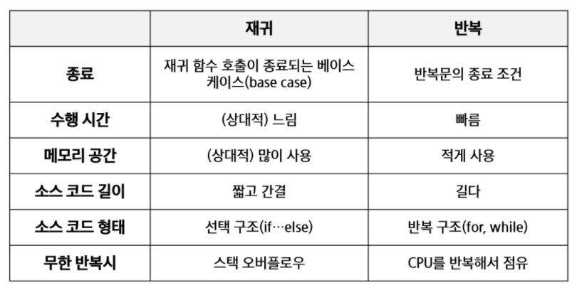

# 완전 검색


## 1. 반복과 재귀

- 반복과 재귀는 유사한 작업을 수행할 수 있따.

- 반복은 수행하는 작업이 완료될 때 까지 계속 반복

  - 루프(for, while 구조)

- 재귀는 주어진 문제의 해를 구하기 위해 동일하면서 더 작은 문제의 해를 이용하는 방법

  - 하나의 큰 문제를 해결할 수 있는(해결하기 쉬운) 더 작은 문제로 쪼개고 결과들을 결합한다.

  - 재귀 함수로 구현

    

> 반복

- 반복을 이용한 선택정렬 등으로 연습해보자.


> 재귀 함수

- 팩토리얼 재귀 함수의 호출 등으로 연습해보자


> 반복? 재귀?

- 해결할 문제를 고려해서 반복이나 재귀의 방법을 선택
- 재귀는 문제 해결을 위한 알고리즘 설계가 간단하고 자연스럽다
  - 추상 자료형(List, tree 등) 의 알고리즘은 재귀적 구현이 간단하고 자연스러운 경우가 많다.
- 일반적으로, 재귀적 알고리즘은 반복(Iterative) 알고리즘보다 더 많은 메모리와 연산을 필요로 한다.
- **입력 값 n이 커질수록 재귀 알고리즘은 반복에 비해 비효율적일 수 있다.**


> 반복과 재귀의 비교




## 2. 완전검색기법

> Baby-Gin Game

- 설명
  - 0~9 사이의 숫자 카드에서 임의의 카드 6장을 뽑았을 때, 3장의 카드가 연속적인 번호를 갖는 경우를 run이라고 하고, 3장의 카드가 동일한 번호를 갖는 경우를 triplet이라고 한다.
  - 카드들이 run이나 triplet으로만 구성된 경우를 Baby-gin이라고 한다.
  - 6장의 카드를 입력받아 어떻게 Baby-gin 여부를 찾을 것인가?


> Brute-force 탐색(sequential search)

- 모든 경우의 수를 생성하고 테스트하기 때문에 수행 속도는 느리지만, 해답을 찾아내지 못할 확률이 작다.
  - 완전검색은 입력의 크기를 작게 해서 간편하고 빠르게 답을 구하는 프로그램을 작성한다.
  - 모든 경우의 수를 생성하는 것 자체가 어려울 수 있다는 게 문제

- 이를 기반으로 그리디 기법이나 동적 계획법을 이용해서 효율적인 알고리즘을 찾을 수 있다.
- 검정등에서 주어진 문제를 풀 때, 우선 완전 검색으로 접근하여 해답을 도출한 후, 성능 개선을 위해 다른 알고리즘을 사용하고 해답을 확인하는 것이 바람직하다.
  - 단, 코드를 잘못 짜서 완전 검색 자체를 반복하는 일이 없도록 하자
- 많은 종류의 문제들이 특정 조건을 만족하는 경우나 요소를 찾는 것이다.
- 또한 이들은 전형적으로 순열(Permutation), 조합(Combination), 그리고 부분집합(subsets)과 같은 조합적 문제들(Combinatorial Problems)와 연관된다.
  - 이 부분은 연습이 되어 있지 않으면 만들기 어렵다.
  - a형 문제로 연습해보자.
- 완전 검색은 조합적 문제에 대한 brute-force 방법이다.


## 3. 조합적 문제

### 1. 순열

> 순열(Permutation)

- 서로 다른 것들 중 몇 개를 뽑아서 한 줄로 나열하는 것
- 서로 다른 n개 중 r개를 택하는 순열은 아래와 같이 표현한다.
- ~n~P~r~
  - ~n~P~r~ = n x (n-1) x (n-2) x ... x (n - r + 1)
- ~n~P~n~ = n! 

- 다수의 알고리즘 문제들은 순서화된 요소들의 집합에서 최선의 방법을 찾는 것과 관련 있다.
  - 예: (Trabeling Salesman Problem)
- N개의 요소들에 대해서 n!개의 순열들이 존재한다.
  - 12! = 479,001,600
  - n > 12인 경우, 시간 복잡도가 폭발적으로 증가한다.


> 완전 검색을 통한 Baby-gin 접근

- 고려할 수 있는 모든 경우의 수 생성하기
  - 입력받은 6개의 숫자로 만들 수 있는 모든 순열 나열(중복 포함)
- 해답 테스트하기
  - 앞의 3자리와 뒤의 3자리를 잘라, run과 triplet 여부를 테스트하고 최종적으로 baby-gin 여부를 테스트한다.


> 단순하게 순열을 생성하는 방법

- {1, 2, 3}을 포함하는 모든 순열을 생성하는 함수
  - 동일한 숫자가 포함되지 않았을 때, 각 자리 수 별로 loop를 이용해 아래와 같이 구현할 수 있다.


> 재귀 호출을 통한 순열 생성

```python
# 3개중 3개 고르기

def f(n, k): # 순열 p[n]을 채우는 함수. k는 배열의 크기
    if n == k:
        print(p)
    else:
        for i in range(k):
            if visited[i] == 0: # 사용하지 않은 숫자 검색
                visited[i] = 1  # 사용했다고 표시
                p[n] = a[i] 	# p[n] 결정
                f(n + 1, k)
                visited[i] = 0  # a[i]를 다른 위치에서 사용할 수 있도록 함
     


a = [1, 2 ,3]
p = [0] * 3
visited = [0] * 3
f(0, 3)

```

```python
# 5개중 3개 고르기

def f(n, k, m): # 순열 p[n]을 채우는 함수. k는 배열의 크기, m은 고를 숫자들의 수
    if n == k:
        print(p)
    else:
        for i in range(m):
            if visited[i] == 0: # 사용하지 않은 숫자 검색
                visited[i] = 1  # 사용했다고 표시
                p[n] = a[i] 	# p[n] 결정
                f(n + 1, k)
                visited[i] = 0  # a[i]를 다른 위치에서 사용할 수 있도록 함
     


a = [1, 2, 3, 4, 5]
p = [0] * 3
m = 5
visited = [0] * 5
f(0, 3, 5)
```


### 2. 부분집합

- 집합에 포함된 원소들을 선택하는 것이다.
- 다수의 중요 알고리즘들이 원소들의 그룹에서 최적의 부분 집합을 찾는 것이다.
- N개의 원소를 포함한 집합
  - 자기 자신과 공집합 포함한 모든 부분집합의 개수는 2^n^개
  - 원소의 수가 증가하면 부분집합의 개수는 지수적으로 증가


> 단순하게 모든 부분 집합을 만드는 방법

- 반복문을 사용하는 방법
- 원소의 수가 증가하면 반복문을 그 만큼 만들어야 하기 때문에 골치아파진다.


> 바이너리 카운팅을 통한 사전적 순서(Lexicographic Order)

- 부분집합을 생성하기 위한 가장 자연스러운 방법이다.
- 바이너리 카운팅(Binary Counting)은 사전적 순서로 생성하기 위한 가장 간단한 방법이다.
- 원소의 개수가 증가해도 쉽게 적용이 가능하다.
- 바이너리 카운팅
  - 원소 수에 해당하는 N개의 비트열을 이용한다.
  - n번재 비트값이 1이면 n번째 원소가 포함되었음을 의미한다.

```python
# 바이터리 카운팅을 통한 부분집합 생성 코드 예
arr = [3, 6, 7, 1, 5, 4]
n = len(arr)

for i in range(0, (1 << n)):
    for j in range(0, n):
        if i & (1 << j):
            print('%d' % arr[j], end=' ')
```


### 3. 조합

-  서로 다른 n개의 원소 중 r개를 순서 없이 골라낸 것을 조합(combination)이라고 부른다.
- 조합의 수식
- ~n~C~r~ = n! / (n-r)! / r! (n >= r)
- ~n~C~r~ = ~n-1~C~r-1~ + ~n-1~C~r~ => 재귀적 표현
  - 5개의 공이 있다고 가정하면, 어떤 한 개의 공을 포함해서 조합을 만든다고 가정했을 때,
    - 나머지는 n-1개, 고를 개수는 r-1개
  - 그 공을 포함하지 않는 경우 조합은
    - 나머지는 n-1개에서, 고를 개수는 r개
- ~n~C~r~ == ~n~C~0~ == 1
- ~n~C~r~ == ~n~C~n-r~


> 재귀 호출을 이용한 조합 생성 알고리즘

- 좀 복잡한 방법


> 10개의 원소 중 3개를 고르는 조합

- 각 원소를 i, j, k라고 한다.
  - i < j < k
  - 조합이므로 순서는 상관이 없다.

```python
# 반복문을 사용

def f(i, j, k):
    print(i, j, k)

N = 10
R = 3

for i in range(N-2): # j, k로 선택될 원소를 남김
    for j in range(i + 1, N - 1): # k로 선택될 원소를 남김
        for k in range(j + 1, N):
            f(i, j, k)
            
```

```python
# 위의 반복문을 재귀로 응용

def nCr(n, r, s): # n개에서 r개를 고르는 조합, s 선택할 수 있는 구간의 시작
    if r == 0:
        print(*comb)
    else:
        for i in range(s, n-r+1):
            comb[r-1] = A[i]
            # comb[3-r] 하면 오름차순
            nCr(n, r-1, i+1)
            
n = 5
r = 3
comb = [0] * 3
A = [i for i in range(1, n + 1)]
nCr(n, r, 0)
```

```python

def nCr(n, r, s, k): # n개에서 r개를 고르는 조합, s 선택할 수 있는 구간의 시작, k 고른 개수
    if k == r:
        print(*comb)
    else:
        for i in range(s, n-r+1):
            comb[k] = A[i]
            nCr(n, r-1, i+1, k+1)
            
n = 5
r = 3
comb = [0] * r
A = [i for i in range(1, n + 1)]
nCr(n, r, 0, 0)
```


## 4. 탐욕 알고리즘

> 문제 제시: 거스름돈 줄이기

- 손님이 지불한 금액에서 물건값을 제한 차액(거스름돈)을 지불하는 문제
- 어떻게 하면 손님에게 주는 거스름돈의 개수를 최소화할까?


> 탐욕(Greedy) 알고리즘

- 탐욕 알고리즘은 최적해를 구하는 데 사용되는 근시안적인 방법
- 일반적으로, 머리속에 떠오르는 생각을 검증 없이 바로 구현하면 Greedy 접근이 된다.
- 여러 경우 중 하나를 선택 할 때마다 그 순간에 최적이라고 생각되는 것을 선택해 나가는 방식으로 진행하여 최종적인 해답에 도달한다.
- 각 선택 시점에서 이루어지는 결정은 지역적으로는 최적이지만, 그 선택들을 계속 수집하여 최종적인 해답을 만들었다고 해서 그것이 최적이라는 보장은 없다.
- 일단, 한번 선택된 것은 번복하지 않는다. 이런 특성 때문에 대부분의 탐욕 알고리즘들은 단순하며, 또한 제한적인 문제들에 적용된다.
- 최적화 문제(optimization)이란 가능한 해들 중에서 가장 좋은(최대 또는 최소)해를 찾는 문제이다.
- 문제는, 최적해를 반드시 구한다는 보장이 없다.
- 예를 들어, 거스름돈 문제의 경우
  - 거스름돈이 800원일 때, 만약 400원짜리 동전이 존재한다면
  - 최적해는 400원짜리 동전 2개이지만
  - 그리디적으로 접근하면 500원짜리 1개와 100원짜리 3개가 답으로 나오게 된다.


> 탐욕 알고리즘의 동작 과정

1) 해 선택
   - 현재 상태에서 부분 문제의 최적 해를 구한 뒤, 이를 부분해 집합(Solution Set)에 추가
2) 실행 가능성 검사
   - 새로운 부분 해 집합이 실행가능한지를 확인한다. 곧, 문제의 제약 조건을 위반하지 않는지를 검사
3) 해 검사
   - 새로운 부분 해 집합이 문제의 해가 되는지를 확인, 아직 전체 문제의 해가 완성되지 않았다면 1번부터 다시 시작


> 활동 선택 문제

- 탐욕 기법의 적용 가능

